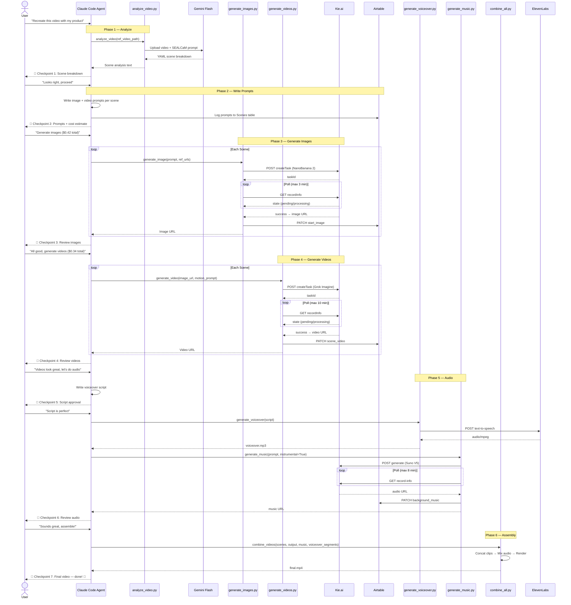
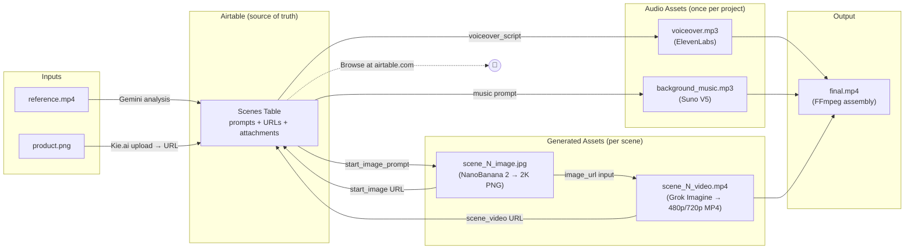

# 🏗️ Creative Cloner — Architecture Deep Dive

## Table of Contents

- [System Overview](#system-overview)
- [Pipeline Sequence](#pipeline-sequence)
- [Data Flow](#data-flow)
- [Component Details](#component-details)
- [Airtable Schema](#airtable-schema)
- [Error Handling Strategy](#error-handling-strategy)
- [Security Model](#security-model)
- [Design Decisions](#design-decisions)

---

## System Overview

Creative Cloner is a **human-in-the-loop AI pipeline** that deconstructs a reference video into scenes, regenerates each scene with a new product, and reassembles everything into a finished video ad. It's structured as a **Claude Code skill** that orchestrates **standalone Python tools**.

```mermaid
graph LR
    subgraph User["👤 User"]
        DIRECTION["Creative Direction\n('make it feel like a luxury ad')"]
        APPROVALS["Checkpoint Approvals\n(yes/no at each phase)"]
    end

    subgraph Agent["🧠 Claude Code Agent"]
        SKILL["SKILL.md\nRules + Prompts"]
        ORCHESTRATOR["Pipeline Orchestrator\n(enforces checkpoints)"]
    end

    subgraph Tools["🐍 Python Tools"]
        ANALYZE["analyze_video.py"]
        IMAGES["generate_images.py"]
        VIDEOS["generate_videos.py"]
        VO["generate_voiceover.py"]
        MUSIC["generate_music.py"]
        COMBINE["combine_all.py"]
    end

    subgraph External["☁️ External APIs"]
        GEMINI["Gemini Flash"]
        KIE["Kie.ai\n(NanoBanana 2, Grok Imagine, Suno)"]
        ELEVEN["ElevenLabs"]
        AIRTABLE["Airtable"]
    end

    User -->|"Natural language"| Agent
    Agent -->|"Function calls"| Tools
    Tools -->|"REST API"| External
    External -->|"Results"| Tools
    Tools -->|"Files"| Agent
    Agent -->|"🛑 Pause for approval"| User
```



**Key insight:** The Claude Code agent is the *orchestrator*, not the *executor*. It decides *what* to do and *when* to proceed, but the actual generation happens in Python tools. This separation means:
- The Python tools are independently testable and reusable
- The agent can be swapped or upgraded without touching generation logic
- Costs are predictable (the agent doesn't make API calls; the tools do)

---

## Pipeline Sequence



---

## Data Flow



**Airtable is the central source of truth.** Every generated asset's URL is written back to Airtable immediately after creation. This means:
- You can audit any project's full generation history in a spreadsheet
- If the pipeline crashes mid-run, you can resume from Airtable (all prior assets are logged)
- The agent can look up existing scenes to avoid regenerating

---

## Component Details

### 1. Video Analysis (`analyze_video.py`)

```
Input:  .mp4 file (reference video)
Output: YAML scene breakdown with SEALCaM dimensions

Flow:
  1. Upload video to Gemini Files API
  2. Poll until ACTIVE state (typically 5-30s)
  3. Send structured analysis prompt (SEALCaM format)
  4. Return YAML text + save to analysis.txt
```

**Why Gemini Flash?** Video understanding requires a multimodal model that can process actual frames. Gemini Flash is fast (~10-15s for a 30s video) and has a generous free tier.

### 2. Image Generation (`generate_images.py`)

```
Input:  Prompt (str), reference image URLs (list), aspect_ratio (str)
Output: Generated image URL (str)

Flow:
  1. If reference is a local file → upload_to_kie() → public URL
  2. POST to Kie.ai /createTask with NanoBanana 2 model
  3. Poll /recordInfo every 5s for up to 3 minutes
  4. On success: extract URL from resultJson, log to Airtable
  5. On fail/unknown/timeout: raise descriptive exception (no retry)
```

**Key functions:**
| Function | Purpose |
|---|---|
| `upload_to_kie(filepath)` | Upload local file → temporary public URL (3-day expiry) |
| `upload_image(filepath)` | Smart upload (URLs pass through, local files upload) |
| `generate_image(prompt, ref_urls, aspect_ratio)` | Main generation + polling loop |
| `log_image_to_airtable(project, scene, url)` | PATCH Airtable record with image attachment |
| `download_image(url, path)` | Save generated image locally |

### 3. Video Generation (`generate_videos.py`)

```
Input:  Start image URL (str), motion prompt (str), duration (str), aspect_ratio (str)
Output: Generated video URL (str)

Flow:
  1. POST to Kie.ai /createTask with grok-imagine/image-to-video
  2. Poll /recordInfo every 10s for up to 10 minutes
  3. On success: extract URL, log to Airtable
  4. On fail/unknown/timeout: raise descriptive exception
```

**Why 10-minute timeout?** Video generation is inherently slower than images (2-4 minutes typical). The polling loop is 60 iterations × 10s = 600s. If a job takes longer, the agent surfaces it as a timeout and offers the user the option to check Kie.ai directly (the job may have completed on the server side).

### 4. Voiceover Generation (`generate_voiceover.py`)

```
Input:  Script text (str), voice_id (str, default: "Rachel")
Output: voiceover.mp3

Flow:
  1. POST to ElevenLabs /text-to-speech/{voice_id}
  2. Write response bytes directly to .mp3 file
```

Simple, synchronous call. ElevenLabs is fast enough (<5s for typical ad copy) that no polling is needed.

### 5. Music Generation (`generate_music.py`)

```
Input:  Prompt (str), instrumental (bool), model (str), custom_mode (bool)
Output: Audio URL (str) or None (on failure)

Flow:
  1. POST to Kie.ai /generate with Suno model params
  2. Poll /generate/record-info every 10s for up to 8 minutes
  3. Handle multiple completion states: SUCCESS, FIRST_SUCCESS, COMPLETE
  4. Extract audio_url from sunoData array
```

**Why Suno via Kie.ai instead of directly?** Kie.ai provides a unified API for multiple AI services. Using one provider for images, videos, *and* music simplifies key management and billing.

### 6. Video Assembly (`combine_all.py`)

```
Input:  Video files (list), output path, music path (optional), voiceover segments (optional), text overlay (optional)
Output: Assembled .mp4

Flow:
  1. Write FFmpeg concat file list
  2. Concatenate all scene videos → combined_temp.mp4
  3. Build filter_complex:
     - Video: optional drawtext overlay
     - Audio: atrim + afade music, adelay + volume voiceover segments, amix everything
  4. Render with libx264 + aac, -shortest to trim to video duration
  5. Fallback: if audio mix fails, copy video-only with silent audio
```

**Voiceover placement:** Voiceover segments are passed as `[(path, offset_seconds), ...]`. Each segment is delayed by its offset before being mixed with the music. This enables the segmented narration style where different lines play over different scenes.

---

## Airtable Schema

### Table: Scenes

This is the **project database** — one record per scene, updated incrementally as assets are generated.

| Field | Type | Written by | When |
|---|---|---|---|
| `Project Name` | Single line text | Agent (manual) | Project creation |
| `scene` | Single line text | Agent (manual) | Project creation |
| `start_image_prompt` | Long text | Agent | Phase 2 (prompt writing) |
| `video_prompt` | Long text | Agent | Phase 2 (prompt writing) |
| `start_image` | Attachment | `generate_images.py` | Phase 3 (after image gen) |
| `scene_video` | Attachment | `generate_videos.py` | Phase 4 (after video gen) |
| `voiceover_script` | Long text | Agent | Phase 5 (Scene 1 only) |
| `voiceover` | Attachment | Agent | Phase 5 (Scene 1 only) |
| `background_music` | Attachment | `generate_music.py` | Phase 5 (all scenes) |

**Design note:** Voiceover script and audio are stored on Scene 1 only (project-level assets). Background music is replicated to all scenes so every row is self-contained in Airtable's gallery view.

### Required Airtable token scopes

```
data.records:read    — to find scene records by Project Name
data.records:write   — to PATCH generated asset URLs
```

No schema modification scopes needed — the table is created manually once.

---

## Error Handling Strategy

The system has a **layered error strategy** designed for paid API calls:

### Layer 1: Python exceptions (tools)

Each tool raises typed exceptions that the agent can interpret:

```python
# generate_images.py
raise Exception("KIE_ERROR_API: Could not create task. API response: ...")
raise Exception("KIE_ERROR_FAILED: Image generation failed. Reason: ...")
raise Exception("KIE_ERROR_TIMEOUT: Timed out after 3 minutes...")
```

The `KIE_ERROR_` prefix lets the agent pattern-match the error type.

### Layer 2: Agent interpretation (SKILL.md Rules 7)

The agent translates error codes into plain English:

| Error prefix | Plain English |
|---|---|
| `KIE_ERROR_TIMEOUT` | "Kie AI is taking longer than expected. It might still be working in the background." |
| `KIE_ERROR_FAILED` | "Kie AI couldn't complete this request. The prompt might need adjusting." |
| `KIE_ERROR_API` | "There was a connection issue with Kie AI. This is usually temporary." |
| `unknown` state | "Kie AI is in an unusual state. The request might still be processing." |

### Layer 3: User choice (3 options)

```
❓ What would you like to do?
1. Try again — fresh request (new cost)
2. Check Kie AI first — see if it actually succeeded
3. Skip this scene — move on
```

### Why no automatic retry?

1. **Duplicate charges** — retrying a job that succeeded silently means paying twice
2. **Prompt engineering feedback** — a `KIE_ERROR_FAILED` often means the prompt needs work; retrying the same prompt is unlikely to help
3. **Resumability** — because all results are logged to Airtable, you can always resume a partial run

---

## Security Model

### Secrets management

```
.agent/.env          ← NOT committed (in .gitignore)
.agent/.env.example  ← Committed, placeholder values only
```

All API keys are loaded via `python-dotenv` from the `.env` file:

```python
load_dotenv(Path(__file__).parent.parent / ".agent" / ".env")
KIE_API_KEY = os.getenv("KIE_API_KEY")
```

### File upload security

The `upload_to_kie()` function uploads reference images to Kie.ai's file streaming endpoint. These are **temporary URLs** (3-day expiry) — they're only used during the current generation run and not stored permanently.

### Airtable access

The Airtable token needs only `data.records:read` and `data.records:write` — the minimum scopes required. No schema modification, no user management, no base deletion.

---

## Design Decisions

### 1. Agent skill vs. pure script (revisited)

The SKILL.md file (~290 lines) is the "brain" of the system. It encodes:
- **Behavioral rules** (7 checkpoint rules, cost transparency, no-auto-retry)
- **Creative framework** (SEALCaM, prompt writing guidelines)
- **Domain knowledge** (API payload schemas, Airtable field mapping, tool inventory)

This is *declarative configuration*, not imperative code. The Claude Code agent reads it as its system prompt and dynamically decides what tool to call next based on the current project state. This is fundamentally different from a script's `if/else` logic — it can handle "make it more dramatic" or "actually, use a cyberpunk style instead" mid-pipeline without any code changes.

### 2. Why not LangChain / CrewAI / etc.?

The agent framework space is crowded, but Claude Code with a skill file has specific advantages for this use case:
- **Natural language is the API** — users describe what they want in plain English
- **Conversational iteration** — feedback loops ("darker lighting", "more energy") happen naturally
- **No framework lock-in** — the Python tools are plain scripts with no LangChain dependency

### 3. Sequential vs. parallel generation

Images and videos are generated **sequentially per scene** (not all scenes at once). This is intentional:
- Each generation costs money — if scene 1's image looks wrong, you want to catch it before generating 6 more
- The checkpoint system requires showing results before proceeding
- For a future "batch mode" (user explicitly says "generate all, I trust the prompts"), parallel generation would be a natural optimization

### 4. FFmpeg over cloud video editing APIs

FFmpeg is local, free, and deterministic. Cloud alternatives (Shotstack, Creatomate, etc.) add latency and cost for what amounts to concatenation + audio mixing. The trade-off is that FFmpeg requires local installation, but the setup cost is one-time.

---

## Performance Profile

Typical 7-scene ad run on a consumer laptop:

| Phase | Wall time | CPU usage | Network |
|---|---|---|---|
| 1. Analyze | 30-45s | Idle | Upload + download ~50MB |
| 2. Write prompts | 20-30s | Idle | Airtable API calls |
| 3. Images (7×) | 3-7 min | Idle | 7× Kie.ai polls |
| 4. Videos (7×) | 14-28 min | Idle | 7× Kie.ai polls |
| 5. Audio | 5-10 min | Idle | ElevenLabs + Kie.ai polls |
| 6. Assembly | 30-60s | High (FFmpeg) | None |
| **Total** | **~25-35 min** | Mostly idle | ~20 API calls |

The pipeline is **I/O bound** — almost all time is spent waiting for cloud GPU jobs. The local machine just polls and downloads.

---

## Extending the System

### Adding a new generation tool

1. Write a Python module in `tools/` following the existing pattern:
   ```python
   # tools/my_new_tool.py
   import os, requests
   from pathlib import Path
   from dotenv import load_dotenv
   load_dotenv(Path(__file__).parent.parent / ".agent" / ".env")
   
   def my_function(param1, param2):
       """Docstring that Claude Code will read."""
       # ... implementation
       return result
   
   if __name__ == "__main__":
       print("Functions available: my_function(param1, param2)")
   ```

2. Add the tool to SKILL.md's tool inventory table
3. Add a checkpoint rule if it involves cost
4. Add any new API keys to `.env.example`

### Adding a new AI model

Update the relevant tool's payload. For example, to use a newer image model:

```python
# In generate_images.py
payload = {
    "model": "new-model-name",  # Changed from "nano-banana-2"
    "input": { ... }
}
```

No agent changes needed — the SKILL.md doesn't hardcode model names in tool-calling logic.

---

<p align="center">
  <sub>Questions? Open an issue or start a discussion on the repo.</sub>
</p>
