# Accredit Flow — Architecture Diagram

This diagram is viewable on GitHub, in VS Code (with Mermaid extension), or at [mermaid.live](https://mermaid.live).

```mermaid
graph TB
    %% ── STYLE ──────────────────────────────────────────────
    classDef browser fill:#1e293b,stroke:#64748b,color:#e2e8f0
    classDef public fill:#0f172a,stroke:#334155,color:#cbd5e1
    classDef protected fill:#172554,stroke:#3b82f6,color:#dbeafe
    classDef layout fill:#1e3a5f,stroke:#60a5fa,color:#bfdbfe
    classDef page fill:#1e293b,stroke:#94a3b8,color:#e2e8f0
    classDef comp fill:#312e81,stroke:#818cf8,color:#c7d2fe
    classDef store fill:#450a0a,stroke:#f87171,color:#fecaca
    classDef api fill:#052e16,stroke:#4ade80,color:#bbf7d0
    classDef ext fill:#3b0764,stroke:#c084fc,color:#e9d5ff

    %% ── ENTRY ──────────────────────────────────────────────
    Browser["🖥 Browser"]:::browser

    Browser --> Vite["⚡ Vite Dev Server / Static Build"]:::browser
    Vite --> index["index.html<br/>SPA Shell"]:::browser
    index --> Main["main.tsx<br/>ReactDOM.createRoot"]:::browser

    %% ── APP SHELL ──────────────────────────────────────────
    Main --> App["App.tsx"]
    App --> QC["QueryClientProvider<br/>(React Query)"]:::comp
    QC --> TP["TooltipProvider"]:::comp
    TP --> Router["BrowserRouter"]:::comp
    TP --> Toaster["Toaster + Sonner<br/>(notifications)"]:::comp

    Router --> Routes{"<Routes/>"}

    %% ── PUBLIC ROUTES ──────────────────────────────────────
    Routes --> Landing["/ — LandingPage<br/>marketing homepage"]:::public
    Routes --> Auth["/auth — Auth<br/>login / sign up"]:::public
    Routes --> NF["* — NotFound"]:::public

    %% ── AUTH GUARD ─────────────────────────────────────────
    Routes --> PR["ProtectedRoute<br/>(auth guard)"]:::comp
    PR --> |"loading"| Spinner["⏳ Loader2 spinner"]:::comp
    PR --> |"no user"| Auth
    PR --> |"authenticated"| Layout

    %% ── LAYOUT ─────────────────────────────────────────────
    Layout["Layout<br/>sidebar (256px) + header"]:::layout
    Layout --> Sidebar["Sidebar<br/>logo · nav links · avatar · sign-out"]:::layout
    Layout --> MainContent["<main> content area"]:::layout

    %% ── PROTECTED PAGES ────────────────────────────────────
    MainContent --> Pages
    subgraph Pages["📄 Pages (protected)"]
        Dashboard["/dashboard — Dashboard<br/>compliance metrics · progress · tasks"]:::page
        Standards["/standards — Standards<br/>TEQSA 7 domains · ASQA 3 standards"]:::page
        Evidence["/evidence — Evidence<br/>file CRUD · Supabase storage"]:::page
        Tasks["/tasks — Tasks<br/>list · filter by status"]:::page
        Gap["/gap-analysis — GapAnalysis<br/>self-assessment · confidence scores"]:::page
        Submissions["/submissions — Submissions<br/>list · create wizard · metrics"]:::page
        SubDetail["/submissions/:id — SubmissionDetail<br/>evidence tabs · approve/reject"]:::page
        SARW["/submissions/:id/self-assurance<br/>SelfAssuranceReportWorkflow<br/>3 sections · AI report gen"]:::page
        PRRW["/submissions/:id/provider-re-registration<br/>ProviderReRegistrationWorkflow<br/>4 sections · AI report gen"]:::page
        Audits["/audits — Audits<br/>CRUD list · metric cards"]:::page
        AuditDetail["/audits/:id — AuditDetail<br/>findings · evidence linking"]:::page
        Profile["/profile — Profile<br/>user · org · team management"]:::page
        Admin["/admin — AdminDashboard<br/>users · tables · storage<br/>role: super_admin only"]:::page
    end

    %% ── SHARED COMPONENTS ──────────────────────────────────
    subgraph Components["🧩 Shared Components"]
        MetricCard["MetricCard"]:::comp
        ProgressBar["ProgressBar"]:::comp
        StatusBadge["StatusBadge"]:::comp
        SubWizard["SubmissionWizard<br/>3-step dialog"]:::comp
        UploadDialog["UploadEvidenceDialog<br/>react-hook-form + zod"]:::comp
        DocPreview["DocumentPreviewDialog"]:::comp
    end

    subgraph UI["🎨 shadcn/ui (50+ components)"]
        RadixUI["Radix UI primitives + Tailwind"]:::comp
    end

    Pages -.-> Components
    Pages -.-> UI

    %% ── DATA LAYER (two patterns) ──────────────────────────
    subgraph DataFetching["📡 Data Fetching"]
        direction LR
        RQ["React Query<br/>useQuery · useMutation<br/>(workflow pages)"]:::comp
        Direct["Direct Supabase<br/>useState + useEffect<br/>(CRUD pages)"]:::comp
        Forms["Forms<br/>react-hook-form + zod<br/>or manual useState"]:::comp
    end

    Pages --> DataFetching

    %% ── SUPABASE ───────────────────────────────────────────
    DataFetching --> Supabase["⚡ Supabase Client<br/>createClient(Database)"]:::api

    Supabase --> AuthService["Auth<br/>email/password · signUp · signIn<br/>onAuthStateChange · localStorage"]:::api
    Supabase --> DB["PostgreSQL Database<br/>Row Level Security"]:::store
    Supabase --> Storage["Object Storage<br/>bucket: evidence"]:::store
    Supabase --> EdgeFuncs["Edge Functions<br/>generate-self-assurance-report<br/>generate-provider-re-registration-report"]:::api

    %% ── AUTH HOOK ──────────────────────────────────────────
    AuthService --> useAuth["useAuth() hook<br/>user · session · loading · signOut"]:::comp

    %% ── DATABASE SCHEMA ────────────────────────────────────
    subgraph Schema["🗄 Database Schema"]
        direction TB
        orgs["organizations<br/>id, name, type"]:::store
        profiles["profiles<br/>id(FK auth.users), full_name, role, org_id, team_id"]:::store
        teams["teams<br/>id, name, org_id"]:::store
        standards["standards<br/>id, framework, number, title, parent_id(self-ref)"]:::store
        evidence["evidence_files<br/>id, file_name, file_path, user_id, org_id, standard_id, sub_category, tags"]:::store
        submissions["submissions<br/>id, title, framework, type, status, org_id, self_assurance_completed, generated_report_content"]:::store
        sub_ev["submission_evidence<br/>(junction: submission ↔ evidence)"]:::store
        audits["audits<br/>id, title, type, framework, status, org_id"]:::store
        findings["audit_findings<br/>id, audit_id, title, severity, standard_id"]:::store
        tasks["tasks<br/>id, title, status, priority, assigned_to, org_id, standard_id"]:::store
        gap["gap_analysis<br/>id, standard_id, org_id, confidence_score, gaps, recommendations"]:::store
        compliance["compliance_tracking<br/>id, standard_id, org_id, status, progress%, evidence_count"]:::store

        orgs --> profiles
        orgs --> teams
        teams --> profiles
        orgs --> evidence
        orgs --> submissions
        orgs --> audits
        orgs --> tasks
        orgs --> gap
        orgs --> compliance
        standards --> evidence
        standards --> tasks
        standards --> gap
        standards --> compliance
        standards --> findings
        audits --> findings
        submissions --> sub_ev
        evidence --> sub_ev
    end

    DB --- Schema

    %% ── HESF DOMAINS ───────────────────────────────────────
    subgraph HESF["🏛 HESF Standards (7 Domains)"]
        D1["1 · Student Participation"]:::ext
        D2["2 · Learning Environment"]:::ext
        D3["3 · Teaching"]:::ext
        D4["4 · Research & Research Training"]:::ext
        D5["5 · Institutional Quality Assurance"]:::ext
        D6["6 · Governance & Accountability"]:::ext
        D7["7 · Representation & Information Mgmt"]:::ext
    end

    HESF --> standards
    HESF --> lib["lib/hesfStandards.ts<br/>getHESFDomain() · getHESFDomainColor() · getHESFDomainName()"]:::comp

    %% ── DATA FLOW SUMMARY ──────────────────────────────────
    subgraph Legend["📋 Key"]
        L1["Public (no auth)"]:::public
        L2["Protected (auth required)"]:::protected
        L3["Component / Hook"]:::comp
        L4["Database / Storage"]:::store
        L5["External Service / API"]:::api
    end
```



---

## Data Flow Summary

```
  Browser
    │
    ▼
  Vite (dev server or static build)
    │
    ▼
  React App (main.tsx → App.tsx)
    │
    ├── Public Routes (no auth)
    │   ├── /          → LandingPage
    │   ├── /auth      → Auth (login / sign up)
    │   └── *          → NotFound
    │
    └── ProtectedRoute (checks useAuth)
        │
        ├── Unauthenticated → redirect to /auth
        └── Authenticated → Layout (sidebar + header)
            │
            ├── /dashboard                    → Dashboard
            ├── /standards                    → Standards
            ├── /evidence                     → Evidence
            ├── /tasks                        → Tasks
            ├── /gap-analysis                 → GapAnalysis
            ├── /submissions                  → Submissions
            ├── /submissions/:id              → SubmissionDetail
            ├── /submissions/:id/self-assurance → SelfAssuranceReportWorkflow
            ├── /submissions/:id/provider-re-registration-workflow → ProviderReRegistrationWorkflow
            ├── /audits                       → Audits
            ├── /audits/:id                   → AuditDetail
            ├── /profile                      → Profile
            └── /admin                        → AdminDashboard (super_admin only)
```

## Data Layer

```
  Page Component
    │
    ├── Pattern A (workflows): React Query
    │   ├── useQuery({ queryKey, queryFn: () => supabase.from()... })
    │   └── useMutation → queryClient.invalidateQueries()
    │
    └── Pattern B (CRUD pages): Direct Supabase
        └── useEffect → supabase.from().select().then(setState)
    │
    ▼
  Supabase Client (createClient<Database>)
    │
    ├── Auth (email/password, session tokens in localStorage)
    ├── PostgreSQL (12 tables, RLS policies, org multi-tenancy)
    ├── Storage (evidence bucket: upload/download/delete)
    └── Edge Functions (AI report generation via supabase.functions.invoke)
```

## Component Tree

```
<App>
  <QueryClientProvider>
    <TooltipProvider>
      <Toaster />
      <Sonner />
      <BrowserRouter>
        <Routes>
          <Route path="/" element={<LandingPage />} />
          <Route path="/auth" element={<Auth />} />
          <Route element={<ProtectedRoute />}>
            <Route element={<Layout />}>
              <Route path="/dashboard" element={<Dashboard />} />
              <Route path="/standards" element={<Standards />} />
              ... (9 more protected routes)
            </Route>
          </Route>
          <Route path="*" element={<NotFound />} />
        </Routes>
      </BrowserRouter>
    </TooltipProvider>
  </QueryClientProvider>
</App>
```
