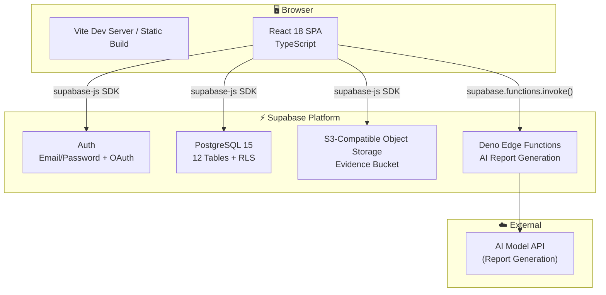
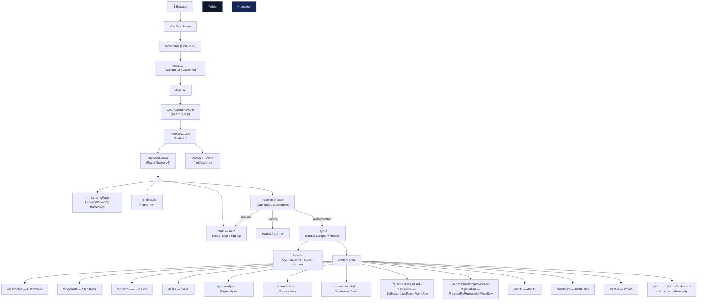
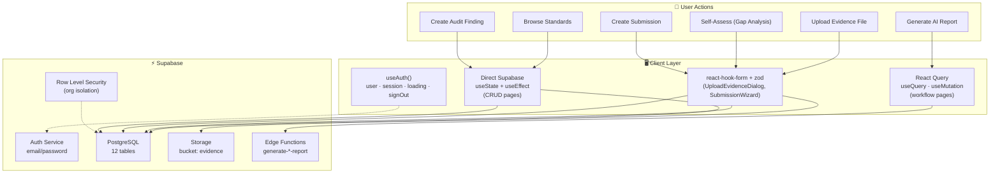
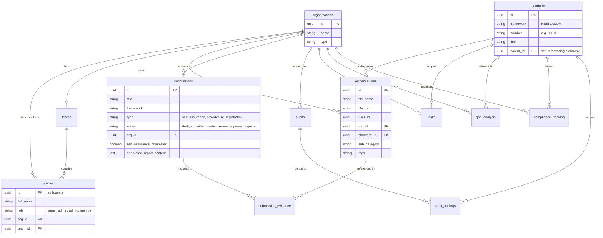

# 🏗️ Accredit Flow — Architecture Deep Dive

## Table of Contents

- [System Overview](#system-overview)
- [Route Architecture](#route-architecture)
- [Data Flow](#data-flow)
- [Component Details](#component-details)
- [Database Schema](#database-schema)
- [Authentication & Authorisation](#authentication--authorisation)
- [Multi-Tenancy with RLS](#multi-tenancy-with-rls)
- [AI Report Generation](#ai-report-generation)
- [Design Decisions](#design-decisions)

---

## System Overview

Accredit Flow is a **React Single Page Application** backed by **Supabase** (PostgreSQL + Auth + Storage + Edge Functions). It helps higher education providers manage accreditation compliance across TEQSA (HESF) and ASQA frameworks.



**Key insight:** Supabase is the entire backend. There is no custom server, no Express/Fastify, no ORM. The React app talks directly to Supabase via the `supabase-js` SDK, and Row Level Security enforces authorisation at the database level. This "thin backend" architecture means no API routes to maintain, no middleware to write, and security is declarative (SQL policies).

---

## Route Architecture



### Auth Guard (`ProtectedRoute.tsx`)

The auth guard is an **outlet-based wrapper**:

```typescript
// Conceptual structure
function ProtectedRoute() {
  const { user, loading } = useAuth()

  if (loading) return <Spinner />
  if (!user) return <Navigate to="/auth" />
  return <Outlet />  // renders nested routes (Layout → pages)
}
```

It's used as a layout route in React Router:

```typescript
<Route element={<ProtectedRoute />}>
  <Route element={<Layout />}>
    <Route path="/dashboard" element={<Dashboard />} />
    {/* ... all other protected pages ... */}
  </Route>
</Route>
```

This means all protected pages automatically get auth checking and the sidebar layout without repeating auth logic.

---

## Data Flow



### Two data-fetching patterns

**Pattern A — React Query (workflow pages):**
```
useQuery({ queryKey: ['submission', id], queryFn: () => supabase.from('submissions')... })
  → Automatic caching, background refetch, loading/error states
useMutation → queryClient.invalidateQueries()
  → Optimistic updates, rollback on error
```

Used in: SelfAssuranceReportWorkflow, ProviderReRegistrationWorkflow, Dashboard

**Pattern B — Direct Supabase (CRUD pages):**
```
useEffect(() => {
  supabase.from('evidence_files').select().eq('org_id', orgId).then(setState)
}, [orgId])
```

Used in: Evidence, Tasks, Audits, Submissions

---

## Component Details

### 1. Application Shell (`App.tsx`)

```
Composition (outer → inner):
  QueryClientProvider     ← React Query cache
    TooltipProvider       ← Radix UI tooltips
      Toaster             ← shadcn/ui toast notifications
        Sonner            ← Alternative toast system
          BrowserRouter   ← React Router v6
            <Routes>
              Public routes (no wrapper)
              ProtectedRoute (auth guard)
                Layout (sidebar + header)
                  13 protected pages
              NotFound (catch-all)
```

### 2. Layout (`Layout.tsx`)

```
Structure:
  ┌──────────┬────────────────────────────────┐
  │          │                                │
  │ Sidebar  │  <main> content area           │
  │ (256px)  │  (flex-1, overflow-auto)       │
  │          │                                │
  │ · logo   │  <Outlet /> renders here       │
  │ · nav    │                                │
  │ · avatar │                                │
  │ · logout │                                │
  │          │                                │
  └──────────┴────────────────────────────────┘
```

The sidebar is persistent across all authenticated pages. Navigation links highlight based on the current route. The sign-out button calls `useAuth().signOut()` which clears the session from localStorage and redirects to `/auth`.

### 3. Shared Components

| Component | Purpose | Dependencies |
|---|---|---|
| `MetricCard` | Display a single KPI (count, percentage, status) | shadcn/ui Card |
| `ProgressBar` | Visual compliance progress per standard | Tailwind CSS |
| `StatusBadge` | Coloured badge for status values (draft, submitted, approved, rejected) | shadcn/ui Badge |
| `SubmissionWizard` | 3-step dialog: Select framework → Select type → Name & create | shadcn/ui Dialog, react-hook-form, zod |
| `UploadEvidenceDialog` | File picker + standard selector + tag input + upload | shadcn/ui Dialog, react-hook-form, zod, Supabase Storage |
| `DocumentPreviewDialog` | Preview uploaded evidence files (PDF, image, etc.) | shadcn/ui Dialog, Supabase Storage signed URLs |

### 4. Page Components

| Page | Data sources | Key interactions |
|---|---|---|
| `Dashboard` | compliance_tracking, tasks, submissions, audits | Aggregate metrics cards, progress bars per domain |
| `Standards` | standards table (self-referencing hierarchy) | Expand/collapse domain → standard → sub-standard tree |
| `Evidence` | evidence_files (filtered by org_id), standards | Upload, tag, search, delete evidence files |
| `GapAnalysis` | gap_analysis, standards | Per-standard confidence rating (1-5), gap notes, recommendations |
| `Submissions` | submissions (filtered by org_id) | List view, create via wizard, filter by status |
| `SubmissionDetail` | submissions + submission_evidence (joined) | Tab view: evidence per standard, approve/reject |
| `SelfAssuranceReportWorkflow` | submissions, evidence, gap_analysis | 3-section form → invoke Edge Function → review AI draft |
| `ProviderReRegistrationWorkflow` | submissions, evidence, compliance | 4-section form → invoke Edge Function → review AI draft |
| `Audits` | audits (filtered by org_id) | CRUD list, metric cards (open findings, severity breakdown) |
| `AuditDetail` | audits + audit_findings + evidence | Findings table, link evidence, update status |
| `Tasks` | tasks (filtered by org_id) | List view, filter by status (todo/in_progress/done), assign |
| `Profile` | profiles (own record), organizations | Edit profile, org settings, team management |
| `AdminDashboard` | All tables (super_admin only) | User management, table browser, storage overview |

---

## Database Schema

12 tables with Row Level Security, designed for multi-tenant (org-based) isolation:



### Complete table inventory

| Table | Purpose | Key RLS policy |
|---|---|---|
| `organizations` | Multi-tenant boundary | Members can read own org |
| `profiles` | User profile + role + org membership | Users can read own profile; admins can read org members |
| `teams` | Sub-org groups | Members can read own team |
| `standards` | HESF + ASQA standards (hierarchical) | Public read (standards are shared reference data) |
| `evidence_files` | Uploaded evidence with standard tagging | Org isolation — users see only their org's files |
| `submissions` | Accreditation submission packages | Org isolation |
| `submission_evidence` | Junction: submission ↔ evidence (many-to-many) | Org isolation (via parent submission) |
| `audits` | Internal/external audit records | Org isolation |
| `audit_findings` | Individual findings within an audit | Org isolation (via parent audit) |
| `tasks` | Compliance tasks with assignment | Org isolation |
| `gap_analysis` | Self-assessment confidence scores + gaps | Org isolation |
| `compliance_tracking` | Aggregated compliance status per standard per org | Org isolation |

### Standards hierarchy (self-referencing)

The `standards` table uses a `parent_id` foreign key to itself to model the hierarchy:

```
HESF Domain 1: Student Participation and Attainment (parent_id = NULL)
├── 1.1: Admissions (parent_id = Domain 1)
│   ├── 1.1.1: Admission Policies (parent_id = 1.1)
│   └── 1.1.2: Entry Requirements (parent_id = 1.1)
├── 1.2: Student Support (parent_id = Domain 1)
└── ...
```

This is rendered as an expandable tree in the Standards page using recursive component rendering.

---

## Authentication & Authorisation

### Auth flow

```
1. User enters email + password on /auth
2. supabase.auth.signInWithPassword() → Supabase Auth
3. Supabase returns session (JWT access token + refresh token)
4. Session stored in localStorage by supabase-js SDK
5. useAuth() hook reads session → provides user object to all components
6. On page load: supabase.auth.onAuthStateChange() → updates useAuth() reactively
7. On sign-out: supabase.auth.signOut() → clears localStorage → redirect to /auth
```

### Role system

| Role | Access |
|---|---|
| `super_admin` | All organisations, all data. Can access /admin dashboard. |
| `admin` | Full access within own organisation. Can manage team members. |
| `member` | Read/write own evidence, tasks, gap analyses. Read-only on submissions and audits. |

### Authorisation enforcement

Authorisation is enforced at **two levels**:

1. **Client-side:** Role checks in page components (hide admin buttons from members, redirect non-super_admins from /admin)
2. **Database-side:** Row Level Security policies that enforce org isolation regardless of client code

The database level is the **enforcement layer** — client-side checks are UX, not security.

---

## Multi-Tenancy with RLS

Every table has Row Level Security policies that enforce organisation-level data isolation:

```sql
-- Example: evidence_files table RLS

-- Enable RLS
ALTER TABLE evidence_files ENABLE ROW LEVEL SECURITY;

-- Policy: Users can SELECT evidence from their own organisation
CREATE POLICY "Select own org evidence" ON evidence_files
  FOR SELECT
  USING (
    auth.uid() IN (
      SELECT id FROM profiles
      WHERE org_id = evidence_files.org_id
    )
  );

-- Policy: Users can INSERT evidence for their own organisation
CREATE POLICY "Insert own org evidence" ON evidence_files
  FOR INSERT
  WITH CHECK (
    org_id = (
      SELECT org_id FROM profiles
      WHERE id = auth.uid()
    )
  );

-- Policy: super_admin can SELECT all evidence
CREATE POLICY "Super admin can select all" ON evidence_files
  FOR SELECT
  USING (
    EXISTS (
      SELECT 1 FROM profiles
      WHERE id = auth.uid() AND role = 'super_admin'
    )
  );
```

**This is the core security model.** The React app never filters by `org_id` in queries — it doesn't need to. RLS automatically scopes every query to the user's organisation. Even if a client-side bug sends an unfiltered query, the database returns only the rows the user is authorised to see.

---

## AI Report Generation

### Architecture

```
SelfAssuranceReportWorkflow (React component)
  ↓ user clicks "Generate Report"
  ↓
supabase.functions.invoke('generate-self-assurance-report', {
  body: { submissionId, standards, evidence, gapAnalysis }
})
  ↓
Supabase Edge Function (Deno runtime)
  ↓ assembles prompt with all evidence + standards
  ↓ calls AI model API
  ↓ returns generated report text
  ↓
React component receives report text
  ↓ displays in editable textarea
  ↓ user reviews and edits
  ↓ saves to submissions.generated_report_content
```

### Two Edge Functions

| Function | Purpose | Sections |
|---|---|---|
| `generate-self-assurance-report` | TEQSA self-assurance report | 3 sections (context, analysis per domain, compliance summary) |
| `generate-provider-re-registration-report` | ASQA provider re-registration | 4 sections (org overview, evidence per standard, gap analysis, action plan) |

### Why Edge Functions?

- **Co-located with data** — the function has direct access to the database (no additional auth)
- **No cold start for the main app** — report generation is infrequent, so keeping it in a serverless function avoids bloating the client bundle
- **Longer timeout** — Edge Functions can run for up to 60s (Supabase Pro), enough for AI model API calls
- **Secrets in the platform** — API keys for the AI model are stored as Supabase secrets, never exposed to the client

---

## Error Handling Strategy

### Layer 1: Client-side validation (zod)

All forms use `react-hook-form` with `zod` schemas. Invalid data is caught before any API call:

```typescript
const evidenceSchema = z.object({
  file: z.instanceof(File).refine(f => f.size < 10 * 1024 * 1024, "Max 10MB"),
  standard_id: z.string().uuid(),
  tags: z.array(z.string()).optional(),
})
```

### Layer 2: Supabase error responses

Every Supabase query returns `{ data, error }`. Components check for errors and display toasts:

```typescript
const { data, error } = await supabase.from('evidence_files').insert({...})
if (error) {
  toast.error(`Upload failed: ${error.message}`)
  return
}
```

### Layer 3: React Query error states

Workflow pages using React Query get structured error handling:

```typescript
const { data, isLoading, isError, error } = useQuery({...})
if (isLoading) return <Skeleton />
if (isError) return <ErrorState message={error.message} onRetry={refetch} />
```

### Layer 4: Edge Function timeouts

AI report generation can take 15-45 seconds. The client shows a progress indicator and handles timeout gracefully:

```typescript
try {
  const { data, error } = await supabase.functions.invoke('generate-report', {
    body: { ... }
  })
} catch (e) {
  toast.error("Report generation timed out. Please try again with fewer standards selected.")
}
```

---

## Security Model

### Secrets management

```
.env.local              ← NOT committed (in .gitignore)
├── VITE_SUPABASE_URL
└── VITE_SUPABASE_ANON_KEY

Supabase Platform (never exposed to client)
├── Service Role Key (server-side only, used by Edge Functions)
├── AI Model API Key (stored as Supabase secret)
└── Database Password
```

### Defence in depth

| Layer | Mechanism | What it protects |
|---|---|---|
| Transport | HTTPS (Supabase enforces) | Data in transit |
| Authentication | Supabase Auth (JWT) | User identity |
| Authorisation | Row Level Security (PostgreSQL) | Data access (org isolation) |
| Validation | zod schemas (client) + CHECK constraints (database) | Data integrity |
| Secrets | `.env.local` + Supabase Vault | API keys |

### The anon key is safe to expose

Supabase's "anon key" is designed to be public — it's included in the client bundle. It has the permissions of an unauthenticated user. All actual authorisation happens at the RLS level, which checks the user's JWT on every query. The service role key (which bypasses RLS) never leaves the Supabase platform.

---

## Performance Profile

| Metric | Value | Notes |
|---|---|---|
| Initial bundle (gzip) | ~180KB | Vite code-splitting, tree-shaken shadcn/ui |
| Lighthouse Performance | ~90+ | CSR with code-split routes |
| First contentful paint | ~1.2s | On 3G, with Supabase CDN |
| Database query (simple) | ~50ms | Indexed, RLS overhead <10ms |
| File upload (10MB) | ~5s | Direct to Supabase Storage (S3) |
| AI report generation | ~25-45s | Edge Function → AI model → response |

---

## Design Decisions

### 1. Thin backend (Supabase-only) over custom API server

Eliminating the API server layer means:
- **No routes to maintain** — the database schema IS the API
- **Security is declarative** — RLS policies are SQL, not middleware
- **Real-time is free** — Supabase subscriptions for live updates (future)
- **One less deployment** — only the static React app needs hosting

The trade-off is that complex business logic that doesn't fit in SQL must run in Edge Functions (which have cold starts and runtime limits).

### 2. shadcn/ui over Material UI / Chakra / etc.

shadcn/ui's "copy-paste" philosophy means you own the component code. This matters for a compliance platform because:
- **Long-term stability** — no dependency breaking changes during audit season
- **Customisability** — tweak any component for accessibility requirements
- **Bundle size** — only the components you use ship

### 3. Two data-fetching patterns instead of one

The split between React Query (workflows) and direct Supabase (CRUD) is a known tech debt item. It evolved organically — CRUD pages were built first with the simpler approach, workflows later with the more sophisticated one. Unifying on React Query would simplify the mental model.

### 4. Self-referencing standards table over separate domain/standard tables

A single `standards` table with `parent_id` handles HESF (3 levels: domain → standard → sub-standard) and ASQA (2 levels: standard → sub-standard) in one schema. Adding a new framework is just more rows, not a schema migration.

---

## Extending the System

### Adding a new accreditation framework

1. Insert the framework's standards into the `standards` table (parent_id for hierarchy)
2. Add framework detection logic to `lib/standards.ts`
3. Add the framework's domain colours to `lib/hesfStandards.ts` (or create a similar helper)
4. The rest of the platform (evidence, tasks, gap analysis, compliance tracking) works generically per standard — no code changes needed

### Adding a new page

1. Create the page component in `src/pages/`
2. Add a route inside the `<Route element={<Layout />}>` wrapper in `App.tsx`
3. Add a navigation link in `Sidebar.tsx`
4. Add RLS policies if the page accesses new data patterns

---

<p align="center">
  <sub>Questions? Open an issue or start a discussion on the repo.</sub>
</p>
