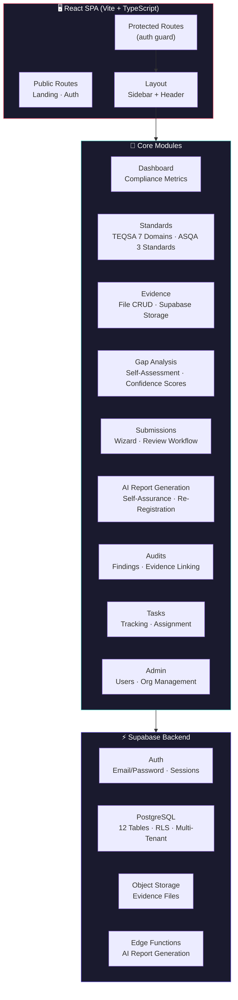

# 🎓 Accredit Flow

> **Higher education accreditation compliance — simplified.**  
> Manage TEQSA & ASQA standards, collect evidence, run gap analyses, generate self-assurance reports with AI, and track compliance progress — all in one collaborative platform.

<p align="center">
  <em>🚧 Demo video coming soon — add a 30-second screen recording here showing the platform</em>
  <!--  -->
</p>

---

## What problem does this solve?

Higher education providers in Australia face rigorous accreditation requirements from TEQSA (Higher Education Standards Framework) and ASQA (Standards for RTOs). The compliance process is document-heavy, time-consuming, and high-stakes:

1. **300+ standards and sub-standards** across multiple frameworks
2. **Thousands of evidence files** to collect, tag, and organise
3. **Self-assurance reports** that must demonstrate compliance with every standard
4. **Gap analyses** to identify where you're falling short — before auditors do
5. **Audit trails** proving you've been tracking compliance continuously, not just cramming before review

Accredit Flow digitises this entire process. It's a React SPA with a Supabase backend that gives accreditation teams a single source of truth for standards, evidence, submissions, audits, and compliance tracking.

---

## 🏗️ Architecture



### The Accreditation Frameworks

| Framework | Authority | Standards | Use case |
|---|---|---|---|
| **HESF** (Higher Education Standards Framework) | TEQSA | 7 Domains, 50+ standards | Universities & higher education providers |
| **ASQA** (Australian Skills Quality Authority) | ASQA | 3 Standards | Registered Training Organisations (RTOs) |

The platform supports both frameworks, with each standard stored as a hierarchical tree (parent → child standards) in the database.

---

## 🚀 Quickstart

### Prerequisites

- **Node.js 18+** with npm
- **Supabase** project (free tier works)
- A **Resend** account (for auth emails, optional — Supabase handles this)

### 1. Clone & install

```bash
git clone https://github.com/YOUR_USERNAME/accredit-flow.git
cd accredit-flow
npm install
```

### 2. Set up Supabase

Create a Supabase project and run the database migrations to create:
- 12 tables with Row Level Security policies
- Storage bucket for evidence files
- Edge Functions for AI report generation

### 3. Configure environment

```bash
cp .env.example .env.local
# Fill in:
#   VITE_SUPABASE_URL=https://your-project.supabase.co
#   VITE_SUPABASE_ANON_KEY=your-anon-key
```

### 4. Start the dev server

```bash
npm run dev
# → http://localhost:5173
```

### 5. Seed the standards

The platform ships with HESF and ASQA standards pre-defined. Run the seed script to populate your database:

```bash
npm run seed:standards
```

---

## 📁 Project Structure

```
accredit-flow/
├── src/
│   ├── main.tsx                    # React entry point
│   ├── App.tsx                     # Root component (QueryClient, Router, Tooltips, Toaster)
│   ├── components/
│   │   ├── ui/                     # shadcn/ui components (50+ Radix UI primitives)
│   │   ├── layout/
│   │   │   ├── Layout.tsx          # Authenticated layout (sidebar + header)
│   │   │   └── Sidebar.tsx         # Navigation sidebar
│   │   ├── auth/
│   │   │   └── ProtectedRoute.tsx  # Auth guard (redirects to /auth if no session)
│   │   └── shared/
│   │       ├── MetricCard.tsx      # KPI display card
│   │       ├── ProgressBar.tsx     # Compliance progress bar
│   │       ├── StatusBadge.tsx     # Status indicator badge
│   │       ├── SubmissionWizard.tsx     # 3-step submission creation dialog
│   │       ├── UploadEvidenceDialog.tsx # File upload with react-hook-form + zod
│   │       └── DocumentPreviewDialog.tsx # Evidence file preview
│   ├── pages/
│   │   ├── LandingPage.tsx         # Public marketing homepage
│   │   ├── Auth.tsx                # Login / sign up
│   │   ├── Dashboard.tsx           # Compliance metrics, progress, tasks overview
│   │   ├── Standards.tsx           # Browseable HESF + ASQA standards
│   │   ├── Evidence.tsx            # Evidence file CRUD with Supabase storage
│   │   ├── Tasks.tsx               # Task list with status filtering
│   │   ├── GapAnalysis.tsx         # Self-assessment with confidence scores
│   │   ├── Submissions.tsx         # Submission list + create wizard
│   │   ├── SubmissionDetail.tsx    # Evidence tab review, approve/reject
│   │   ├── SelfAssuranceReportWorkflow.tsx  # AI-powered self-assurance report (3 sections)
│   │   ├── ProviderReRegistrationWorkflow.tsx # AI-powered re-registration report (4 sections)
│   │   ├── Audits.tsx              # Audit CRUD with metric cards
│   │   ├── AuditDetail.tsx         # Findings management, evidence linking
│   │   ├── Profile.tsx             # User profile, org settings, team management
│   │   ├── AdminDashboard.tsx      # Super admin: users, tables, storage overview
│   │   └── NotFound.tsx            # 404 page
│   ├── hooks/
│   │   └── useAuth.ts              # Auth hook (user, session, loading, signOut)
│   ├── lib/
│   │   ├── supabase.ts             # Supabase client (createClient<Database>)
│   │   └── hesfStandards.ts        # HESF domain helpers (getDomain, getColor, getName)
│   └── types/
│       └── database.ts             # Generated TypeScript types from Supabase schema
├── supabase/
│   ├── migrations/                 # Database migrations (tables, RLS, functions)
│   └── functions/                  # Edge Functions (AI report generation)
├── public/
├── ARCHITECTURE.md
├── Accredit-Flow-Diagram.md
└── README.md
```

### Key files deep-dive

| File | Role | Why it matters |
|---|---|---|
| `App.tsx` | Application shell | Wraps everything in QueryClientProvider, TooltipProvider, BrowserRouter, and Toaster — the foundation all pages depend on |
| `ProtectedRoute.tsx` | Auth guard | Checks `useAuth()` — shows spinner while loading, redirects to /auth if no user, renders child routes if authenticated |
| `Layout.tsx` | App chrome | Persistent sidebar (256px) + header across all authenticated pages |
| `useAuth.ts` | Auth hook | Centralises user state — `user`, `session`, `loading`, `signOut`. Every protected page consumes this |
| `supabase.ts` | Database client | Typed Supabase client with full TypeScript support for all 12 tables |
| `hesfStandards.ts` | Domain helpers | Maps HESF domain numbers → names, colours, and categories |
| `SubmissionWizard.tsx` | Submission creation | 3-step dialog (framework selection, type, title) with zod validation |
| `UploadEvidenceDialog.tsx` | File upload | react-hook-form + zod schema → Supabase storage bucket |

---

## 🎯 Core Workflows

### 1. Evidence Collection

```
Upload file → Tag with standard → Optional sub_category + tags → Store in Supabase
                                                                    ↓
                                                           Compliance tracking auto-updates
```

Every piece of evidence is linked to a specific standard. The compliance tracking table automatically counts evidence per standard per organisation, showing progress bars and completion percentages on the dashboard.

### 2. Gap Analysis

```
Select standard → System rates domain completion confidence → Document gaps → Note recommendations
                                                                        ↓
                                                              Dashboard shows gap heatmap
```

Gap analysis is the pre-audit self-check. The system automatically rates its confidence in how complete each domain is — surfacing which standards are fully covered, partially covered, or have critical gaps. You document specific gaps and note recommended actions. The dashboard aggregates this into a visual heatmap showing which domains need attention.

### 3. Submission & Self-Assurance Reports

```
Create submission (wizard) → Attach evidence → AI generates report (Edge Function)
                                          ↓
                              Review → Approve/Reject → Export
```

Submissions are the formal evidence packages submitted to TEQSA or ASQA. The Self-Assurance Report Workflow collects evidence across 3 sections, then invokes a Supabase Edge Function to generate a draft report using AI. The Provider Re-Registration Workflow does the same across 4 sections.

### 4. Audit Management

```
Create audit → Add findings → Link findings to standards → Link findings to evidence
                                                        ↓
                                              Track remediation status
```

Audits capture external or internal review findings. Each finding is linked to a standard and can reference evidence files. The audit detail page shows finding severity, status, and linked evidence in one view.

---

## 🔐 Multi-Tenant Security

All data is isolated by organisation using **Supabase Row Level Security (RLS)**:

```sql
-- Example RLS policy: users can only see their org's evidence
CREATE POLICY "Users can view their org's evidence" ON evidence_files
  FOR SELECT USING (auth.uid() IN (
    SELECT id FROM profiles WHERE org_id = evidence_files.org_id
  ));
```

Every table has RLS policies enforcing org-level isolation. There's also a `super_admin` role that can see across organisations via the Admin Dashboard.

---

## 💰 Cost Model

Running on Supabase free tier:

| Resource | Free tier limit | Sufficient for |
|---|---|---|
| Database | 500MB | ~50,000 evidence records |
| Auth | 50,000 MAU | Unlimited for most institutions |
| Storage | 1GB | ~2,000 PDF documents |
| Edge Functions | 500K invocations | ~200 AI report generations |
| Bandwidth | 5GB | Moderate usage |

**Pro tier (~$25/month)** lifts all limits and adds daily backups.

---

## 📊 Real Projects

Accredit Flow is designed for:
- **Universities** managing TEQSA re-registration
- **RTOs** preparing for ASQA audits
- **Higher education consultants** managing compliance for multiple clients (multi-tenant)
- **Internal audit teams** tracking continuous compliance

---

## 🤔 Design Decisions & Trade-offs

### Why Supabase over a custom backend?

| Approach | Pros | Cons |
|---|---|---|
| **Supabase** (chosen) | Managed PostgreSQL, built-in auth, RLS for multi-tenancy, storage, Edge Functions, real-time | Vendor dependency, cold starts on Edge Functions |
| Custom Node.js + PostgreSQL | Full control, no vendor lock-in | Must build auth, storage, RLS, real-time from scratch |

Supabase provides ~80% of what a compliance platform needs out of the box. The remaining 20% (AI report generation) runs on Edge Functions. This is a pragmatic choice for a product that needs to ship, not maintain infrastructure.

### Why React Query for workflows but direct Supabase for CRUD?

Two data-fetching patterns co-exist:

| Pattern | Used in | Why |
|---|---|---|
| **React Query** (useQuery/useMutation) | Workflow pages (self-assurance, re-registration) | Caching, background refetch, optimistic updates — workflows have complex state |
| **Direct Supabase** (useState + useEffect) | CRUD pages (evidence, tasks, audits) | Simpler mental model, fewer dependencies — CRUD pages are straightforward |

The split is pragmatic rather than dogmatic. New pages tend toward React Query; legacy CRUD pages still use direct Supabase. A future refactor would unify on React Query.

### Why shadcn/ui over a custom design system?

shadcn/ui provides 50+ accessible, composable components built on Radix UI primitives. This means:
- **Accessibility out of the box** — Radix handles focus management, keyboard navigation, screen reader support
- **Tailwind theming** — match the institution's brand colours
- **Copy-paste ownership** — the component code lives in your repo, not a node_modules black box
- **No bundle bloat** — tree-shaken, only the components you use ship

---

## 🔜 Roadmap

- [ ] **Document versioning** — track evidence file revisions over time
- [ ] **Bulk evidence upload** — drag-and-drop 50+ files with auto-tagging
- [ ] **Export to TEQSA/ASQA templates** — one-click formatted submission packages
- [ ] **Reminder & deadline system** — automated emails for upcoming audit milestones
- [ ] **External auditor access** — time-limited, read-only access for external reviewers
- [ ] **Timeline view** — visualise compliance progress over months/years
- [ ] **Integration with LMS/HR systems** — auto-pull evidence from existing systems

---

## 📝 License

MIT — use this for your own institution, commercial or personal.

---

<p align="center">
  <sub>Built with React · Supabase · shadcn/ui · Tailwind CSS · TypeScript</sub>
</p>
