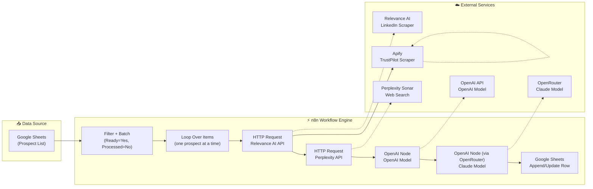
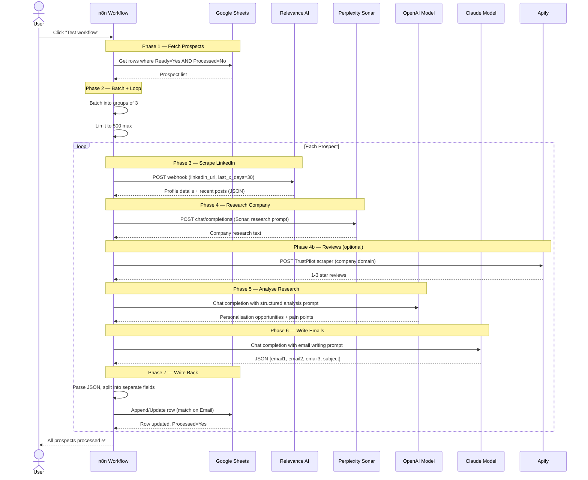
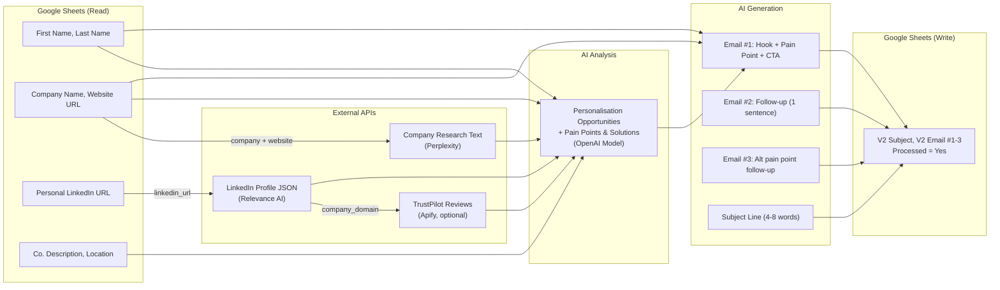

# 🏗️ Email Campaign Prep — Architecture Deep Dive

## Table of Contents

- [System Overview](#system-overview)
- [Pipeline Sequence](#pipeline-sequence)
- [Data Flow](#data-flow)
- [Component Details](#component-details)
- [Google Sheets Schema](#google-sheets-schema)
- [Script Variant Architecture](#script-variant-architecture)
- [Error Handling Strategy](#error-handling-strategy)
- [Security Model](#security-model)
- [Design Decisions](#design-decisions)

---

## System Overview

Email Campaign Prep is an **n8n workflow** that automates cold email campaign preparation. It reads prospects from Google Sheets, enriches them via external APIs, runs AI-powered research analysis, and generates personalised 3-email sequences — all orchestrated through n8n's visual workflow engine.



**Key insight:** This is a **batch processing pipeline**, not a real-time API. It processes prospects sequentially in a loop, with batching (groups of 3) to manage rate limits. The workflow is idempotent — re-running won't duplicate work because the `Processed` flag is set on each completed row.

---

## Pipeline Sequence



---

## Data Flow



**Google Sheets is both the input source and the output destination.** The workflow reads unprocessed rows (Ready=Yes, Processed=No), enriches each one, and writes results back to the same row. The `Email` column is used as the match key for upserts — this means you can re-import the same sheet with new columns and the workflow will update existing rows rather than creating duplicates.

---

## Component Details

### 1. Prospect Fetching (`Get row(s) in sheet`)

```
Input:  Google Sheets document + sheet name
Output: Array of prospect row objects

Flow:
  1. Connect to Google Sheets via OAuth
  2. Apply filters: Ready = "Yes" AND Processed = "No"
  3. Return matching rows
```

**Why two flags?** `Ready` is set manually (a human reviews the prospect first). `Processed` is set automatically after emails are written. This two-flag system prevents the workflow from processing leads that haven't been vetted, and ensures idempotency on re-runs.

### 2. Batching + Loop Control

```
Input:  Array of prospects (potentially hundreds)
Output: Sequential processing in groups of 3

Flow:
  1. Limit: cap at 500 prospects per run (safety valve)
  2. Batch: assign each prospect to B1, B2, or B3 (cycling)
  3. Loop Over Items: process one at a time
```

**Why batch?** The `Loop Over Items` node processes sequentially, but the batch assignments allow future optimisation (parallel processing within each batch group). Currently the batches are informational — all processing is sequential in the loop.

### 3. LinkedIn Scraping (`Scrape Profiles + Posts - Relevance AI`)

```
Input:  linkedin_url (str), last_x_days (int, default 30)
Output: linkedin_profile_details_data (JSON object)

Flow:
  1. POST to Relevance AI webhook trigger
  2. Auth via header: Authorization: [API_KEY]
  3. Body: {"linkedin_url": "...", "last_x_days": 30}
  4. Returns full profile + recent posts as nested JSON
  5. onError: continueRegularOutput (don't kill the loop)
```

**Why Relevance AI?** Relevance AI provides pre-built LinkedIn scraping agents that handle session management, rate limiting, and data extraction. Building this in-house would require maintaining browser automation infrastructure.

**Error resilience:** `onError: continueRegularOutput` means a failed scrape won't halt the entire batch. The workflow continues with whatever data is available.

### 4. Company Research (`Research Company - Perplexity`)

```
Input:  Company Name, Website URL
Output: Research text (plain English)

Flow:
  1. POST to api.perplexity.ai/chat/completions
  2. Model: sonar (real-time web search)
  3. System prompt: "You are a researcher in a business development team..."
  4. User prompt: "Find as much info as you can about {Company}..."
  5. Returns cited research with live web data
```

**Why Perplexity instead of a traditional search API?** Perplexity Sonar returns synthesised, cited research rather than raw search results. This means the analysis step gets coherent context, not a list of URLs.

### 5. Research Analysis (`Analyse`)

```
Input:  LinkedIn profile JSON + Perplexity research text
Output: Structured analysis (personalisation + pain points)

Flow:
  1. OpenAI Model via OpenAI node
  2. System prompt defines analysis framework:
     - Personalization opportunities (LinkedIn posts, achievements, background)
     - Pain points & solutions mapped to our service offerings
  3. Output format: structured markdown with sections
```

**The analysis is the bridge between raw research and email writing.** OpenAI Model is used here (not Claude) because this is a structured extraction task — cheaper and just as accurate.

### 6. Email Generation (`Email #1 #2 #3`)

```
Input:  First Name, Company Name, Analysis text
Output: JSON {email1: {subject, body}, email2: {body}, email3: {subject, body}}

Flow:
  1. Claude model via OpenRouter
  2. Detailed prompt with email structure rules:
     - Email #1: Hook → Pain Point → Solution → CTA (max 100 words)
     - Email #2: Short follow-up (1 sentence, same thread)
     - Email #3: Different pain point, warmer tone
  3. Guidelines: 6th-grade reading level, conversational, UK English, no formal openers
  4. Output: strict JSON (no markdown wrapper)
```

**Why Claude for writing?** Email writing requires natural, non-robotic prose with subtle tonal control. Claude model consistently produces more human-feeling output than OpenAI Model for this task. The ~$0.003/prospect cost premium is negligible compared to the reply-rate improvement.

### 7. Output Writing (`Append or update row in sheet`)

```
Input:  Parsed email JSON + prospect Email (match key)
Output: Updated Google Sheets row

Flow:
  1. Mode: appendOrUpdate
  2. Match column: Email
  3. Write columns: V2 Subject, V2 Email #1, V2 Email #2, V2 Email #3
  4. Set Processed = "Yes"
```

**Why "V2" column prefix?** The sheet supports multiple script variants writing to different column sets (V2, V3, etc.). This lets you run different variants on the same prospect list and compare results side by side.

---

## Google Sheets Schema

### Prospect List Columns

This is the **campaign database** — one row per prospect, updated incrementally.

| Column | Type | Set by | Purpose |
|---|---|---|---|
| `First Name` | Text | Manual | Prospect's first name |
| `Last Name` | Text | Manual | Prospect's last name |
| `Company Name` | Text | Manual | Company they work for |
| `Email` | Text | Manual | **Match key** for upserts |
| `Personal LinkedIn URL` | Text | Manual | URL for LinkedIn scraping |
| `Website URL` | Text | Manual | Company website for research |
| `Co. Description` | Text | Manual | Short company description |
| `Location` / `Country` | Text | Manual | Geographic context |
| `Position` | Text | Manual | Job title |
| `Ready` | Text | Manual | "Yes" = ready to process |
| `Processed` | Text | Automated | "Yes" = emails written |
| `V2 Subject` | Text | Automated | Email #1 subject line |
| `V2 Email #1` | Text | Automated | First outreach email body |
| `V2 Email #2` | Text | Automated | First follow-up body |
| `V2 Email #3` | Text | Automated | Second follow-up body |

Additional columns exist for other variants (V3, original hooks, etc.) and for enrichment data (Research, Data 1-3, Notes).

---

## Script Variant Architecture

The workflow contains **~8 script variants** wired as separate nodes. They share the same research infrastructure but differ in their email-writing approach:

```
Loop Over Items
    │
    ├── Script Option 1  →  Aged care: research-driven, structured analysis prompt
    ├── Script Option 3  →  Aged care: template-driven with personalisation slot
    ├── Script Option 4  →  Aged care: facility-type-aware (residential/hospital/community)
    ├── Script Option 5  →  Aged care: lean version, lower token cost
    ├── Script Option 6  →  Aged care: alt research prompt variant
    ├── Original Hooks   →  Generic B2B hooks
    ├── Basic LLM Chain  →  Template-based hooks
    └── Hiring Sales Staff →  Companies hiring sales roles
```

Each variant has its own:
- **Research prompt** (what to look for, word limits, output format)
- **Writing persona** (aged care, generic B2B, sales hiring, etc.)
- **Template structure** (hook-first vs. pain-point-first vs. template-fill)
- **Language model** (Claude model for high-quality writing, OpenAI Model for structured hooks)
- **Output columns** (V2, V3, or specific named columns)

**Only one variant is active per loop iteration** — the `Loop Over Items` node outputs to a single variant. Switch variants by reconnecting the output.

---

## Error Handling Strategy

The workflow has a **resilience-over-perfection** strategy designed for batch processing at scale:

### Layer 1: Node-level error handling

| Node | Error strategy | Rationale |
|---|---|---|
| `Scrape Profiles + Posts` | `onError: continueRegularOutput` | Missing LinkedIn data shouldn't kill the batch |
| `TrustPilot Reviews` | `onError: continueRegularOutput` + `alwaysOutputData: true` | Reviews are optional enrichment |
| `Split emails` | `onError: continueRegularOutput` | Malformed JSON from the LLM shouldn't halt processing |

### Layer 2: Batching as circuit breaker

Prospects are batched into groups of 3. If one prospect in a batch fails, the other 2 still proceed. This limits blast radius.

### Layer 3: Idempotency via Processed flag

The `Processed` flag is set to "Yes" only after successful email generation AND sheet write. If the workflow crashes mid-process, re-running won't duplicate work — unprocessed rows are picked up where they left off.

### Layer 4: Limit node as safety valve

The `Limit` node caps processing at 500 prospects per run. This prevents accidental mass-execution if the filter is misconfigured.

---

## Security Model

### Secrets management

```
n8n Credential Store      ← NOT in the exported JSON (auto-redacted)
├── Google Sheets OAuth   → KHJY2NQviymnfwqJ
├── OpenRouter API Key    → OfcSQUeiUrBgYSlU / UpV21Z3vKMd1YHwz
├── OpenAI API Key        → EFYq4VPgudLw8nL7
├── Perplexity API Key    → uiHkSp7yr3J0HNGd
└── Relevance AI Key      → [REDACTED] (header auth)
```

All credentials are stored in n8n's encrypted credential store, not in the workflow JSON. The sanitised export replaces actual keys with placeholder IDs.

### Data exposure

- **Prospect data** flows through Relevance AI, Perplexity, OpenAI, and OpenRouter APIs
- **No PII beyond professional data** — LinkedIn URLs, company names, and work emails only
- **Google Sheets OAuth** is scoped to specific spreadsheets, not the entire account

---

## Design Decisions

### 1. n8n over custom code

The n8n workflow engine provides:
- **Visual debugging** — see exactly which node failed and what data it had
- **Credential management** — API keys never touch the workflow JSON
- **No deployment** — runs in the cloud or self-hosted, no CI/CD needed
- **Non-technical operation** — team members can adjust filters and re-run without coding

The trade-off is harder version control (the JSON export is verbose and diffs poorly) and vendor dependency.

### 2. Batch over streaming

The workflow processes in batches (pull from sheet → process → write back) rather than streaming (webhook per prospect). This is intentional:
- **Cost control** — you see the full prospect list before any API calls are made
- **Review step** — the `Ready` flag means a human has vetted each prospect
- **Resumability** — if the workflow crashes, re-run picks up where it left off

### 3. Sequential over parallel

Prospects are processed one at a time in the loop (not parallelised). This is intentional for rate-limiting reasons — Relevance AI and Perplexity have usage limits, and blasting 100 simultaneous requests would trigger them. For a future "speed mode," parallel processing within each batch group would be a natural optimisation.

### 4. Multi-variant over multi-workflow

All script variants live in one workflow rather than separate workflows. This means:
- Shared infrastructure (scraping, research) isn't duplicated
- A/B testing is a single connection change
- Maintenance is centralised — update the scraping logic once, all variants benefit

The trade-off is workflow complexity — the node graph is large and requires careful labelling.

---

## Performance Profile

Typical per-prospect timing:

| Step | Wall time | Network |
|---|---|---|
| LinkedIn scrape | 5-15s | Relevance AI webhook |
| Company research | 3-8s | Perplexity API |
| Research analysis | 2-5s | OpenAI API |
| Email generation | 5-10s | OpenRouter API |
| Sheet write | 1-2s | Google Sheets API |
| **Total per prospect** | **~20-35s** | 4-5 API calls |

**Batch of 100 prospects:** ~35-60 minutes sequential. Mostly I/O bound waiting for API responses.

---

## Extending the System

### Adding a new script variant

1. Duplicate an existing script node (e.g. `Script Option 4`)
2. Modify the prompt template for your new use case
3. Add new output columns to the Google Sheet
4. Update the `Append or update row` node to map the new columns
5. Switch the `Loop Over Items` connection to test

### Adding a new research source

1. Add an HTTP Request node (or LangChain node) for the new API
2. Wire it after the LinkedIn scrape (so you have the prospect data)
3. Reference its output in the analysis prompt via `{{ $json... }}` expression
4. Set `onError: continueRegularOutput` for resilience

---

<p align="center">
  <sub>Questions? Open an issue or start a discussion on the repo.</sub>
</p>
