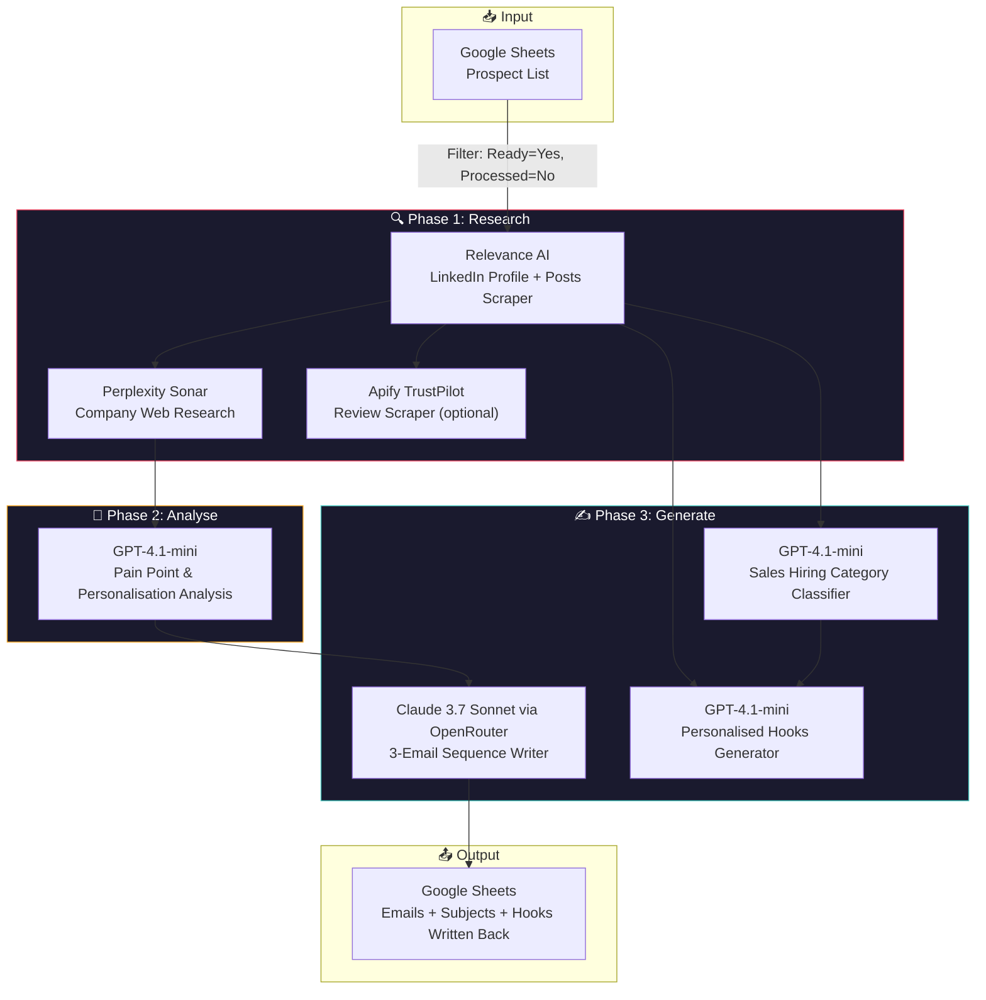

# 📧 Email Campaign Prep AI Agent

> **Turn a spreadsheet of prospects into personalised cold email sequences — fully automated.**  
> Research each lead via LinkedIn scraping + web search, analyse pain points & personalisation opportunities with AI, and generate multi-email cold outreach sequences — with all results written back to Google Sheets.

<p align="center">
  <em>🚧 Demo video coming soon — add a 30-second screen recording here showing a full run</em>
  <!--  -->
</p>

---

## What problem does this solve?

Cold email outreach at scale has two bottlenecks: **research** and **personalisation**. Manual research takes 10–15 minutes per prospect. Template emails get ignored. Email Campaign Prep collapses that to **~30 seconds per prospect** by using AI to:

1. **Scrape** the prospect's LinkedIn profile and recent posts (Relevance AI)
2. **Research** their company via web search (Perplexity)
3. **Analyse** the research to find personalisation opportunities and pain points (GPT-4.1-mini)
4. **Generate** a 3-email cold sequence with personalised hooks, subject lines, and follow-ups (Claude 3.7 Sonnet via OpenRouter)
5. **Write** everything back to Google Sheets — ready for review and send

**The key insight:** Multiple script variants target different outreach strategies (aged care, sales hiring, generic B2B) — pick the one that fits your campaign, or run them all and A/B test.

---

## 🏗️ Architecture



### The Variant System

The workflow contains **multiple script variants** — different combinations of research prompts and email-writing strategies, all wired in parallel. This lets you:

- **A/B test** different outreach angles (e.g. "peer-to-peer casual" vs. "problem-aware direct")
- **Switch strategies per campaign** without rebuilding the workflow
- **Iterate fast** — duplicate the best-performing variant and tweak the prompt

Active variants target aged care facility decision-makers (for Evaheld), sales leaders at growing tech companies, and generic B2B outreach.

---

## 🚀 Quickstart

### Prerequisites

- **n8n** (self-hosted or cloud) with LangChain nodes installed
- API keys for the services below
- A Google Sheet with your prospect list

### 1. Import the workflow

```bash
# In n8n, go to Workflows → Import from File
# Select: Email Prep - Aged Care_SANITIZED.json
```

### 2. Set up API keys & credentials

You'll need accounts at:

| Service | Used for | Approx. cost |
|---|---|---|
| [Relevance AI](https://relevanceai.com) | LinkedIn profile scraping | Usage-based credits |
| [Perplexity](https://perplexity.ai) | Company web research | Pay-per-query |
| [OpenRouter](https://openrouter.ai) | Claude 3.7 Sonnet for email writing | ~$0.015/1K tokens |
| [OpenAI](https://platform.openai.com) | GPT-4.1-mini analysis & hooks | ~$0.15/1M input tokens |
| [Google Sheets](https://console.cloud.google.com) | Prospect data source & output | Free tier |
| [Apify](https://apify.com) (optional) | TrustPilot review scraping | Usage-based |

### 3. Set up your Google Sheet

Create a sheet with at minimum these columns:

| Column | Type | Purpose |
|---|---|---|
| `First Name` | Text | Prospect's first name |
| `Last Name` | Text | Prospect's last name |
| `Company Name` | Text | Company they work for |
| `Email` | Text | Their email address (used as match key for updates) |
| `Personal LinkedIn URL` | Text | LinkedIn profile URL for scraping |
| `Website URL` | Text | Company website for research |
| `Ready` | Text | Set to "Yes" to include in processing |
| `Processed` | Text | Auto-set to "Yes" after emails are written |

### 4. Configure the workflow

1. Update the **Google Sheets node** to point at your spreadsheet
2. Pick your **active script variant** by connecting the `Loop Over Items` output to the variant you want
3. Adjust **filter criteria** in the "Get row(s) in sheet" node (e.g. change `Ready=Yes` to your own flag column)

### 5. Run it

Click **"Test workflow"** in n8n. The workflow will:
1. Pull all prospects matching your filter
2. Batch them into groups of 3 (to avoid rate limits)
3. Loop through each prospect — scrape, research, analyse, generate
4. Write the email sequences back to the sheet

---

## 📁 Project Structure

```
email-campaign-prep/
├── Email Prep - Aged Care_SANITIZED.json   # n8n workflow export
├── Email_Prep_Aged_Care_diagram.html       # Visual diagram of the workflow
├── README.md
└── ARCHITECTURE.md
```

### Key nodes deep-dive

| Node | Role | Why it matters |
|---|---|---|
| `Get row(s) in sheet` | Prospect source | Filters prospects by Ready/Processed flags — idempotent, won't re-process the same lead |
| `Scrape Profiles + Posts - Relevance AI` | LinkedIn data | Gets full profile JSON + recent posts (last 30 days) — the richest personalisation source |
| `Research Company - Perplexity` | Web research | Finds company news, funding, expansions — context the LinkedIn profile doesn't have |
| `Analyse` (GPT-4.1-mini) | Research synthesis | Extracts the top personalisation opportunities and pain points from raw research |
| `Email #1 #2 #3` (Claude 3.7 Sonnet) | Email writer | Generates all 3 emails in one call — subject line, body, follow-ups |
| `Append or update row in sheet` | Output | Writes subject + 3 emails back to the sheet, sets Processed=Yes |

---

## 🎯 The Personalisation Framework

Every email is built on two pillars extracted from the research:

| Pillar | What it is | Example |
|---|---|---|
| **Personalisation Opportunity** | A specific, verifiable fact about the prospect | "Saw your post about rolling out new digital tools for smoother admissions" |
| **Pain Point + Solution** | A business challenge + how we solve it | "Low ACD uptake (~9% nationally) → our platform boosted it to 40%+ at a similar facility" |

The framework enforces specificity — no "great company, would love to connect" fluff. Every hook references something real: a LinkedIn post, an award, a recent hire, or an industry pain point backed by evidence.

---

## 🛡️ Error Handling & Reliability

The workflow is designed for **batch processing at scale**:

- **Batching** — prospects are grouped into batches of 3 to avoid hitting API rate limits
- **Idempotency** — the `Processed` flag prevents duplicate processing. Re-run the workflow safely
- **`onError: continueRegularOutput`** — scraping nodes won't kill the whole batch if one prospect's LinkedIn is unavailable
- **Multiple script variants** — if one email style underperforms, switch to another without rebuilding

---

## 💰 Cost Model

Transparent per-prospect pricing:

| Step | Provider | Cost/prospect |
|---|---|---|
| LinkedIn scrape | Relevance AI | ~$0.01 (credit-based) |
| Company research | Perplexity Sonar | ~$0.01 |
| Analysis | GPT-4.1-mini | <$0.001 |
| Email generation | Claude 3.7 Sonnet | ~$0.003 |
| **Total** | | **~$0.025/prospect** |

**Batch of 100 prospects:** ~$2.50. Manual research equivalent: ~25 hours.

---

## 📊 Campaign Variants

The workflow ships with multiple script variants for different outreach contexts:

| Variant | Target | Tone | Best for |
|---|---|---|---|
| **Script Option 1** | Aged care leaders (Evaheld) | Casual peer-to-peer, warm connection | Introducing a new product to a known industry |
| **Script Option 3** | Aged care leaders (Evaheld) | Template-driven with personalisation slot | Faster execution, still personalised |
| **Script Option 4** | Aged care leaders (Evaheld) | Research-driven with facility-type adaptation | Most tailored — adapts tone to residential vs. hospital vs. community care |
| **Script Option 5** | Aged care leaders (Evaheld) | Lean version of Option 4 | Lower token cost, faster |
| **Script Option 6** | Aged care leaders (Evaheld) | Organisation-type aware | Variant with different research prompts |
| **Hiring Sales Staff** | Tech companies hiring sales roles | Hiring-aware, pipeline-focused | Companies in active sales expansion |
| **Original Hooks** | Generic B2B (LeadsAlways) | Warm founder-to-founder | Broad B2B outreach |
| **Basic LLM Chain** | Generic B2B (LeadsAlways) | Template hooks | Quick hooks for volume outreach |

---

## 🤔 Design Decisions & Trade-offs

### Why n8n instead of a pure code solution?

| Approach | Pros | Cons |
|---|---|---|
| **n8n workflow** (chosen) | Visual debugging, built-in credential management, easy to fork and modify variants, no deployment needed | Vendor lock-in, harder to version control, harder to test |
| Pure Python/Node script | Testable, version-controllable, portable | Must build credential management, retry logic, UI for non-technical users |

n8n wins for this use case because email campaigns are **operational workflows** — they need a UI for non-technical team members to review, adjust filters, and re-run. The visual editor makes it easy to A/B test script variants by swapping connections.

### Why Claude 3.7 Sonnet for email writing?

Email writing is a high-stakes creative task — the difference between a reply and an ignore is often a single awkward phrase. Claude 3.7 Sonnet consistently produces more natural, less "AI-sounding" prose than GPT-4.1-mini, especially for the nuanced casual-peer tone these emails require. The ~2x cost premium is worth it for the reply-rate improvement.

### Why multiple script variants in one workflow?

Instead of maintaining separate workflows for each outreach strategy, all variants live in one workflow. This means:
- Shared research infrastructure (scraping, Perplexity) — no duplication
- Easy A/B testing — just switch which variant the loop feeds into
- Variant comparison — all results land in the same sheet with different column prefixes (V2, V3, etc.)

---

## 🔜 Roadmap

- [ ] **Reply-rate tracking** — connect to email sending platform and correlate variant → reply rate
- [ ] **Auto-segment** — route prospects to different script variants based on company size, role, or industry
- [ ] **A/B test automation** — randomly assign variants and track statistical significance
- [ ] **Multi-language support** — generate emails in the prospect's local language
- [ ] **CRM integration** — push generated emails directly to HubSpot/Salesforce/Instantly

---

## 📝 License

MIT — use this for your own campaigns, commercial or personal.

---

<p align="center">
  <sub>Built with n8n · Powered by Relevance AI, Perplexity, GPT-4.1-mini & Claude 3.7 Sonnet</sub>
</p>
