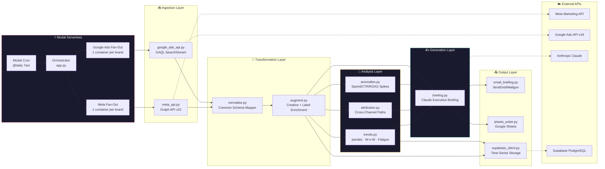
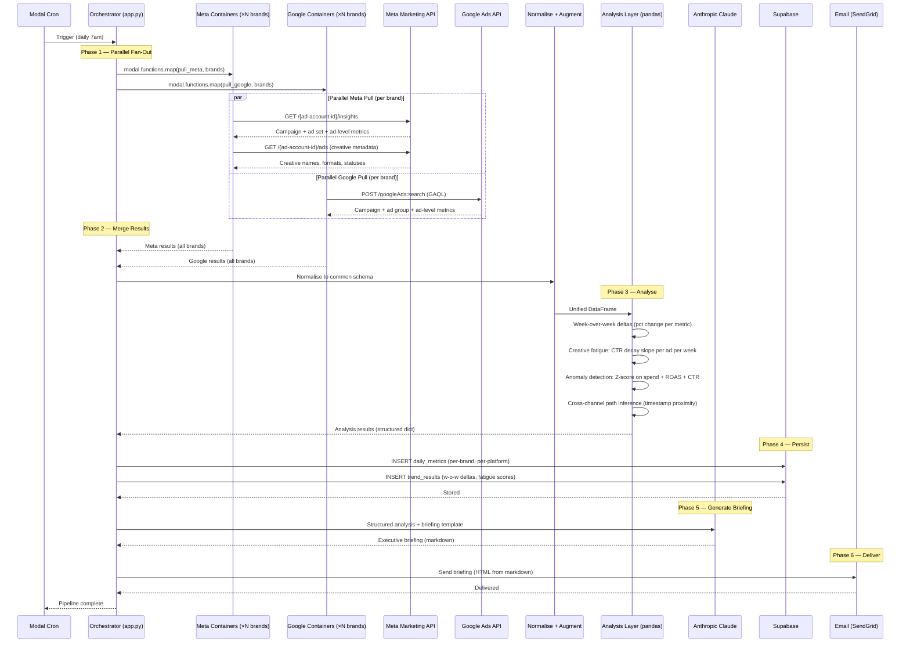
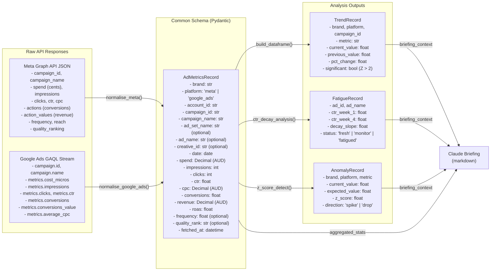

# 🏗️ Marketing ROI Analytics Agent — Architecture Deep Dive

## Table of Contents

- [System Overview](#system-overview)
- [Pipeline Sequence](#pipeline-sequence)
- [Data Flow](#data-flow)
- [Component Details](#component-details)
- [Common Data Schema](#common-data-schema)
- [Supabase Schema](#supabase-schema)
- [Mock Data Architecture](#mock-data-architecture)
- [Error Handling Strategy](#error-handling-strategy)
- [Security Model](#security-model)
- [Design Decisions](#design-decisions)

---

## System Overview

Marketing ROI Analytics Agent is a **Modal-hosted Python pipeline** that pulls ad performance data from Meta and Google Ads in parallel, normalises it into a common schema, runs time-series analysis, and generates an AI-powered executive briefing. It runs daily via Modal Cron and delivers results via email.



**Key insight:** This is a **fan-out → merge → analyse → narrate** pipeline. The orchestration is serverless Python (Modal), not a visual workflow engine. Each brand's data is pulled in an isolated Modal container, making the pipeline horizontally scalable — 3 brands or 50, same architecture, same runtime (~15 seconds for the parallel pull phase).

---

## Pipeline Sequence



**Fan-out is the key to speed.** With 10 brands × 2 platforms = 20 API calls, sequential execution would take ~2 minutes (6s per call average). Modal runs all 20 in parallel, so the ingestion phase completes in ~6 seconds regardless of brand count.

---

## Data Flow



**The common schema is the critical abstraction.** Every downstream component — trends, fatigue detection, anomaly detection, briefing generation — operates on the Pydantic model, not raw API JSON. This means adding a new ad platform (TikTok, LinkedIn, etc.) requires only a new normaliser function that maps to `AdMetricsRecord`. Nothing downstream changes.

---

## Component Details

### 1. Modal Orchestrator (`app.py`)

```python
import modal
from modal import App, Cron, Secret

app = App("marketing-roi-analytics")

@app.function(
    schedule=Cron("0 7 * * *"),  # Daily at 7am
    secrets=[
        Secret.from_name("meta-api-credentials"),
        Secret.from_name("google-ads-credentials"),
        Secret.from_name("anthropic-api-key"),
        Secret.from_name("supabase-url"),
        Secret.from_name("sendgrid-api-key"),
    ],
    timeout=600,  # 10 minute hard limit
)
@modal.concurrent(max_inputs=20)  # Fan-out concurrency cap
def daily_pipeline():
    brands = load_brand_config("config/brands.yaml")

    # Phase 1: Parallel fan-out to all ad accounts
    meta_results = modal.functions.map(
        pull_meta_for_brand,
        [b for b in brands if b.meta_account_id]
    )
    google_results = modal.functions.map(
        pull_google_for_brand,
        [b for b in brands if b.google_customer_id]
    )

    # Phase 2: Transform
    all_records = normalise_and_merge(meta_results, google_results)

    # Phase 3: Analyse
    trends = analyse_trends(all_records)
    fatigue = detect_creative_fatigue(all_records)
    anomalies = detect_anomalies(all_records)

    # Phase 4: Persist
    persist_to_supabase(all_records, trends, fatigue, anomalies)

    # Phase 5: Generate + Deliver
    briefing = generate_briefing(all_records, trends, fatigue, anomalies)
    send_briefing_email(briefing)
    write_to_google_sheets(all_records, trends)
```

**`@modal.concurrent(max_inputs=20)`** caps parallel containers — prevents accidental fan-out beyond API rate limits when scaling to many brands.

**`timeout=600`** is a safety valve. The pipeline should complete in ~30 seconds; 10 minutes catches hung API calls without blocking the next day's run.

### 2. Meta API Client (`src/ingest/meta_api.py`)

```
Input:  brand_config (meta_account_id, access_token)
Output: list[dict] — raw Meta Graph API responses

Flow:
  1. GET /{ad-account-id}/insights
     Params: fields=spend,impressions,clicks,ctr,cpc,actions,action_values,
                   frequency,reach,quality_score_organic
             time_range={"since":"YYYY-MM-DD","until":"YYYY-MM-DD"}
             time_increment=1  (daily breakdown)
             level=ad          (most granular)
  2. GET /{ad-account-id}/ads
     Params: fields=name,creative{id,name,title,body,image_url},status
  3. Merge insights with creative metadata on ad_id
  4. Handle pagination (cursor-based, up to 500 ads per account)
  5. Return raw JSON list
```

**Why ad-level granularity?** Creative fatigue detection needs ad-level CTR data over time. Campaign-level aggregation would hide the signal — a campaign can look healthy while one ad within it is decaying.

**Rate limit handling:** Basic tier is ~200 calls/hour per user. At 2 calls per brand (insights + creatives) × 10 brands = 20 calls per run, this stays well within limits. If scaling beyond ~100 brands, stagger the fan-out or upgrade to Standard tier.

### 3. Google Ads API Client (`src/ingest/google_ads_api.py`)

```
Input:  brand_config (google_customer_id, google_manager_id, developer_token)
Output: list[dict] — raw GAQL SearchStream responses

Flow:
  1. Construct GAQL query:
     SELECT
       campaign.id, campaign.name, campaign.status,
       ad_group.id, ad_group.name,
       ad_group_ad.ad.id, ad_group_ad.ad.name,
       segments.date,
       metrics.cost_micros,
       metrics.impressions,
       metrics.clicks,
       metrics.ctr,
       metrics.average_cpc,
       metrics.conversions,
       metrics.conversions_value
     FROM ad_group_ad
     WHERE segments.date DURING LAST_7_DAYS
       AND campaign.status = "ENABLED"
     ORDER BY segments.date DESC
  2. POST /customers/{customer-id}/googleAds:search
     (authenticated via OAuth, proxied through manager account if configured)
  3. Stream response (SearchStream returns paginated chunks)
  4. Normalise micros → dollars (metrics.cost_micros / 1_000_000)
  5. Return raw dict list
```

**Why GAQL SearchStream instead of the older AdWords API?** The AdWords API is deprecated. GAQL (Google Ads Query Language) is the current standard — it's SQL-like, strongly typed, and supports the `segments.date` dimension needed for daily time-series.

**Manager account architecture:** For multi-brand groups like LK Group, the Google Ads setup typically has a manager account that can query all sub-accounts. The GAQL client authenticates once with the manager account and queries each customer ID from there — no per-brand OAuth dance.

### 4. Normalisation Layer (`src/transform/normalise.py`)

The most architecturally important module. Maps two completely different API response schemas into one Pydantic model:

```python
from decimal import Decimal
from src.models.schemas import AdMetricsRecord

def normalise_meta(raw: dict, brand: str, date: str) -> AdMetricsRecord:
    """Map Meta Graph API response → common schema."""
    return AdMetricsRecord(
        brand=brand,
        platform="meta",
        account_id=raw.get("account_id"),
        campaign_id=raw.get("campaign_id"),
        campaign_name=raw.get("campaign_name"),
        ad_set_name=raw.get("adset_name"),
        ad_name=raw.get("ad_name"),
        date=date,
        spend=Decimal(str(raw.get("spend", 0))),  # Already in dollars
        impressions=raw.get("impressions", 0),
        clicks=raw.get("clicks", 0),
        ctr=raw.get("ctr", 0.0),
        cpc=Decimal(str(raw.get("cpc", 0))),
        conversions=float(_extract_conversions(raw.get("actions", []))),
        revenue=Decimal(str(_extract_revenue(raw.get("action_values", [])))),
        roas=_safe_roas(spend, revenue),
        frequency=raw.get("frequency"),
        quality_rank=raw.get("quality_score_organic", {}).get("quality_score"),
    )

def normalise_google_ads(raw: dict, brand: str) -> AdMetricsRecord:
    """Map Google Ads GAQL response → common schema."""
    metrics = raw.get("metrics", {})
    campaign = raw.get("campaign", {})
    spend = Decimal(str(metrics.get("cost_micros", 0))) / Decimal("1000000")

    return AdMetricsRecord(
        brand=brand,
        platform="google_ads",
        account_id=str(raw.get("customer_id")),
        campaign_id=str(campaign.get("id")),
        campaign_name=campaign.get("name", ""),
        ad_set_name=raw.get("ad_group", {}).get("name"),  # Ad group ≈ ad set
        ad_name=raw.get("ad_group_ad", {}).get("ad", {}).get("name"),
        date=_parse_date(raw.get("segments", {}).get("date")),
        spend=spend.quantize(Decimal("0.01")),
        impressions=int(metrics.get("impressions", 0)),
        clicks=int(metrics.get("clicks", 0)),
        ctr=float(metrics.get("ctr", 0)),
        cpc=Decimal(str(metrics.get("average_cpc", 0))) / Decimal("1000000"),
        conversions=float(metrics.get("conversions", 0)),
        revenue=Decimal(str(metrics.get("conversions_value", 0))),
        roas=_safe_roas(float(spend), float(metrics.get("conversions_value", 0))),
        # Google doesn't expose frequency or quality rank at ad level
        frequency=None,
        quality_rank=None,
    )
```

**Field mapping table — Meta ↔ Google Ads:**

| Common Schema | Meta Source | Google Ads Source |
|---|---|---|
| `platform` | `"meta"` | `"google_ads"` |
| `campaign_id` | `campaign_id` (string) | `campaign.id` (int → str) |
| `spend` | `spend` (dollars, float) | `metrics.cost_micros` (micros / 1,000,000) |
| `conversions` | `actions[]` → find `action_type` = `"offsite_conversion"` | `metrics.conversions` |
| `revenue` | `action_values[]` → find `action_type` = `"offsite_conversion"` | `metrics.conversions_value` |
| `frequency` | `frequency` | N/A |
| `quality_rank` | `quality_score_organic.quality_score` | N/A |
| `ad_set_name` | `adset_name` | `ad_group.name` |
| `ad_name` | `ad_name` | `ad_group_ad.ad.name` |

### 5. Analysis Layer (`src/analyse/`)

Three independent analysis modules, each consuming the same `list[AdMetricsRecord]`:

**trends.py — Week-over-week comparison:**
```python
def analyse_trends(records: list[AdMetricsRecord]) -> list[TrendResult]:
    """
    1. Build DataFrame from records
    2. Group by (brand, platform, campaign_id)
    3. Compare current week vs. previous week on: spend, impressions, clicks, CTR, ROAS
    4. Flag significant shifts (pct_change > 20%)
    5. Rank: top 5 winners, top 5 losers by ROAS change
    """
```

**fatigue.py — Creative fatigue detection:**
```python
def detect_creative_fatigue(records: list[AdMetricsRecord]) -> list[FatigueResult]:
    """
    1. Filter to ad-level records with 4+ weeks of data
    2. Calculate CTR per ad per week
    3. Fit linear regression: CTR ~ week
    4. Classify: negative slope AND R² > 0.6 → "fatigued"
                negative slope AND R² < 0.6 → "monitor"
                flat or positive → "fresh"
    5. Return fatigue scores with recommendations:
       "Ad X — CTR declined from 2.1% to 1.3% over 4 weeks.
        Recommended: refresh creative. Top-performing hook in your
        account right now is the social-proof angle (avg 3.1% CTR)."
    """
```

**anomalies.py — Statistical anomaly detection:**
```python
def detect_anomalies(records: list[AdMetricsRecord]) -> list[AnomalyResult]:
    """
    1. Build 28-day rolling baseline per (brand, platform, metric)
    2. Calculate z-score for each metric today vs. baseline
    3. Flag anything with |z| > 2.5
    4. Separate into spikes (z > 2.5, positive direction) and drops (z < -2.5)
    5. Common patterns detected:
       - Spend spike without ROAS improvement → "wasted spend"
       - CTR drop without frequency change → "creative fatigue (corroborated)"
       - ROAS spike without spend change → "algorithm optimisation or seasonality"
    """
```

### 6. Briefing Generation (`src/generate/briefing.py`)

```
Input:  Aggregated metrics (dict), trends (list), fatigue (list), anomalies (list)
Output: Executive briefing (markdown string)

Flow:
  1. Assemble structured context:
     - Portfolio-level summary table (brand × platform × key metrics)
     - Top 5 winners, top 5 losers (by ROAS change)
     - Fatigued creatives ranked by CTR decay
     - Anomalies with z-scores and plain-English descriptions
  2. Load briefing template from config/briefing_template.yaml
  3. Send to Claude with system prompt:
     "You are an executive marketing analyst. Write a concise, action-oriented
      briefing. Prioritise: (1) what needs attention today, (2) what's working
      that we should scale, (3) one cross-channel insight. Use Australian English.
      Be specific — reference actual brand names, campaign names, and dollar figures.
      Include an estimated financial impact section."
  4. Claude returns markdown — no post-processing needed
```

**Why Claude for the briefing?** The briefing requires synthesising analytical outputs with commercial context — explain *why* a ROAS drop matters, not just that it happened. Claude's long-form writing quality is the best available for this type of narrative.

**Token usage:** ~3,000 tokens input (structured analysis context + template), ~800-1,200 tokens output. ~$0.03 per briefing. 30 briefings/month = ~$0.90.

### 7. Output Layer

**Email delivery (`email_briefing.py`):**
- Converts Claude's markdown to HTML (using Python's `markdown` library with inline CSS)
- Sends via SendGrid or Mailgun API
- Subject line: `"📊 Marketing ROI Briefing — {date} — Portfolio ROAS {X.XX}x"`

**Google Sheets export (`sheets_writer.py`):**
- Writes raw daily metrics to a `daily_metrics` sheet (append mode, one row per brand × platform × campaign)
- Writes trend results to a `trends` sheet (overwrite, current snapshot)
- Enables non-technical stakeholders to explore the data without touching code

---

## Common Data Schema

The `AdMetricsRecord` Pydantic model is the backbone of the system. Every ingest module produces it, every analysis module consumes it:

```python
from pydantic import BaseModel, Field
from decimal import Decimal
from datetime import date, datetime
from typing import Optional, Literal

class AdMetricsRecord(BaseModel):
    """Single day of ad performance data for one ad, normalised across platforms."""
    brand: str
    platform: Literal["meta", "google_ads"]
    account_id: str
    campaign_id: str
    campaign_name: str
    ad_set_name: Optional[str] = None
    ad_name: Optional[str] = None
    creative_id: Optional[str] = None
    date: date
    spend: Decimal = Field(..., decimal_places=2)
    impressions: int
    clicks: int
    ctr: float
    cpc: Decimal = Field(..., decimal_places=2)
    conversions: float
    revenue: Decimal = Field(..., decimal_places=2)
    roas: float
    frequency: Optional[float] = None
    quality_rank: Optional[str] = None
    fetched_at: datetime = Field(default_factory=datetime.now)
```

**Design principles:**
- **Decimal for money** — never float. `spend`, `cpc`, and `revenue` use `Decimal` with 2 decimal places to avoid floating-point errors across financial calculations
- **Optional platform-specific fields** — `frequency` and `quality_rank` are Meta-only. They're `Optional` because Google Ads doesn't expose equivalents. The analysis modules handle `None` gracefully
- **String IDs** — Meta uses string account IDs; Google uses integers. Normalised to string everywhere to avoid type confusion

---

## Supabase Schema

### Table: daily_metrics

Stores the raw normalised data for historical trend analysis. One row per ad per day.

| Column | Type | Purpose |
|---|---|---|
| `id` | UUID (PK) | Unique record identifier |
| `brand` | TEXT | Brand name (e.g. "NBL", "Snooze") |
| `platform` | TEXT | `"meta"` or `"google_ads"` |
| `account_id` | TEXT | Ad account identifier |
| `campaign_id` | TEXT | Campaign identifier |
| `campaign_name` | TEXT | Human-readable campaign name |
| `ad_set_name` | TEXT (nullable) | Ad set / ad group name |
| `ad_name` | TEXT (nullable) | Individual ad name |
| `date` | DATE | Day this data represents |
| `spend` | NUMERIC(12,2) | Spend in AUD |
| `impressions` | INTEGER | Impression count |
| `clicks` | INTEGER | Click count |
| `ctr` | FLOAT | Click-through rate |
| `cpc` | NUMERIC(10,4) | Cost per click in AUD |
| `conversions` | FLOAT | Conversion count |
| `revenue` | NUMERIC(12,2) | Attributed revenue in AUD |
| `roas` | FLOAT | Return on ad spend |
| `frequency` | FLOAT (nullable) | Meta-only: avg impressions per user |
| `fetched_at` | TIMESTAMPTZ | When this record was ingested |

**Index:** `(brand, platform, date)` — every query filters on date range and brand.

### Table: trend_results

Stores the computed trend analysis for historical comparison.

| Column | Type | Purpose |
|---|---|---|
| `id` | UUID (PK) | Unique record identifier |
| `date` | DATE | When this trend was computed |
| `brand` | TEXT | Brand name |
| `platform` | TEXT | `"meta"` or `"google_ads"` |
| `campaign_id` | TEXT | Campaign identifier |
| `metric` | TEXT | Metric name (spend, roas, ctr, etc.) |
| `current_value` | FLOAT | This week's value |
| `previous_value` | FLOAT | Last week's value |
| `pct_change` | FLOAT | Percentage change |
| `significant` | BOOLEAN | Whether the change exceeds the 20% threshold |

### Table: creative_fatigue

| Column | Type | Purpose |
|---|---|---|
| `id` | UUID (PK) | Unique record identifier |
| `date` | DATE | When this analysis was computed |
| `brand` | TEXT | Brand name |
| `platform` | TEXT | `"meta"` or `"google_ads"` |
| `ad_id` | TEXT | Ad identifier |
| `ad_name` | TEXT | Human-readable ad name |
| `ctr_week_1` | FLOAT | CTR in the ad's first week |
| `ctr_current` | FLOAT | CTR in the most recent week |
| `decay_slope` | FLOAT | Linear regression slope (CTR per week) |
| `status` | TEXT | `"fresh"`, `"monitor"`, or `"fatigued"` |

---

## Mock Data Architecture

For the demo, the system uses mock data that matches the exact shape of real API responses. This is not a hack — it's deliberate architectural design:

```python
# In meta_api.py
def pull_meta_for_brand(brand: BrandConfig) -> list[dict]:
    if brand.use_mock or not brand.meta_access_token:
        return load_mock_data("meta_mock.json")[brand.name]
    # Real API call otherwise
    return _call_meta_api(brand.meta_account_id, brand.meta_access_token)
```

**Mock data design principles:**
1. **Schema-identical** — the mock JSON has the same field names, types, and nesting as real Meta and Google Ads responses. The normalisation layer doesn't know or care whether data came from mocks or real APIs
2. **Realistic patterns** — the mock data includes deliberately planted signals: one brand with a fatiguing creative (4-week CTR decline), one brand with a ROAS spike, one brand underspending. The briefing reflects these patterns accurately
3. **Config-driven** — setting `use_mock: true` in `brands.yaml` per brand. You can run 2 brands on real APIs and 8 on mocks in the same pipeline
4. **Demo-ready** — a reviewer can clone, set `use_mock: true`, and run the full pipeline with zero API credentials

---

## Error Handling Strategy

### Layer 1: Per-brand isolation

Each brand's API pull runs in its own Modal container. If one brand's Meta API returns a 500, the other 9 brands complete normally:

```python
@app.function(allow_concurrent_inputs=20, retries=2)
def pull_meta_for_brand(brand: BrandConfig) -> PullResult:
    try:
        data = _call_meta_api(brand)
        return PullResult(brand=brand.name, status="success", data=data)
    except MetaAPIError as e:
        return PullResult(brand=brand.name, status="error", error=str(e))
    except Exception as e:
        return PullResult(brand=brand.name, status="error", error=f"Unexpected: {e}")
```

### Layer 2: Graceful degradation in analysis

Analysis modules handle partial data:

```python
def analyse_trends(records: list[AdMetricsRecord]) -> list[TrendResult]:
    if len(records) < 10:
        # Not enough data for meaningful trends — skip with a note
        return [TrendResult(note="Insufficient data for trend analysis")]
    # ... normal analysis
```

### Layer 3: Briefing fallback

If Claude is unavailable (API outage, rate limited), the briefing is sent as a data-only email with tables and no narrative. The subject line changes: `"📊 Marketing ROI Report — {date} — Data Only (AI unavailable)"`.

### Layer 4: Modal retries

`retries=2` on the Modal function handles transient network errors. The Modal penalty system adds exponential backoff. After 2 retries, the function returns an error result rather than failing the entire pipeline.

### Layer 5: Stale data detection

```python
def check_data_freshness(records: list[AdMetricsRecord]) -> list[str]:
    """Warn if any platform's data is more than 24 hours old."""
    warnings = []
    for platform in ["meta", "google_ads"]:
        latest = max(r.fetched_at for r in records if r.platform == platform)
        if (datetime.now() - latest).hours > 24:
            warnings.append(f"{platform} data is stale ({latest})")
    return warnings
```

---

## Security Model

### Secrets management

```
Modal Secrets (encrypted at rest)
├── meta-api-credentials
│   └── Per brand: access_token (OAuth)
├── google-ads-credentials
│   └── developer_token, client_id, client_secret, refresh_token
├── anthropic-api-key
│   └── API key for Claude
├── supabase-url
│   └── Supabase project URL + anon key
└── sendgrid-api-key
    └── API key for email delivery
```

Modal Secrets are encrypted at rest and injected as environment variables at runtime. They never appear in code, config files, or logs.

### API permission scopes (minimum necessary)

| API | Scope | Why read-only? |
|---|---|---|
| Meta Marketing API | `ads_read` only | No ad creation, editing, or budget modification |
| Google Ads API | `READ_ONLY` developer token | GAQL SELECT — no mutations |
| Supabase | `INSERT` on metrics tables | No DELETE or DROP — append-only time-series |
| SendGrid | `mail.send` | Send only — no template or list management |

**The agent has no write access to ad platforms.** It cannot create, pause, or modify ads. This is an intentional design choice — the briefing *recommends* actions, but a human must execute them. Automated budget reallocation is on the roadmap but with an explicit approval gate.

### Data retention

Raw metrics are stored in Supabase with a 90-day retention policy (configurable). After 90 days, data is aggregated to weekly averages and the daily rows are pruned. This keeps the free tier viable indefinitely.

---

## Design Decisions

### 1. Modal over n8n

This is the only demo in the portfolio that uses Modal instead of n8n. The decision is driven by the problem shape:

| Factor | Modal (chosen) | n8n |
|---|---|---|
| **Parallel API calls** | Native `modal.functions.map()` — 20 containers in 6 seconds | Sequential loop or queue mode — ~2 minutes |
| **Data analysis** | Full Python — pandas DataFrames, scipy stats, numpy | JavaScript function nodes (feasible but clunky for this workload) |
| **Code quality signal** | Python file — clean diff, PR review, unit-testable | JSON export — verbose, hard to review, hard to test |
| **Portfolio narrative** | Shows breadth: "I pick the right tool for the problem" | Would show depth on one platform |

For sequential, operational workflows (email campaigns, voice agents, content factories), n8n is genuinely better. For parallel data engineering + analysis, Modal is genuinely better. Using both shows judgement.

### 2. Common schema as architectural backbone

The entire pipeline depends on `AdMetricsRecord`. This is a deliberate bet:

**Upside:**
- Adding a new platform = one new normaliser function (~50 lines). Nothing else changes
- Analysis modules are platform-agnostic — they operate on the schema, not raw API JSON
- Mock data and real data are indistinguishable downstream

**Risk:**
- If the schema needs to change, every module is affected. Mitigated by Pydantic's backward-compatibility features (optional fields, defaults)

### 3. Read-only by design

The agent reads from ad platforms and writes to Supabase + email. It cannot modify campaigns. This is not a limitation — it's a safety feature:

- Marketing leaders are comfortable granting `ads_read` to an experimental AI agent
- They would (rightly) be uncomfortable granting `ads_management` to something new
- Once trust is established over months, write access with approval gates can be added

### 4. Briefing over dashboard

Dashboards compete with Meta and Google's own UIs. The daily email briefing is additive — it tells you something you didn't know, in a format that fits into your existing morning routine. The data is still available in Sheets for people who want to explore.

### 5. Mock data as first-class feature

Most demos hardcode data. This one makes mock data a documented, config-driven feature:

```yaml
# brands.yaml
brands:
  - name: "NBL"
    meta_account_id: "act_123456789"
    use_mock: true  # ← toggle this
```

This means:
- The demo runs for anyone, anywhere, with zero setup
- The transition to production is flipping a boolean, not rewriting code
- It signals production thinking — "I've built this to be tested before it touches real accounts"

---

## Performance Profile

Typical daily run (10 brands, 2 platforms each):

| Phase | Wall time | Compute | Network |
|---|---|---|---|
| Fan-out (20 parallel containers) | <1s (cold start) + 6s (API calls) | 20 × 0.25 vCPU | 20 × ~50KB responses |
| Normalise + merge | <2s | 1 vCPU | None |
| Trend analysis (pandas) | <3s | 1 vCPU | None |
| Fatigue detection | <1s | 1 vCPU | None |
| Anomaly detection | <1s | 1 vCPU | None |
| Supabase INSERT | <2s | Idle | ~500 rows |
| Claude briefing | 5-8s | Idle | ~3K tokens in, ~1K out |
| Email send | <1s | Idle | SMTP |
| **Total** | **~20-25s** | Mostly idle | ~1MB total |

**Cost per run:** ~$0.007 (Modal compute) + ~$0.03 (Claude) = **~$0.037.** At 30 runs/month: **~$1.11.**

The pipeline is **network I/O bound** — most time is spent waiting for external API responses (Meta, Google, Claude, Supabase, SendGrid). Modal's CPU allocation is idle >90% of the runtime.

---

## Extending the System

### Adding a new ad platform (e.g. TikTok Ads)

1. Create `src/ingest/tiktok_api.py` — implement the TikTok Marketing API client
2. Add `normalise_tiktok()` to `src/transform/normalise.py` — map TikTok's response schema to `AdMetricsRecord`
3. Add a `pull_tiktok_for_brand()` Modal function in `app.py`
4. Add TikTok credentials to Modal Secrets
5. Add `tiktok_customer_id` and `tiktok_access_token` to `BrandConfig`

**Nothing else changes.** The analysis modules, briefing generator, and output layer operate on `AdMetricsRecord` — they don't know or care which platform the data came from.

### Adding a new analysis module

1. Create `src/analyse/new_analysis.py` with a function that takes `list[AdMetricsRecord]` and returns a typed result
2. Call it in `app.py`'s pipeline after the transform phase
3. Add its output to the briefing context dict
4. Optionally: create a new Supabase table for the results

### Switching from mock to real APIs

Per brand in `brands.yaml`:

```yaml
brands:
  - name: "NBL"
    meta_account_id: "act_123456789"
    use_mock: false           # ← flip this
    meta_access_token: "..."  # ← add real credential
```

The `use_mock` flag is read by each ingest function. No code changes needed.

### Adding a Slack/Teams delivery channel

Create `src/output/slack_briefing.py` with a function that posts the markdown briefing to a Slack channel via webhook. Call it alongside `send_briefing_email()` in `app.py`. The briefing content is already markdown — Slack renders it natively.

---

<p align="center">
  <sub>Questions? Open an issue or start a discussion on the repo.</sub>
</p>
