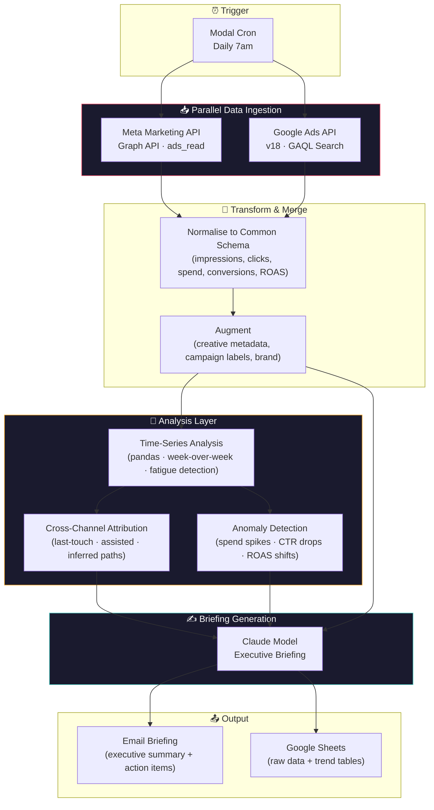

# 📊 Marketing ROI Analytics Agent

> **Unify cross-channel ad performance, detect what's working, and get an AI-generated executive briefing — every morning, across every brand.**  
> Pull campaign data from Meta and Google Ads in parallel, run time-series analysis, and deliver a natural-language briefing that tells you what to do, not just what happened.

<p align="center">
  <em>🚧 Demo video coming soon — add a 30-second screen recording here showing a daily briefing run</em>
  <!--  -->
</p>

---

## What problem does this solve?

Meta Ads Manager and Google Ads have excellent internal analytics — for their own platform. But no one runs ads on just one platform, and no one manages just one brand. The real problems are:

1. **Cross-channel blindness** — Meta tells you how your Facebook ads performed. Google tells you how your Search ads performed. Neither tells you that the customer who converted via Google Search first saw your brand 4 days earlier in a Facebook retargeting ad
2. **Dashboard fatigue** — Marketing leaders at multi-brand groups log into 10+ separate ad accounts to understand what's happening. There's no portfolio-level view
3. **Analytics, not intelligence** — Dashboards show you charts. They don't tell you *"Creative fatigue is hitting your top Facebook ad set — CTR dropped 30% in 4 days. Here are the three specific ads causing it, what they have in common, and a recommended replacement angle"*
4. **No financial quantification** — Clicks and impressions don't answer the question the CFO asks: "What return did we get on that spend?"

Marketing ROI Analytics Agent sits on top of the platforms, not instead of them. The raw numbers still live in Meta and Google — this agent unifies, analyses, and narrates.

---

## 🏗️ Architecture



### What this does that the ad platforms don't

| Capability | Meta Ads Manager | Google Ads | This Agent |
|---|---|---|---|
| Single-platform metrics | ✅ | ✅ | ✅ |
| Cross-channel unified view | ❌ | ❌ | ✅ |
| Multi-brand portfolio view | ❌ | ❌ | ✅ (10+ brands, one briefing) |
| AI-generated narrative insights | ❌ | ❌ | ✅ ("Creative fatigue on Ad Set 3 — pause and reallocate") |
| Creative fatigue detection | ❌ | ❌ | ✅ (CTR decay rate per ad, per week) |
| Assisted conversion paths | Partial (Facebook-only) | Partial (Google-only) | ✅ (cross-platform path inference) |
| Time-saved / cost-avoided quantification | ❌ | ❌ | ✅ (built-in ROI calculator) |
| Weekly trend comparison | Manual | Manual | ✅ (automated week-over-week with significance flags) |

---

## 🚀 Quickstart

### Prerequisites

- **Python 3.11+** with pip
- A **Modal.com** account ([sign up](https://modal.com))
- A **Supabase** project (free tier works)
- API keys for the services below

### 1. Clone & install

```bash
git clone https://github.com/YOUR_USERNAME/marketing-roi-analytics.git
cd marketing-roi-analytics
pip install -r requirements.txt
```

### 2. Set up API keys

```bash
cp .env.example .env
# Edit .env with your actual keys
```

You'll need accounts at:

| Service | Used for | Approx. cost |
|---|---|---|
| [Modal](https://modal.com) | Serverless orchestration + cron scheduling | ~$0.50/month (compute seconds) |
| [Meta for Developers](https://developers.facebook.com) | Ad account data via Marketing API | Free (reads only) |
| [Google Ads API](https://developers.google.com/google-ads/api) | Campaign data via GAQL queries | Free (basic access) |
| [Supabase](https://supabase.com) | Time-series storage + trend queries | Free tier |
| [Anthropic](https://console.anthropic.com) | Claude for briefing generation | ~$0.03/briefing |

### 3. Configure brand ad accounts

Create a `brands.yaml` file mapping each brand to its ad account credentials:

```yaml
brands:
  - name: "NBL"
    meta_account_id: "act_123456789"
    google_customer_id: "1234567890"
    google_manager_id: "1234567890"
  - name: "Snooze"
    meta_account_id: "act_987654321"
    google_customer_id: "0987654321"
    google_manager_id: "0987654321"
  # ... more brands
```

Credentials are stored in Modal Secrets — never in the config file.

### 4. Deploy

```bash
modal deploy app.py
```

The agent deploys as a scheduled Modal app. It will run daily at 7am, pull data from every configured brand in parallel, analyse it, and email the briefing.

### 5. Run manually (for testing)

```bash
modal run app.py --date 2026-07-14
```

---

## 📁 Project Structure

```
marketing-roi-analytics/
├── app.py                          # Modal app entry point (cron + orchestration)
├── src/
│   ├── ingest/
│   │   ├── meta_api.py             # Meta Marketing API client (Graph API v22)
│   │   └── google_ads_api.py       # Google Ads API client (v18, GAQL)
│   ├── transform/
│   │   ├── normalise.py            # Unify Meta + Google data into common schema
│   │   └── augment.py              # Enrich with creative metadata, labels, brand
│   ├── analyse/
│   │   ├── trends.py               # Week-over-week comparison, fatigue detection
│   │   ├── attribution.py          # Cross-channel path inference
│   │   └── anomalies.py            # Spend/CTR/ROAS anomaly detection
│   ├── generate/
│   │   └── briefing.py             # Claude-powered executive briefing
│   ├── output/
│   │   ├── email_briefing.py       # Format + send via SendGrid/Mailgun
│   │   └── sheets_writer.py        # Write raw data + trends to Google Sheets
│   ├── db/
│   │   ├── supabase_client.py      # Supabase Python client
│   │   └── schema.sql              # Table definitions + trend queries
│   └── models/
│       └── schemas.py              # Pydantic models for the common data schema
├── config/
│   ├── brands.yaml                 # Brand → ad account mappings
│   └── briefing_template.yaml      # Executive briefing format + sections
├── notebooks/
│   └── trend_exploration.ipynb     # Ad-hoc analysis notebook
├── mock_data/
│   ├── meta_mock.json              # Mock Meta API responses (for demo)
│   └── google_ads_mock.json        # Mock Google Ads API responses (for demo)
├── tests/
├── requirements.txt
├── .env.example
├── ARCHITECTURE.md
└── README.md
```

### Key files deep-dive

| File | Role | Why it matters |
|---|---|---|
| `app.py` | Modal entry point | Defines the cron schedule, parallel fan-out to all ad accounts, and the pipeline sequence. ~80 lines. |
| `meta_api.py` | Meta Marketing API client | Authenticates via OAuth, constructs Graph API queries, handles pagination and rate limits. Returns structured campaign/ad-set/ad-level data. |
| `google_ads_api.py` | Google Ads API client | Constructs GAQL queries, handles the SearchStream response format, normalises the micros-based currency values. |
| `normalise.py` | Schema unification | The critical piece — maps Meta's field names (e.g. `actions` → conversions, `spend` in cents) and Google's field names (e.g. `metrics.conversions_value` in micros) into a single common schema. |
| `trends.py` | Time-series analysis | pandas-powered week-over-week comparison. Detects creative fatigue (CTR decay slope), identifies top/bottom movers, flags significant shifts. |
| `attribution.py` | Cross-channel paths | Infers assisted conversion paths from timestamp + channel data. Not a full MMM — lightweight heuristics that work with the available data. |
| `briefing.py` | AI briefing generation | Takes the structured analysis output + trend tables, sends to Claude with a briefing template, returns formatted markdown. |
| `brands.yaml` | Brand configuration | Single source of truth for which ad accounts belong to which brand. Adding a new brand = one YAML entry + granting API access. |

---

## 🎯 The Daily Briefing Format

Every morning, the agent produces a structured briefing. Here's what it covers:

### Section 1: Executive Summary (3 bullet points)

*"The 3 things you need to know today."*

- Top-line portfolio ROAS: blended vs. last week vs. same week last month
- Biggest winner (which brand/campaign drove the most incremental return)
- Biggest concern (which brand/campaign needs attention)

### Section 2: Portfolio Dashboard

A brand-by-brand table with:
- Spend, revenue, ROAS, impressions, clicks, CTR, CPC
- Week-over-week delta on each metric
- Flag icons for significant shifts (↑↓)

### Section 3: Creative Performance Spotlight

The agent identifies:
- **Top creative** — highest ROAS creative across the portfolio this week, with analysis of *why* it's working (hook pattern, format, offer type)
- **Fatigued creative** — creative with declining CTR over 2+ weeks, with a recommended replacement angle
- **Gap** — a creative format or message that none of your brands are using but competitors are

### Section 4: Cross-Channel Insight

*"Customers who converted on Google Search this week first saw a Meta ad in 34% of cases — up from 22% last month. Meta retargeting is feeding your Google bottom-of-funnel. Recommendation: maintain or increase retargeting budget; the path data supports it."*

### Section 5: Recommended Actions (ranked by estimated impact)

Concrete, specific actions:
1. *"Pause NBL Ad Set 3 (fatigued, CTR down 30%). Reallocate $500 to Ad Set 7 (ROAS 4.2x, scaling cleanly)."*
2. *"Refresh creative for Snooze retargeting — current ad has been running 18 days with declining CTR. Suggested hook: social-proof angle (see attached brief)."*
3. *"Google Shopping for Brand Collective is underpacing — spend dropped 40% week-over-week. Check if product feed is healthy."*

### Section 6: Financial Impact Estimate

*"Estimated time saved vs. manual reporting: 8 hours/week. Recommended budget reallocations: ~$1,200/week moved from underperforming to top-performing campaigns. Conservatively, this represents ~$3,600/week in recovered value at current average ROAS."*

---

## 🛡️ Error Handling & Reliability

The agent is designed for **graceful partial failure** — if one brand's API fails, the other 9 still produce results:

- **Per-brand isolation** — each brand's API calls run in separate Modal containers. A Meta API outage for one account doesn't block the pipeline
- **Mock data fallback** — for the demo, if no API credentials are configured, the agent uses mock data matching the exact API response schemas. This means the pipeline runs end-to-end with no real accounts connected
- **Missing platform tolerance** — a brand might run Meta but not Google Ads (or vice versa). The pipeline handles partial data per brand
- **Stale data detection** — if an API returns data that hasn't updated (e.g. Google Ads is 48 hours behind), the briefing flags it: *"⚠️ Google Ads data for Snooze is 2 days stale — verify with platform directly"*
- **Briefing fallback** — if Claude is unavailable, the briefing is sent as a data-only email (tables, no narrative). The pipeline never silently fails

---

## 💰 Cost Model

Monthly cost estimate (production, 10 brands, daily runs):

| Component | Provider | Cost/month |
|---|---|---|
| Compute (30 × ~15s runs) | Modal | ~$0.50 |
| Data storage (time-series) | Supabase | Free tier |
| Briefing generation (30 × ~2K tokens) | Claude | ~$1.80 |
| Email delivery (30 briefings) | SendGrid | Free tier |
| Meta API access | Meta | Free |
| Google Ads API access | Google | Free |
| **Total** | | **~$2.30/month** |

**The cost is in the engineering time, not the infra.** This is a ~$2/month system replacing 8+ hours/week of manual analytics work — roughly $40K/year in recovered analyst time for a marketing team.

---

## 🤔 Design Decisions & Trade-offs

### Why Modal instead of n8n?

| Factor | Modal (chosen) | n8n |
|---|---|---|
| **Parallel API calls** | Native fan-out to 20+ containers | Sequential loop or queue mode |
| **Data analysis** | Full Python — pandas, numpy, scipy | JavaScript function nodes (clunky for data work) |
| **Version control** | Python file — clean diffs, PR reviewable | JSON export — verbose, diffs poorly |
| **Portfolio signal** | Shows engineering depth (code, not nodes) | Shows automation breadth (consistent with existing demos) |
| **Deployment** | `modal deploy app.py` | One-click activate in n8n UI |

n8n is the right tool for sequential, step-by-step operational workflows (like the Email Campaign Prep pipeline). Modal is the right tool when you need parallel data ingestion, proper pandas-based analysis, and git-native code. Using different platforms for different problems signals architectural judgement.

### Why mock data for the demo?

Nobody expects a portfolio demo to connect to live ad accounts with real spend. The mock data approach is deliberate:

- **API-native design** — the mock data matches the exact response schemas of Meta's Graph API and Google's GAQL Search. The code that parses and normalises it is the same code that would run in production
- **Demo runs anywhere** — no OAuth dance, no ad account setup, no waiting for app review. A recruiter can run it
- **Controlled narrative** — the mock data includes specific patterns (a fatiguing creative, a surging competitor) so the briefing shows off the agent's intelligence

The README and code make clear that swapping mock data for real APIs is a credential change, not an architecture change.

### Why not build a dashboard UI?

Dashboards are what the ad platforms already provide. The value of this agent is the **morning briefing** — a narrative that lands in your inbox telling you what to do. A dashboard would compete with Meta and Google's own UIs; the briefing complements them. That said, a lightweight Streamlit or Gradio UI for ad-hoc trend exploration is on the roadmap.

### Multi-brand isolation

Each brand's API credentials are stored as separate Modal Secrets. The pipeline runs per-brand containers that share no state. This means:
- A brand leaving the portfolio is a one-line YAML deletion
- API rate limits are naturally isolated (one container per brand per platform)
- The architecture scales from 3 brands to 50 with zero code changes — Modal handles the fan-out

---

## 🔜 Roadmap

- [ ] **Real API integration** — swap mock data for live OAuth-authenticated Meta and Google Ads connections
- [ ] **Streamlit exploration UI** — lightweight dashboard for ad-hoc trend analysis (not replacing the briefing, augmenting it)
- [ ] **Competitor spend estimation** — integrate Meta Ad Library and Google Transparency Center data for competitive benchmarking
- [ ] **MMM-lite** — lightweight Marketing Mix Modeling using the time-series data across channels
- [ ] **Slack/Teams delivery** — briefing delivery to Slack channels in addition to email
- [ ] **Automated budget reallocation** — read-only analysis today; one-click budget shifts via API (with human approval gate)
- [ ] **Creative A/B test readout** — automatically detect when an A/B test reaches statistical significance and report the winner

---

## 📝 License

MIT — use this for your own projects, commercial or personal.

---

<p align="center">
  <sub>Built with Modal · Python · pandas · Powered by Meta Marketing API, Google Ads API, Supabase & Anthropic</sub>
</p>
