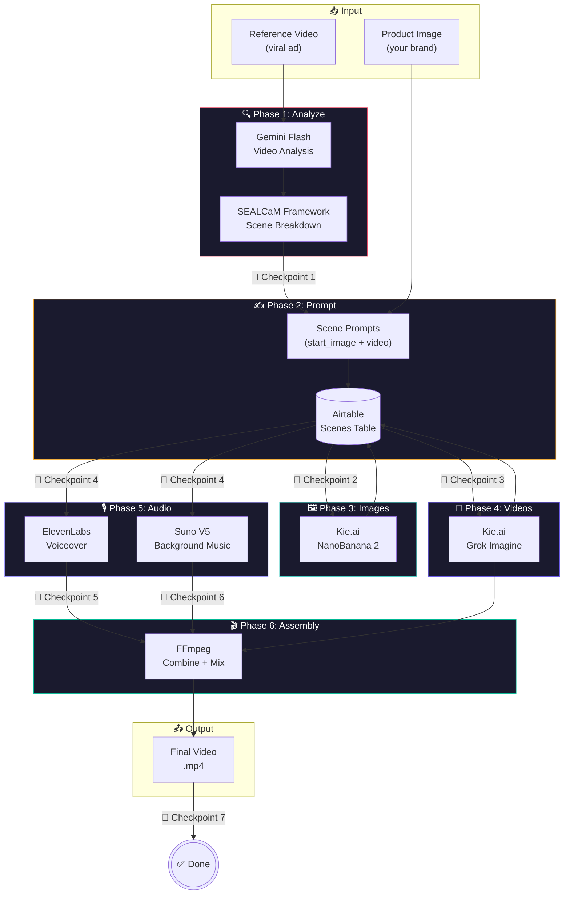

# 🎬 Creative Cloner AI Agent

> **Turn any viral video into your branded content — scene by scene, with AI.**  
> Analyze a reference ad, recreate every shot with your product, and assemble a finished commercial — with human approval at every step.

<p align="center">
  <em>🚧 Demo video coming soon — add a 30-second screen recording here showing a full run</em>
  <!--  -->
</p>

---

## What problem does this solve?

Making a professional video ad takes weeks and costs $5k–$50k. Creative Cloner collapses that to **~30 minutes and ~$1.50** by using AI to:

1. **Deconstruct** a viral reference video into its individual scenes using the **SEALCaM framework** (Subject, Environment, Action, Lighting, Camera, Metatokens)
2. **Rewrite** each scene for *your* product, brand, and style
3. **Generate** new images (NanoBanana 2), animate them into video clips (Grok Imagine), and add voiceover (ElevenLabs) + music (Suno)
4. **Assemble** the final cut with FFmpeg — timed voiceover segments, background music, and text overlay

**The key insight:** Every generation step has a **human checkpoint**. You approve images before paying to animate them, approve the script before paying for voiceover, and so on. No silent spending.

---

## 🏗️ Architecture



### The Checkpoint System

Every phase has a **mandatory human gate**. The agent cannot proceed without explicit approval. This is deliberately designed — AI generation is cheap but not free, and bad outputs compound downstream. A wrong image wasted 3 minutes; a wrong video wastes 10.

| # | Checkpoint | What you review | Cost to redo |
|---|---|---|---|
| 1 | Scene breakdown | SEALCaM analysis accuracy | Free (prompt only) |
| 2 | Prompts & costs | Image + video prompts, $ estimate | Free (prompt only) |
| 3 | Generated images | Actual images | $0.06/image |
| 4 | Generated videos | Actual video clips | $0.048/video |
| 5 | Voiceover script | Narration text | Free (prompt only) |
| 6 | Voiceover + music | Audio files | ~$0.12 total |
| 7 | Final video | Complete assembled ad | Full pipeline |

---

## 🚀 Quickstart

### Prerequisites

- **Python 3.10+** with pip
- **FFmpeg** installed and on your PATH ([download](https://ffmpeg.org/download.html))
- **Claude Code** ([install](https://docs.anthropic.com/en/docs/claude-code/overview))
- API keys for the services below

### 1. Clone & install

```bash
git clone https://github.com/YOUR_USERNAME/creative-cloner.git
cd creative-cloner
pip install -r .agent/requirements.txt
```

### 2. Set up API keys

```bash
cp .env.example .env
# Edit .env with your actual keys (see .env.example for links)
```

You'll need accounts at:
| Service | Used for | Approx. cost |
|---|---|---|
| [Kie.ai](https://kie.ai) | Image + Video + Music generation | ~$0.06/image, ~$0.05/video |
| [Google AI Studio](https://aistudio.google.com/apikey) | Video analysis (Gemini) | Free tier available |
| [Airtable](https://airtable.com/create/tokens) | Asset tracking & prompt logging | Free tier |
| [ElevenLabs](https://elevenlabs.io) | Voiceover generation | ~$0.02/segment |

### 3. Create an Airtable base

Create a base with a table called **Scenes** and these fields:

| Field | Type |
|---|---|
| `Project Name` | Single line text |
| `scene` | Single line text |
| `start_image_prompt` | Long text |
| `video_prompt` | Long text |
| `start_image` | Attachment |
| `scene_video` | Attachment |
| `voiceover_script` | Long text |
| `voiceover` | Attachment |
| `background_music` | Attachment |

### 4. Run it

```bash
# Put your reference video and product image in a project folder
mkdir -p inputs/my-project
cp ~/Downloads/viral-ad.mp4 inputs/my-project/
cp ~/Downloads/my-product.png inputs/my-project/

# Start Claude Code and tell it what you want
claude
```

Then in Claude Code:

> "Recreate the video in `inputs/my-project/viral-ad.mp4` but replace their product with mine from `my-product.png`. Make it feel like a luxury car commercial."

The agent will walk you through each checkpoint — you approve at every step.

---

## 📁 Project Structure

```
creative-cloner/
├── .agent/
│   ├── skills/creative-cloner/
│   │   └── SKILL.md              # Claude Code skill definition (the "brain")
│   ├── .env.example              # API key template (copy to .env)
│   └── requirements.txt          # Python dependencies
├── tools/                        # Pipeline scripts (importable modules)
│   ├── analyze_video.py          # Gemini-powered SEALCaM analysis
│   ├── generate_images.py        # NanoBanana 2 via Kie.ai + Airtable logging
│   ├── generate_videos.py        # Grok Imagine via Kie.ai + Airtable logging
│   ├── generate_voiceover.py     # ElevenLabs TTS
│   ├── generate_music.py         # Suno V5 via Kie.ai
│   └── combine_all.py            # FFmpeg assembly with segmented audio
├── inputs/                       # Your projects go here
│   └── your-project/
│       ├── video.mp4             # Reference video
│       ├── product.png           # Your product/brand image
│       └── prompts.yaml          # Generated scene prompts
├── outputs/                      # Final videos land here
├── .gitignore
└── README.md
```

### Key files deep-dive

| File | Role | Why it matters |
|---|---|---|
| `SKILL.md` | Agent prompt/behavior definition | Contains the 7 checkpoint rules, cost transparency, error handling policy (never auto-retry Kie AI failures). This is the "operating manual" for the AI agent. |
| `generate_images.py` | Image gen + upload + Airtable sync | Uploads reference images to Kie.ai, generates with NanoBanana 2, polls for completion, logs result to Airtable. ~150 lines. |
| `generate_videos.py` | Video gen + Airtable sync | Same pattern as images but with 10-minute timeout (videos take longer). Handles `fail`/`unknown`/`timeout` states explicitly. |
| `generate_music.py` | Suno V5 music gen | Supports custom mode (style + title) and instrumental-only. Polls for up to 8 minutes. Returns audio URL or `None` on failure. |
| `combine_all.py` | FFmpeg orchestration | Concatenates video clips, mixes background music with volume ducking, places voiceover segments at timed offsets, renders text overlay. Falls back to silent assembly if audio mix fails. |

---

## 🎯 The SEALCaM Framework

Every scene is described using 6 dimensions — this structured format lets the AI write precise generation prompts:

| Dimension | What it captures | Example |
|---|---|---|
| **S**ubject | Primary focus of the shot | "BMW E30 M3, aggressive stance" |
| **E**nvironment | Setting, depth, atmosphere | "Frozen lake, pine forest, mountains" |
| **A**ction | Motion and blocking | "Car drifting sideways, snow spraying" |
| **L**ighting | Light quality and direction | "Golden hour rim light, high contrast" |
| **Ca**mera | Lens, angle, movement | "Low angle, 35mm, tracking shot" |
| **M**etatokens | Style and quality cues | "1980s VHS aesthetic, cinematic, 4K" |

This isn't just prompt engineering — it's a **formal decomposition** that makes the creative process repeatable. Different reference videos, same framework.

---

## 🛡️ Error Handling & Reliability

The agent has a **no-silent-retry policy** for API failures. This is intentional:

```python
# From SKILL.md — the agent's operating rules:
# "If Kie AI fails, DO NOT automatically retry!
#  Retrying without asking can create duplicate images/videos and waste money!"
```

When a generation fails, the agent:
1. **Stops immediately** (no retry loop)
2. **Explains the error** in plain English (translating timeout/"fail"/"unknown"/network states)
3. **Gives the user 3 options:** Retry (new generation, new cost) / Check Kie.ai dashboard (the job might have succeeded silently) / Skip this scene

This is the kind of production thinking that separates a demo from a tool you'd actually pay money to use.

---

## 💰 Cost Model

Transparent per-unit pricing, shown to the user *before* each generation step:

| Asset | Provider | Cost/unit | Time/unit |
|---|---|---|---|
| Scene analysis | Gemini Flash | Free | ~30s |
| Image (2K) | NanoBanana 2 via Kie.ai | $0.06 | ~30-60s |
| Video (6s, 480p) | Grok Imagine via Kie.ai | $0.048 | ~2-4 min |
| Music track | Suno V5 via Kie.ai | ~$0.10 | ~1-3 min |
| Voiceover segment | ElevenLabs via Kie.ai | ~$0.02 | ~5s |

**Typical 7-scene ad:** ~$1.50–$2.00 and ~25–35 minutes total (mostly waiting for video generation).

---

## 📊 Real Projects Built With This

| Project | Reference | Scenes | Output | Notes |
|---|---|---|---|---|
| **BYD** | Car drifting ad | 7 | `outputs/BYD_final.mp4` | BMW E30 M3 → BYD SUV, 1980s VHS style |
| **BYD Moon** | Same reference, different direction | 7 | `outputs/BYD_Moon_final_with_logo.mp4` | Added segmented voiceover + logo overlay |
| **AETOS Offroad** | SUV adventure ad | 8 | *(in progress)* | Full pipeline with variation downloads |

---

## 🤔 Design Decisions & Trade-offs

### Why a Claude Code skill instead of a pure Python script?

| Approach | Pros | Cons |
|---|---|---|
| **Claude Code skill** (chosen) | Natural language interface, flexible prompt writing by an LLM, handles edge cases conversationally, easy to iterate | Requires Claude Code, higher per-run token cost |
| Pure Python script | Deterministic, no LLM dependency, faster | Rigid — can't handle "make it more dramatic" feedback mid-pipeline, hardcoded prompts |

The skill approach means the prompt-writing step (Phase 2) benefits from an LLM that can adapt to any product, style, or creative direction. A pure script would need template prompts that feel generic.

### Why human checkpoints instead of full automation?

Fully automated "click button → get video" sounds appealing but fails in practice because:
- **Image generation is stochastic** — 30% of outputs need retries for quality
- **Cost compounds** — a bad image becomes a bad video (wasted $0.05) becomes a bad scene (wasted time)
- **Creative direction is subjective** — "make it more energetic" isn't something you can encode in a config file

The checkpoint system catches failures at the cheapest possible stage.

### Why Airtable for logging?

Airtable gives you a **visual, shareable record** of every generation — prompts, images, videos, audio. This means:
- Non-technical stakeholders can review generations in a browser
- You can A/B test prompts and compare results side by side
- It doubles as a project portfolio (every row = one scene with all its assets)

---

## 🔜 Roadmap

- [ ] **Multi-variation support** — generate 3 variations per scene, pick the best
- [ ] **Style transfer presets** — "1980s VHS", "Apple commercial", "Nike ad" as one-click options
- [ ] **Direct social media export** — 9:16 vertical format with auto-cropping
- [ ] **Cost tracking dashboard** — per-project spend summary
- [ ] **Parallel generation** — generate all scene images simultaneously (currently sequential due to checkpoint design)

---

## 📝 License

MIT — use this for your own projects, commercial or personal. See [LICENSE](LICENSE).

---

## 🙋 FAQ

**Q: Do I need a GPU?**  
No. All generation happens in the cloud via Kie.ai, Gemini, ElevenLabs, and Suno APIs.

**Q: How long does a full run take?**  
~25–35 minutes for a 7-scene ad. Most of that is waiting for video generation (2–4 minutes per clip).

**Q: Can I use this without Claude Code?**  
The Python tools in `tools/` are standalone — you can import `generate_images`, `generate_videos`, etc. in your own scripts. But the prompt-writing and creative decisions currently require an LLM.

**Q: What if a generation fails?**  
See the [error handling section](#-error-handling--reliability). The agent never auto-retries — it explains the error and asks what you want to do.

---

<p align="center">
  <sub>Built with Claude Code · Powered by Kie.ai, Gemini, ElevenLabs & Suno</sub>
</p>
