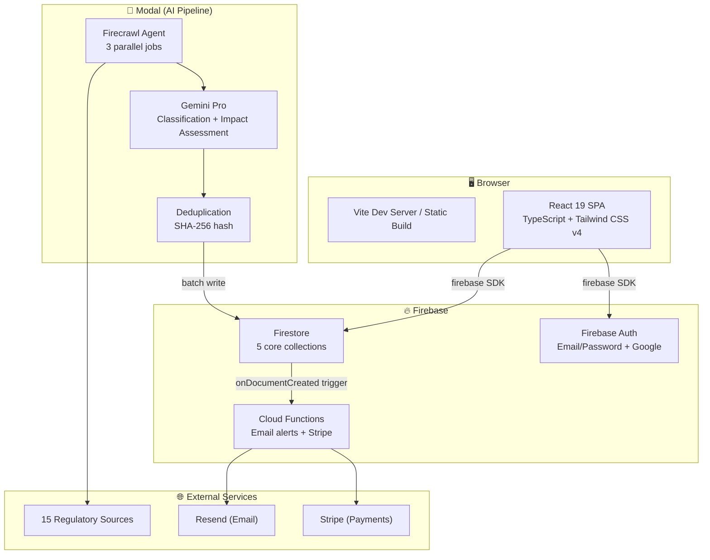
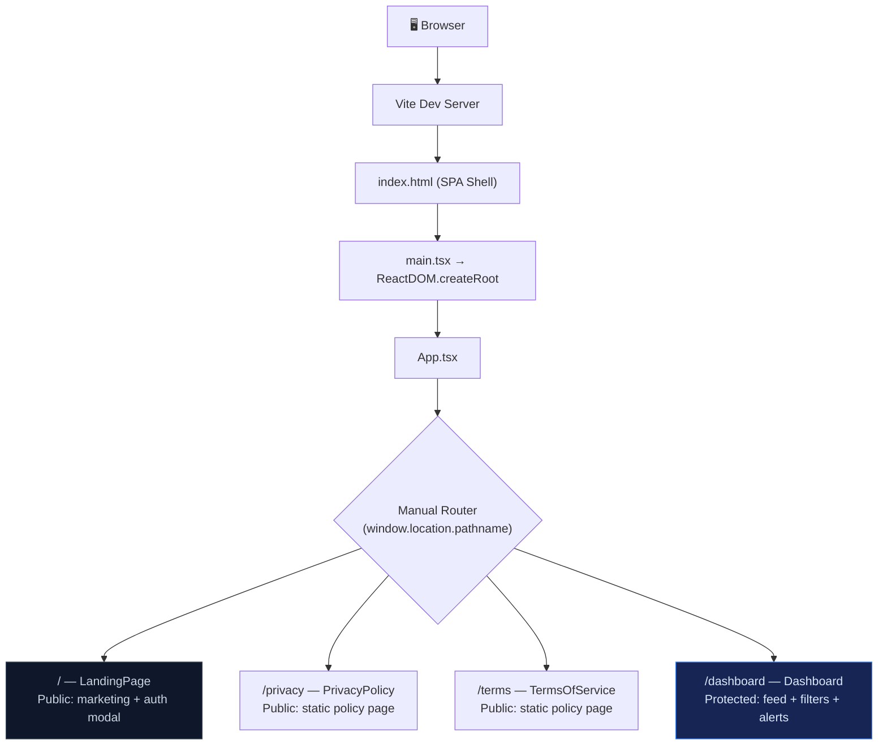
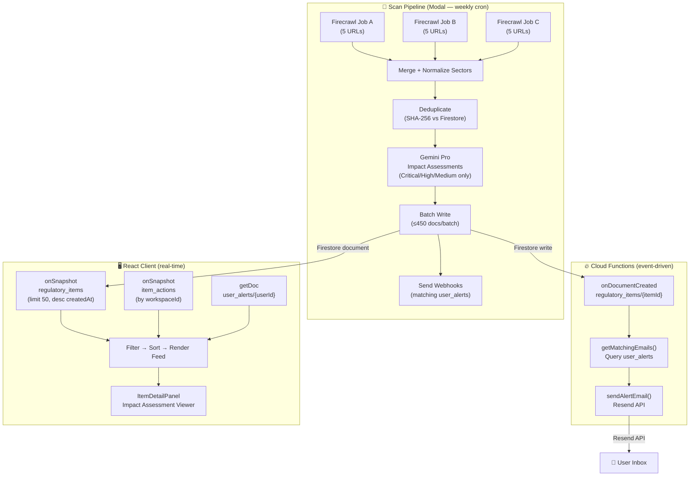
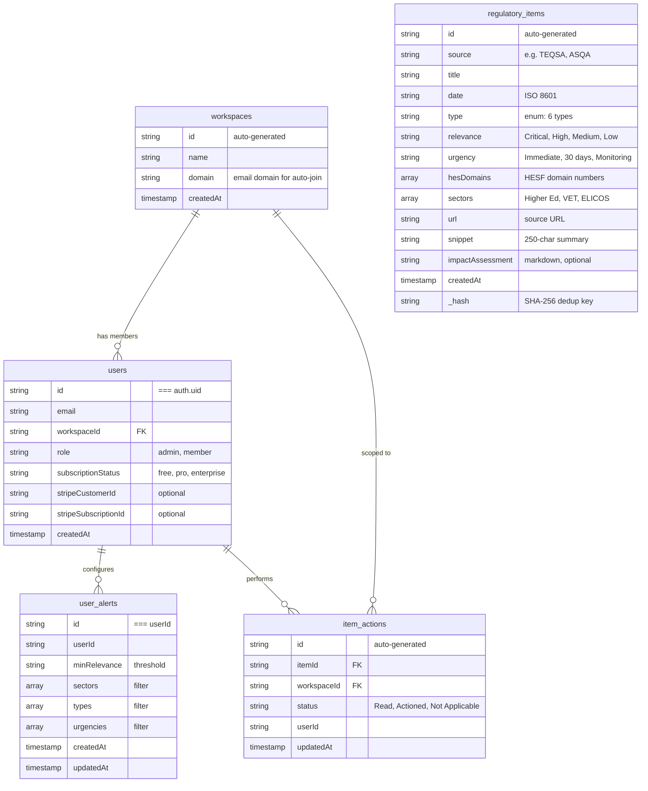

# 🏗️ Regulatory Radar — Architecture Deep Dive

## Table of Contents

- [System Overview](#system-overview)
- [Route Architecture](#route-architecture)
- [Data Flow](#data-flow)
- [Component Details](#component-details)
- [Firestore Data Model](#firestore-data-model)
- [AI Scanning Pipeline](#ai-scanning-pipeline)
- [Cloud Functions](#cloud-functions)
- [Authentication & Authorisation](#authentication--authorisation)
- [Multi-Product Architecture](#multi-product-architecture)
- [Security Model](#security-model)
- [Error Handling Strategy](#error-handling-strategy)
- [Email Alert System](#email-alert-system)
- [Performance Profile](#performance-profile)
- [Design Decisions](#design-decisions)
- [Extending the System](#extending-the-system)

---

## System Overview

Regulatory Radar is a **three-tier AI-native platform** that automatically monitors Australian education regulatory sources. It combines a **Modal-hosted AI pipeline** (Firecrawl + Gemini), a **Firebase backend** (Firestore + Cloud Functions), and a **React SPA frontend** (Vite + TypeScript + Tailwind CSS).



**Key insight:** The three tiers have clean separation. The Modal pipeline **writes** to Firestore. The Cloud Functions **react** to new writes. The React frontend **reads and acts**. No tier depends on another's internal state — Firestore is the single source of truth.

---

## Route Architecture



### Routing approach

The app uses a **minimal manual router** rather than React Router. The current path is tracked via `useState(window.location.pathname)` with a `popstate` listener for back/forward navigation. Navigation uses `window.history.pushState` / `replaceState`.

This was chosen for the initial build because:
- Only 4 routes exist (landing, dashboard, privacy, terms)
- No nested layouts or parameterised routes needed
- Simpler auth redirect logic (effect-based, no `<Navigate>` components)

### Auth Flow

```
1. User visits / → LandingPage renders (marketing content + "Portal" button)
2. User clicks "Portal" → AuthModal opens (Email/Password or Google sign-in)
3. Firebase Auth returns session → App re-renders with `user` state populated
4. Effect detects `user && path === '/'` → navigates to `/dashboard`
5. User's workspace is auto-resolved (match by email domain, or create new)
6. Subscription status loaded from Firestore `users/{uid}`
```

### Auth Guard

There's no separate `ProtectedRoute` component. The auth guard is inline in `App.tsx`:

```typescript
// Simplified logic
if (loading) return <Spinner />
if (path !== '/dashboard') return <LandingPage />
if (!user) {
  // Redirect effect will fire on next tick
  return <Spinner />
}
return <Dashboard /> // Sidebar + nav + feed + item detail panel
```

The redirect is handled by a `useEffect` that watches `[path, user, loading]` and syncs the URL with auth state. This avoids flash-of-wrong-page by waiting for `loading` to resolve before redirecting.

---

## Data Flow



### Real-time updates

The React frontend uses Firestore's **real-time listeners** (`onSnapshot`) rather than one-shot queries:

- **`regulatory_items`**: `onSnapshot` with `orderBy('createdAt', 'desc')` and `limit(50)`. New items appear instantly when the Modal pipeline writes them — no refresh needed.
- **`item_actions`**: `onSnapshot` filtered by `workspaceId`. Actions (Read/Actioned/N/A) update across all workspace members in real time.

This means the dashboard is **always live** — a new critical item appears in the feed seconds after the scan pipeline writes it.

### User alert settings

Alert preferences are loaded once via `getDoc` (not a real-time listener) because they only change when the user saves settings. After save, a `useEffect` dependency on `user` re-fetches them.

---

## Component Details

### 1. Application Shell (`App.tsx`)

```
┌──────────────────────────────────────────────────────────┐
│                        App.tsx                            │
│  ┌─────────────┐  ┌──────────┐  ┌─────────────────────┐ │
│  │ Auth State   │  │  Router  │  │   Subscription      │ │
│  │ (user,       │  │  (path)  │  │   (free/pro/enter)  │ │
│  │  workspace)  │  │          │  │                     │ │
│  └─────────────┘  └──────────┘  └─────────────────────┘ │
│                                                          │
│  ┌──────────────────────────────────────────────────┐   │
│  │                 Dashboard Layout                   │   │
│  │  ┌──────────┐  ┌──────────────────────────────┐  │   │
│  │  │          │  │  Top Nav (tabs + search +     │  │   │
│  │  │ Sidebar  │  │  sort + notifications)        │  │   │
│  │  │ (brand,  │  │  ──────────────────────────── │  │   │
│  │  │  nav,    │  │  Stats Bar (critical/high/    │  │   │
│  │  │  avatar) │  │  medium counts)               │  │   │
│  │  │          │  │  ──────────────────────────── │  │   │
│  │  │          │  │  Filter Tabs (All / Critical+ │  │   │
│  │  │          │  │  High / Legislative / etc.)   │  │   │
│  │  │          │  │  ──────────────────────────── │  │   │
│  │  │          │  │  Feed (list of item cards)    │  │   │
│  │  │          │  │                               │  │   │
│  │  └──────────┘  └──────────────────────────────┘  │   │
│  └──────────────────────────────────────────────────┘   │
│                                                          │
│  ┌───────────────────────┐  ┌────────────────────────┐  │
│  │ Alert Settings Tab     │  │ Profile Tab             │  │
│  │ (threshold + filters)  │  │ (display name, email,   │  │
│  │                        │  │  subscription, billing) │  │
│  └───────────────────────┘  └────────────────────────┘  │
│                                                          │
│  + ItemDetailPanel (slide-out overlay, always mounted)   │
└──────────────────────────────────────────────────────────┘
```

### 2. Item Detail Panel (`ItemDetailPanel.tsx`)

The detail panel is a **slide-out overlay** that appears from the right when a user clicks a feed item. It's always mounted but hidden (`selectedItem === null`).

```
┌───────────────────────────────┐
│  ← Back to Feed               │
│  ─────────────────────────    │
│  Relevance · Urgency · Type   │
│                               │
│  # Title                      │
│  Source · Date                │
│                               │
│  ─── Impact Assessment ───    │
│  (rendered as Markdown)       │
│  · Executive Summary          │
│  · Potential Considerations   │
│  · Operational Impact         │
│  · Key Areas for Review       │
│  · HES Domain Mapping         │
│                               │
│  ─── Actions ─────────────    │
│  [Read] [Actioned] [N/A]     │
│                               │
│  Original Source → (link)     │
│                               │
│  ─── Disclaimer ──────────    │
│  Not legal advice banner      │
└───────────────────────────────┘
```

For free-tier users, the impact assessment body is blurred with an upgrade CTA overlay — the title, metadata, and source link remain visible as a teaser.

### 3. Config-Driven Components

The `DashboardConfig` interface (defined in `src/config/types.ts`) drives every aspect of the UI:

| Config section | What it controls | Example (Regulatory Radar) |
|---|---|---|
| `dashboard` | Page title, description, search placeholder, sidebar labels | "Regulatory Signals" |
| `filterTabs` | Quick-filter tabs with built-in filter functions | All / Critical+High / Legislative / Guidance / Alerts / Policy |
| `categories` | Multi-select filter chips with strict matching | Higher Ed, VET, ELICOS |
| `itemTypes` | Type filter chips | Legislative Change, Regulatory Guidance, etc. |
| `sortOptions` | Sort dropdown | Date, Relevance, Sector |
| `alertSettings` | Alert page copy, threshold options | Critical Only, High & Critical, etc. |
| `pricing` | Pro tier name, price, features, Stripe URL | "Compliance Pro", "$19 AUD/month" |
| `impactAssessment` | Framework name, stakeholder list, disclaimer text | "HESF (2021)" |

This means the same `App.tsx` renders completely different dashboards for different products just by swapping the config.

---

## Firestore Data Model

6 collections with security rule enforcement:



### Collection write policies

| Collection | Created by | Rationale |
|---|---|---|
| `regulatory_items` | Modal pipeline (admin SDK) | Immutable from frontend — preserves audit integrity |
| `user_alerts` | End user (authenticated) | User owns their alert configuration |
| `item_actions` | End user (authenticated) | User owns their triage actions |
| `workspaces` | End user (authenticated, on sign-up) | Auto-created by email domain match |
| `users` | End user (authenticated, on sign-up) | Self-registration with email verification |

### Deduplication strategy

The `_hash` field is `SHA-256(title.lower() + "|" + url.lower())`. Before writing, the Modal pipeline loads all existing hashes from Firestore and filters out matches. This prevents the same regulatory update from appearing multiple times (e.g. if re-crawled across successive scans).

---

## AI Scanning Pipeline

### Architecture (`modal/scan.py`)

```
@app.function(schedule=Cron("0 6 * * 3"))  # Wed 06:00 UTC
def run_scan():
    # Step 1: Fan out
    job_a = run_firecrawl_job.spawn(FIRECRAWL_URLS_A, "A")   # 5 URLs
    job_b = run_firecrawl_job.spawn(FIRECRAWL_URLS_B, "B")   # 5 URLs
    job_c = run_firecrawl_job.spawn(FIRECRAWL_URLS_C, "C")   # 5 URLs

    # Wait for all three
    results_a = job_a.get()  # blocks until Job A completes
    results_b = job_b.get()
    results_c = job_c.get()

    # Step 2: Merge + normalize
    items = results_a + results_b + results_c
    items = normalize_sectors(items)  # fix AI aliases, infer from URL

    # Step 3: Deduplicate
    new_items = filter_new_items(db, items)  # SHA-256 vs Firestore

    # Step 4: Enrich Critical/High/Medium with Gemini
    for item in new_items:
        if item['relevance'] in {'Critical', 'High', 'Medium'}:
            item['impactAssessment'] = generate_impact_assessment(item)

    # Step 5: Write to Firestore (batch, ≤450 docs/batch)
    write_to_firestore(db, new_items)

    # Step 6: Notify via webhooks (legacy, email alerts are now Cloud Function)
    send_webhooks(db, new_items)
```

### Firecrawl Agent integration

Each Firecrawl Agent job sends a **JSON schema** defining the exact shape of items to extract. The schema enforces enum values for `relevance`, `urgency`, `type`, and `sectors` — so the AI's output is always structurally valid:

```python
schema = {
    "type": "object",
    "properties": {
        "items": {
            "type": "array",
            "items": {
                "type": "object",
                "properties": {
                    "source": {"type": "string"},
                    "title": {"type": "string"},
                    "date": {"type": "string"},
                    "type": {"type": "string", "enum": [
                        "Legislative Change", "Regulatory Guidance",
                        "Sector Alert", "Good Practice",
                        "Administrative", "Policy/Reform"
                    ]},
                    "relevance": {"type": "string", "enum": [
                        "Critical", "High", "Medium", "Low"
                    ]},
                    "urgency": {"type": "string", "enum": [
                        "Immediate", "Within 30 days", "Monitoring"
                    ]},
                    # ...
                },
                "required": ["source", "title", "date", "type",
                             "relevance", "urgency", "url", "summary", "full_text"]
            }
        }
    },
    "required": ["items"]
}
```

### Gemini Pro impact assessments

The assessment prompt is **relevance-gated**:
- **Critical/High items** → Full 5-section report (Executive Summary, Potential Considerations, Operational Impact, Key Areas for Review, HES Domain Mapping) — target 700–750 words
- **Medium items** → 3-section report (Executive Summary, Operational Impact, HES Domain Mapping)
- **Low items** → No assessment generated (raw summary suffices)

The prompt includes strict constraints: UK English, considerative language ("institutions may wish to review…"), no legal advice, no filler phrases. The output is structured Markdown rendered directly in the item detail panel.

### Sector normalisation

The AI sometimes returns non-standard sector names (e.g. "VET" instead of "Vocational Education"). The `normalize_sectors()` function maps aliases and falls back to URL-based inference:

```python
SOURCE_SECTOR_MAP = [
    ("asqa.gov.au", ["Vocational Education"]),
    ("teqsa.gov.au", ["Higher Education"]),
    ("englishaustralia.com.au", ["ELICOS"]),
    # ...
]
```

### Dual product support

The Modal pipeline has **two scan scripts** writing to **two separate Firestore collections**:

| Script | Collection | Focus | Cadence |
|---|---|---|---|
| `scan.py` | `regulatory_items` | Australian education regulation | Weekly (Wed 06:00 UTC) |
| `scan_ai_act.py` | `ai_compliance_items` | EU AI Act, ISO 42001, NIST AI RMF | Weekly (separate schedule) |

Both share the same pattern (Firecrawl → Gemini → Firestore) but with different prompts, schemas, and classification axes.

---

## Cloud Functions

### Email Alert Dispatcher (`dispatchEmailAlerts`)

```typescript
export const dispatchEmailAlerts = onDocumentCreated({
  document: "regulatory_items/{itemId}",
}, async (event) => {
  const item = event.data.data();  // the new document

  // Find all user_alerts where:
  //   1. minRelevance ≤ item.relevance
  //   2. User's sectors filters intersect item.sectors
  //   3. User's types filters include item.type
  const matches = await getMatchingEmails(item, 'user_alerts', 'sectors');

  // Send personalised HTML email to each matching user
  for (const match of matches) {
    await sendAlertEmail(match.email, item, snapshot.id, options);
  }
});
```

### Matching logic (`getMatchingEmails`)

The function is **parameterised by collection and category field** — the same logic serves both Regulatory Radar (`user_alerts`, `sectors`) and CompRadar (`ai_compliance_alerts`, `riskTiers`):

1. Fetch all user alert documents
2. For each alert, check relevance threshold (index comparison on `['Low', 'Medium', 'High', 'Critical']`)
3. Check category intersection (user's selected sectors vs item's sectors)
4. Check type inclusion (user's selected types must include item's type)
5. If all match, resolve the user's email via Firebase Admin Auth
6. Return `{ email, item }[]` for dispatch

### Email HTML generation

Emails are **inline-styled HTML** (no external CSS) for maximum email client compatibility. The template includes:
- Dark navy header with title
- Colour-coded relevance + urgency badges
- Full impact assessment rendered from Markdown → inline-styled HTML
- Deep-link CTA to the dashboard item
- Legal disclaimer banner (amber, prominent)

### Stripe Integration

Two Cloud Functions manage subscriptions:

| Function | Trigger | What it does |
|---|---|---|
| `stripeWebhook` | HTTP POST from Stripe | `checkout.session.completed` → upgrade user to "pro" in Firestore. `customer.subscription.deleted` → downgrade to "free" |
| `createPortalSession` | Callable from client | Creates a Stripe Customer Portal session for subscription management (billing, cancellation) |

---

## Authentication & Authorisation

### Auth methods

- **Email/Password** — primary method, with Firebase handling verification
- **Google OAuth** — available in the AuthModal via `signInWithPopup`
- Auth state is managed via `onAuthStateChanged` listener — the entire app re-renders when auth state changes

### Workspace auto-resolution

On first sign-in, users are automatically assigned to a workspace:

```
1. Check if user doc exists in Firestore `users/{uid}`
2. If yes → load existing workspaceId
3. If no → extract domain from email (e.g. "university.edu.au")
4. → Query `workspaces` for matching domain
5. → If match: join existing workspace
6. → If no match: create new workspace with that domain
7. → Write user doc with workspaceId
8. → Show pricing page for new users
```

### Security rules enforcement

Authorisation is **database-level** via Firestore security rules:

```javascript
// regulatory_items: read by anyone authenticated, write disabled from frontend
match /regulatory_items/{itemId} {
  allow read: if isAuthenticated();
  allow create, update, delete: if false;  // admin SDK bypasses this
}

// user_alerts: full CRUD for owner only
match /user_alerts/{userId} {
  allow read, create, update, delete: if isOwner(userId);
  // create/update additionally validates field types, lengths, and enums
}
```

**The security rules are the enforcement layer.** The client code never filters by user ID in read queries (Firestore does it). Even if a client sends `collection('user_alerts').get()`, RLS scopes it to the caller's own document.

---

## Multi-Product Architecture

The codebase supports two products from a single codebase:

| Aspect | Regulatory Radar | CompRadar |
|---|---|---|
| **Config** | `regulatoryRadarConfig` | Separate config |
| **Firestore collections** | `regulatory_items`, `user_alerts`, `item_actions` | `ai_compliance_items`, `ai_compliance_alerts`, `ai_compliance_actions` |
| **Category field** | `sectors` (Higher Ed, VET, ELICOS) | `riskTiers` (Prohibited, High Risk, Limited Risk, Minimal Risk) |
| **Domain field** | `hesDomains` (HESF domain numbers) | `aiActArticles` (EU AI Act article numbers) |
| **Item types** | Legislative Change, Regulatory Guidance, etc. | EU AI Act Update, ISO 42001 Amendment, Enforcement Action, etc. |
| **AI pipeline** | `modal/scan.py` (15 education URLs) | `modal/scan_ai_act.py` (AI regulation URLs) |
| **Cloud Functions** | Shared — parameterised by collection name | Shared — parameterised by collection name |
| **Icon** | Radar concentric circles | Shield |

### How it works technically

The `DashboardConfig` TypeScript interface defines every variable aspect of the product. The `getConfig(path)` function selects the right config based on the URL path (currently hardcoded to `regulatoryRadarConfig` pending a proper router upgrade). All components read from the config object — no component has product-specific logic.

The Cloud Functions achieve multi-product support by accepting `collection` and `categoryField` as parameters to `getMatchingEmails()`. The alert dispatch function hardcodes the collection name, but the matching engine is generic.

---

## Security Model

### Secrets management

```
.env.local                  ← NOT committed (in .gitignore)
├── Firebase config         ← public (anon key is safe in bundle)
└── GEMINI_API_KEY          ← client-side (used for inline features)

functions/.env              ← NOT committed
├── RESEND_API_KEY
├── STRIPE_SECRET_KEY
├── STRIPE_WEBHOOK_SECRET
└── SERVICE_ACCOUNT_JSON    ← Firebase Admin SDK credentials

Modal Secrets               ← Stored in Modal platform
├── FIRECRAWL_API_KEY
├── GEMINI_API_KEY
├── FIREBASE_SERVICE_ACCOUNT_JSON
└── FIREBASE_DATABASE_ID
```

### Defence in depth

| Layer | Mechanism | What it protects |
|---|---|---|
| Transport | HTTPS (Firebase enforces, Resend enforces, Stripe enforces) | Data in transit |
| Authentication | Firebase Auth (JWT-based sessions) | User identity |
| Authorisation | Firestore security rules (per-collection, per-document) | Data access |
| Frontend immutability | `allow create: if false` on `regulatory_items` | Scan pipeline integrity |
| Validation | Security rule field validators (type, length, enum, URL format) | Data integrity |
| Secrets | Environment variables + Modal secrets — never in client bundle | API keys |
| Input sanitisation | Zod-like manual validation in security rules | Malformed writes |

### The anon key is safe

Firebase's "anon key" is designed to be public — it's included in the client bundle (`firebase-applet-config.json`). It has the permissions of an unauthenticated user. All actual authorisation happens at the security rules level, which checks the user's JWT on every query and mutation. The Firebase Admin SDK key (which bypasses all rules) never leaves the server (Cloud Functions + Modal).

---

## Error Handling Strategy

### Layer 1: Firestore security rule validation

Malformed writes are rejected at the database level before any data is stored:

```javascript
function isValidRegulatoryItem(data) {
  return hasRequiredFields(['source', 'title', 'date', 'type', ...]) &&
         data.relevance in ['Critical', 'High', 'Medium', 'Low'] &&
         data.urgency in ['Immediate', 'Within 30 days', 'Monitoring'] &&
         data.url is string && (data.url.matches("^https://.*") || ...) &&
         // ...
}
```

### Layer 2: Client-side error capture

All Firestore operations are wrapped with error handling that captures the full context:

```typescript
function handleFirestoreError(error, operationType, path) {
  const errInfo = {
    error: error.message,
    operationType,  // CREATE, UPDATE, DELETE, LIST, GET, WRITE
    path,           // collection path
    authInfo: {     // full auth context for debugging
      userId, email, emailVerified, isAnonymous, providerInfo
    }
  }
  console.error('Firestore Error: ', JSON.stringify(errInfo));
}
```

### Layer 3: User-facing toasts

All mutations show success/error feedback via `sonner` toasts:

```typescript
try {
  await setDoc(doc(db, 'user_alerts', user.uid), { ... })
  toast.success('Settings saved successfully!')
} catch (error) {
  toast.error('Failed to save settings.')
  handleFirestoreError(error, OperationType.WRITE, `user_alerts/${user.uid}`)
}
```

### Layer 4: Modal pipeline resilience

The scan pipeline is **idempotent by design**:
- SHA-256 dedup prevents re-processing already-seen items
- Batch writes use Firestore batches (≤450 docs/batch) to handle large volumes
- Gemini assessment failures for individual items don't block other items
- Empty Firecrawl results are handled gracefully (log + return, no crash)
- Webhook failures log and continue — one bad webhook URL doesn't block others

---

## Email Alert System

### Template structure

Emails are purpose-built for compliance professionals:

```
┌──────────────────────────────────────┐
│  REGULATORY RADAR ALERT              │  ← Dark navy header
│  [Title of regulatory update]        │
├──────────────────────────────────────┤
│  🔴 Critical  ⏰ Immediate  📋 Type  │  ← Colour-coded badges
│  Higher Education, VET               │
├──────────────────────────────────────┤
│  Impact Assessment                   │
│  ──────────────────────────────────  │
│  Executive Summary                   │  ← Rendered from Markdown
│  ...                                 │     to inline-styled HTML
│  Potential Considerations            │
│  ...                                 │
│  Operational Impact                  │
│  ...                                 │
│  Key Areas for Review                │
│  ...                                 │
│  HES Domain Mapping                  │
│  ...                                 │
├──────────────────────────────────────┤
│  [View in Dashboard]  ← Deep link    │  ← Sky blue CTA button
│  You received this because you       │
│  have matching alert configured.     │
├──────────────────────────────────────┤
│  ⚠ IMPORTANT — Not Legal Advice     │  ← Amber disclaimer banner
│  This is a regulatory intelligence   │
│  aggregator...                       │
└──────────────────────────────────────┘
```

### Markdown → Email HTML conversion

The `assessmentToEmailHtml()` function converts Gemini's Markdown output to inline-styled HTML using the `marked` library, then injects inline styles via regex replacement. This ensures the email renders consistently across Gmail, Outlook, and Apple Mail without external stylesheets.

---

## Performance Profile

| Metric | Value | Notes |
|---|---|---|
| Initial bundle (gzip) | ~120KB | Vite + tree-shaken Tailwind v4 |
| First contentful paint | ~1.5s | Client-side rendered, no SSR |
| Dashboard load (first 50 items) | ~800ms | Firestore real-time listener, warm cache |
| Item detail open | ~50ms | Already mounted, CSS transition only |
| Scan pipeline (end-to-end) | ~8–12 min | 3 parallel Firecrawl jobs + Gemini enrichment |
| Email delivery (from item write) | ~3–8s | Cloud Function cold start + Resend API |
| Alert matching (100 users) | ~2s | Sequential auth.getUser() calls (rate-limited by Firebase Admin) |

---

## Design Decisions

### 1. Three-tier separation (Modal → Firebase → React)

The AI pipeline, backend logic, and frontend are completely decoupled. This means:
- **The scan can fail** without affecting the dashboard (users still see existing items)
- **The Cloud Functions can be redeployed** without touching the pipeline
- **The frontend can be redesigned** without changing the data model

The trade-off is that coordination happens implicitly through Firestore (eventual consistency, no distributed transactions). For a monitoring dashboard (not a transactional system), this is the right trade-off.

### 2. Real-time listeners over REST polling

Firestore `onSnapshot` subscriptions mean the dashboard is always current — no polling, no refresh buttons. The trade-off is that listeners consume read quota even when no data changes. For a dashboard with ≤50 active items, this is negligible.

### 3. Config-driven UI over hardcoded components

The `DashboardConfig` pattern means adding a new product is ~200 lines of config, not a fork of the codebase. The trade-off is that `App.tsx` is monolithic (~1000 lines) rather than decomposed into product-specific components. This was a deliberate choice for the two-product scale — if the product family grows beyond 3, extracting product-specific rendering into separate components would be warranted.

### 4. Weekly cron over continuous monitoring

The scan runs weekly (Wed 06:00 UTC). Daily or hourly scanning would increase Firecrawl API costs and generate noise (most regulatory sources update weekly, not hourly). The trade-off is that a truly urgent update published Thursday would wait until the following Wednesday — mitigated by the email alert system (once the item is written, notification is near-instant).

### 5. Gemini for classification over fine-tuned model

Using Gemini Pro with a detailed prompt (rather than training a custom classifier) means:
- **Iterable** — tweak the prompt in `modal/scan.py` without retraining
- **Zero training data** — no need to build and maintain a labelled dataset
- **Flexible** — the same model handles both education regulation and AI compliance with different prompts

The trade-off is that prompt engineering is less predictable than a fine-tuned model — edge cases in regulatory language classification require prompt iteration rather than adding training examples.

### 6. Manual router over React Router

The app uses `window.location.pathname` + `popstate` listener rather than React Router. This was chosen because:
- Only 4 routes exist
- No parameterised routes (no `/items/:id`)
- Auth redirect logic is simpler in effects than in `<Navigate>` components

The trade-off is that adding nested routes or parameterised routes would require migrating to React Router. This is acknowledged tech debt.

---

## Extending the System

### Adding a new regulatory source

1. Add the URL to the appropriate group in `modal/scan.py` (`FIRECRAWL_URLS_A/B/C`)
2. Add an entry to `SOURCE_SECTOR_MAP` if sector inference from URL is needed
3. Run a test scan: `modal run scan.py`
4. Verify new items appear in Firestore and the dashboard

### Adding a new product (e.g., "Finance Radar")

1. Create `src/config/financeRadar.ts` implementing `DashboardConfig` — define categories, item types, filter tabs, pricing
2. Update `src/config/index.ts` to route based on path
3. Create `modal/scan_finance.py` — Firecrawl URLs, Gemini prompt, schema for the new domain
4. Add Firestore rules for new collections (`finance_items`, `finance_alerts`, `finance_actions`)
5. Deploy a new `onDocumentCreated` Cloud Function pointing at the new collection
6. Add the product to `ProductSwitcher.tsx` navigation

No frontend component changes needed — the existing `App.tsx` renders from config.

### Adding a new item classification axis

1. Add the field to the Firecrawl schema in `modal/scan.py`
2. Add validation to Firestore security rules
3. Add the field to the `RegulatoryItem` TypeScript interface in `App.tsx`
4. Add filter UI (chips, dropdown, or checkboxes) in the appropriate section
5. Add the field to the alert matching logic in `functions/src/index.ts`

---

<p align="center">
  <sub>Questions? Open an issue or start a discussion on the repo.</sub>
</p>
