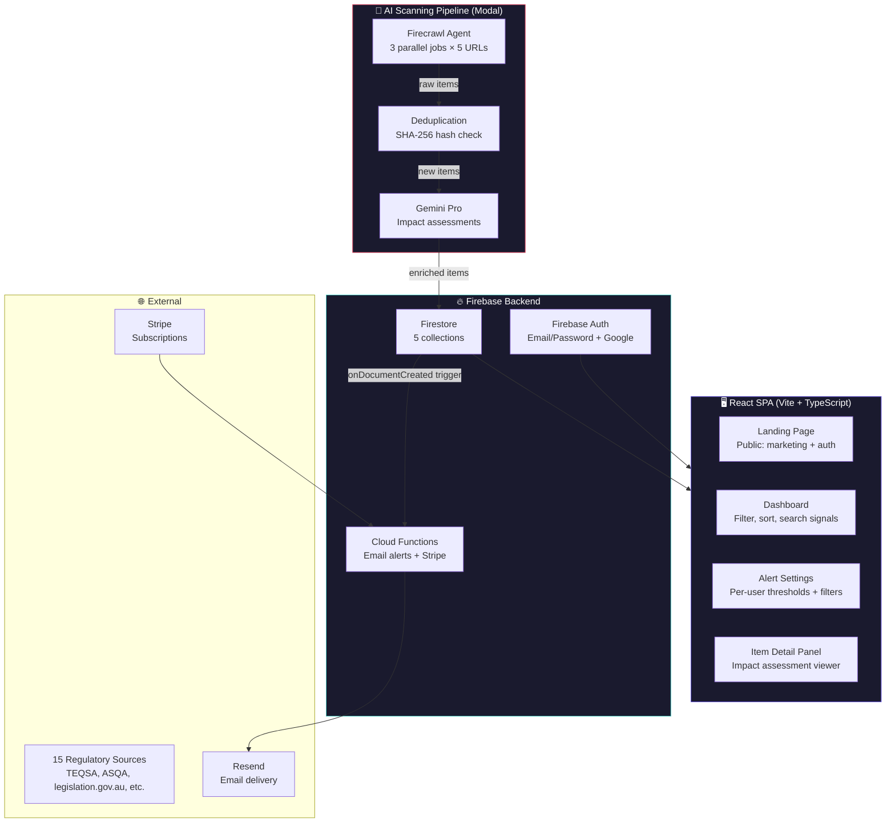

# 📡 Regulatory Radar

> **AI-powered regulatory monitoring for Australian education providers.**  
> Automatically scans 15+ regulatory sources, classifies updates by relevance and urgency using AI, generates structured impact assessments, and sends targeted email alerts — so your compliance team never misses a critical update.  
> **Live at [regu-radar.com](https://regu-radar.com)**

<p align="center">
  <a href="https://lnkd.in/p/g4qeKH6G" target="_blank">
    
  </a>
</p>

---

## What problem does this solve?

Higher education, VET, and ELICOS providers in Australia must track regulatory changes across a fragmented landscape of government agencies, legislative portals, and sector bodies. The manual process is slow, error-prone, and high-stakes:

1. **15+ regulatory sources** across TEQSA, ASQA, ESOS, state regulators, and federal legislation
2. **Hundreds of updates per month** — most are noise, but missing a critical one has real consequences
3. **No standardised classification** — urgency, relevance, and sector impact are buried in prose
4. **Manual triage burns hours** — compliance teams spend more time scanning than acting
5. **Email alerts are blunt** — all-or-nothing subscriptions with no custom filtering

Regulatory Radar automates this entire pipeline. It's an AI-native platform with a Firebase backend and React frontend that scans, classifies, enriches, and alerts — so your team focuses on decisions, not discovery.

---

## 🏗️ Architecture



### Source Coverage

| Category | Sources | Coverage |
|---|---|---|
| **Federal Regulators** | TEQSA, ASQA, Home Affairs, Dept of Education | Higher Ed, VET, ELICOS |
| **Legislation** | legislation.gov.au, Federal Register of Legislation | All sectors |
| **State Regulators** | VRQA (VIC), TAC (WA), NSW Education | VET |
| **Sector Bodies** | Universities Australia, English Australia, NCVER | Higher Ed, ELICOS, VET |
| **Frameworks** | AQF, NEAS | Qualifications, ELICOS standards |

15 source URLs are split across 3 parallel Firecrawl Agent jobs (5 URLs each) for speed.

---

## 🚀 Quickstart

### Prerequisites

- **Node.js 18+** with npm
- **Firebase** project (Blaze plan for Cloud Functions)
- **Modal** account (for the AI pipeline)
- A **Resend** account (for email alerts)
- A **Stripe** account (for subscriptions, optional for local dev)

### 1. Clone & install

```bash
git clone https://github.com/YOUR_USERNAME/regulatory-radar.git
cd regulatory-radar
npm install
```

### 2. Set up Firebase

Create a Firebase project with Firestore, Authentication (Email/Password + Google), and Cloud Functions.

### 3. Configure environment

```bash
# Frontend (.env.local)
cp .env.example .env.local
# Fill in your Firebase config

# Cloud Functions (functions/.env)
# RESEND_API_KEY=re_...
# STRIPE_SECRET_KEY=sk_live_...
# STRIPE_WEBHOOK_SECRET=whsec_...
# SERVICE_ACCOUNT_JSON={...}

# Modal (modal/.env)
# GEMINI_API_KEY=...
# FIRECRAWL_API_KEY=fc-...
# FIREBASE_SERVICE_ACCOUNT_JSON={...}
# FIREBASE_DATABASE_ID=...
```

### 4. Start the dev server

```bash
npm run dev
# → http://localhost:5173
```

### 5. Deploy the AI pipeline

```bash
cd modal
modal deploy scan.py        # Weekly scan for education regulation
modal deploy scan_ai_act.py # Weekly scan for AI compliance
```

### 6. Deploy Cloud Functions

```bash
cd functions
npm run deploy
```

---

## 📁 Project Structure

```
regulatory-radar/
├── src/
│   ├── main.tsx                  # React entry point
│   ├── App.tsx                   # Root component (auth, routing, dashboard, alerts)
│   ├── LandingPage.tsx           # Public marketing homepage
│   ├── firebase.ts               # Firebase client init (Firestore, Auth, Functions)
│   ├── components/
│   │   ├── ui/                   # Custom UI primitives (Button, Card, Badge)
│   │   ├── AuthModal.tsx         # Email/Password + Google sign-in dialog
│   │   ├── ItemDetailPanel.tsx   # Slide-out panel with full item details + impact assessment
│   │   ├── PricingPage.tsx       # Subscription selection (Free vs Pro)
│   │   ├── ProductSwitcher.tsx   # Multi-product switcher (Regulatory Radar ↔ CompRadar)
│   │   ├── Tooltip.tsx           # Tooltip wrapper
│   │   ├── GlassToken.tsx        # Visual brand element
│   │   ├── PrivacyPolicy.tsx     # Privacy policy page
│   │   └── TermsOfService.tsx    # Terms of service page
│   └── config/
│       ├── types.ts              # DashboardConfig TypeScript interface
│       ├── regulatoryRadar.ts    # Full config: filters, categories, pricing, alerts
│       └── index.ts              # Config selector
├── functions/
│   └── src/
│       └── index.ts              # Cloud Functions: email alerts, Stripe webhook, customer portal
├── modal/
│   ├── scan.py                   # Education regulation scan (15 URLs, weekly)
│   └── scan_ai_act.py            # AI compliance scan (weekly)
├── firebase.json                 # Firebase project config (Firestore DB ID)
├── firestore.rules               # Firestore security rules (6 collections)
├── firebase-blueprint.json       # Full Firestore schema reference
├── public/
├── ARCHITECTURE.md
└── README.md
```

### Key files deep-dive

| File | Role | Why it matters |
|---|---|---|
| `App.tsx` | Application shell | Contains all auth state, routing, filtering, sorting, item actions, and subscription logic — the single-page app lives here |
| `firebase.ts` | Firebase client | Initialises Firestore, Auth, and Functions with typed configuration |
| `config/regulatoryRadar.ts` | Product config | Every dashboard behaviour is config-driven: filter tabs, sort options, categories, pricing, alert thresholds — swap configs for different products |
| `modal/scan.py` | AI pipeline entrypoint | Orchestrates the full scan-and-classify pipeline: Firecrawl crawl → Gemini enrichment → Firestore write → webhook notify |
| `functions/src/index.ts` | Cloud Functions | Triggers on new `regulatory_items` documents, matches against user alerts, sends HTML emails via Resend. Also handles Stripe webhooks |
| `firestore.rules` | Security rules | Enforces backend-only writes to regulatory items, user-owned alert docs, and authenticated access to item actions |
| `ItemDetailPanel.tsx` | Detail viewer | Slide-out panel rendering full impact assessments, HES domain mapping, and action buttons per item |

---

## 🎯 Core Workflows

### 1. Automated Scan & Classification

```
Weekly cron (Wed 06:00 UTC)
  → 3 parallel Firecrawl Agent jobs crawl 15 source URLs
    → Gemini Pro extracts structured data (title, type, relevance, urgency, sectors, domains)
      → SHA-256 dedup against existing Firestore docs
        → Gemini Pro generates 700-750 word impact assessments (Critical/High/Medium items)
          → Batch write to Firestore `regulatory_items`
```

Each item is classified across three axes:
- **Relevance**: Critical / High / Medium / Low
- **Urgency**: Immediate / Within 30 days / Monitoring
- **Type**: Legislative Change, Regulatory Guidance, Sector Alert, Policy/Reform, Administrative, Good Practice

### 2. Smart Email Alerts

```
New regulatory_item written to Firestore
  → Cloud Function triggers (onDocumentCreated)
    → Queries all user_alerts for matching preferences
      → Matches on: minRelevance, sectors, types
        → Sends branded HTML email via Resend with:
          - Relevance/urgency badges
          - Structured impact assessment
          - Deep-link to dashboard item
```

Alerts are **not blast emails**. Each user gets only items matching their configured thresholds — a VET provider isn't spammed with ELICOS-only updates.

### 3. Review & Action

```
Dashboard feed (filtered + sorted)
  → Click item → ItemDetailPanel slides out
    → Read AI-generated impact assessment (Executive Summary, Potential Considerations, HES Domain Mapping)
      → Mark status: Read / Actioned / Not Applicable
        → Filter feed by status to track what's been triaged
```

---

## 🔐 Security Model

### Defence in depth

| Layer | Mechanism | What it protects |
|---|---|---|
| Transport | HTTPS (Firebase enforces) | Data in transit |
| Authentication | Firebase Auth (Email/Password + Google OAuth) | User identity |
| Authorisation | Firestore security rules | Collection-level access control |
| Validation | Rule-level field validators (type, length, enum) | Data integrity |
| Backend isolation | `regulatory_items` is frontend-immutable (write: false) | Scan pipeline integrity |
| Secrets | Modal secrets + Firebase env vars + `.env.local` | API keys never in client bundle |

### Firestore security rules summary

| Collection | Read | Write |
|---|---|---|
| `regulatory_items` | Authenticated users | **Backend only** (admin SDK bypasses rules) |
| `user_alerts` | Owner only | Owner only (validated) |
| `item_actions` | Authenticated users | Owner's own actions (validated) |
| `workspaces` | Authenticated users | Authenticated users (validated) |
| `users` | Authenticated users | Owner only (email-verified) |

The `regulatory_items` collection is the **write-once append log** — only the Modal pipeline creates documents. The frontend can only read. This prevents tampering and ensures all users see the same classified items.

---

## 💰 Cost Model

Running on Firebase Blaze + Modal free tier + Resend free tier:

| Service | Free tier | Sufficient for |
|---|---|---|
| Modal | $30/month credit | ~4 weekly scans |
| Firebase Auth | Unlimited (email/password) | Unlimited users |
| Firestore | 1GB storage, 50K reads/day | ~10,000 items |
| Cloud Functions | 2M invocations/month | ~50K alert emails |
| Resend | 100 emails/day | ~3,000 emails/month |
| Stripe | Pay-as-you-go (2.9% + $0.30) | Transaction-based |

**Production costs:** ~$30–60/month for the AI pipeline (Modal compute + Firecrawl API), $25/month for Firebase Blaze, and per-email costs for Resend beyond the free tier.

---

## 🧩 Multi-Product Architecture

Regulatory Radar shares its codebase with **CompRadar** (AI compliance monitoring for the EU AI Act, ISO/IEC 42001, and NIST AI RMF). Both products use the same:

- **React frontend** — config-driven via `DashboardConfig` interface (different collections, categories, filter tabs, pricing)
- **Firebase backend** — shared Cloud Functions with parameterised alert logic
- **Modal pipeline** — separate scan scripts (`scan.py` vs `scan_ai_act.py`) writing to separate Firestore collections

To add a third product, you'd:
1. Create a new config in `src/config/`
2. Add a new Modal scan script
3. Add Firestore rules for the new collections
4. Add the product to the Cloud Functions alert dispatch

---

## 🤔 Design Decisions & Trade-offs

### Why Firebase over a custom backend?

| Approach | Pros | Cons |
|---|---|---|
| **Firebase** (chosen) | Managed Firestore, built-in auth, Cloud Functions triggers, SDK with real-time listeners | Vendor lock-in, Cloud Functions cold starts |
| Custom Node.js + PostgreSQL | Full control, no vendor dependency | Must build auth, storage, triggers from scratch |

Firebase's `onDocumentCreated` trigger is the killer feature — new regulatory items automatically fire the alert matching logic without a message queue or cron job polling the database.

### Why Modal for the AI pipeline?

Modal provides long-running serverless containers (up to 15 min timeout) with GPU access — ideal for running parallel Firecrawl jobs followed by Gemini API calls. The alternative (Cloud Functions) has a 9-minute max timeout and no GPU support.

### Why config-driven UI?

The `DashboardConfig` TypeScript interface means adding a second product (CompRadar) required zero frontend component changes — only a new config file. Every filter tab, sort option, category label, price point, and alert threshold is data, not code.

### Why Firecrawl Agent over raw scraping?

Firecrawl Agent handles JavaScript-rendered government sites, follows pagination, and extracts structured JSON via schema — all from a single API call. Writing and maintaining 15 individual scrapers would be brittle and high-maintenance.

### Why Gemini over a fine-tuned model?

Gemini Pro is called with a detailed prompt and JSON schema for structured extraction. It handles the nuance of regulatory language (distinguishing "administrative notice" from "legislative change") without training data. The prompt is versioned in `modal/scan.py` and iterable without model retraining.

---

## 🔜 Roadmap

- [ ] **Workspace collaboration** — shared item status tracking across teams
- [ ] **Custom watchlists** — saved filter combinations with individual alert schedules
- [ ] **Weekly digest** — batched email summary instead of per-item alerts
- [ ] **Slack/Teams integration** — webhook delivery alongside email
- [ ] **Historical trend analysis** — regulatory change patterns over time
- [ ] **Bulk actions** — mark multiple items as reviewed in one click
- [ ] **Export to compliance report** — generate formatted PDF briefings for board meetings
- [ ] **Regulatory calendar** — upcoming compliance deadlines extracted from sources

---

## 📝 License

MIT — use this for your own institution, commercial or personal.

---

<p align="center">
  <sub>Built with React · Firebase · Modal · Firecrawl · Gemini · Resend · Stripe · TypeScript · Tailwind CSS</sub>
</p>
