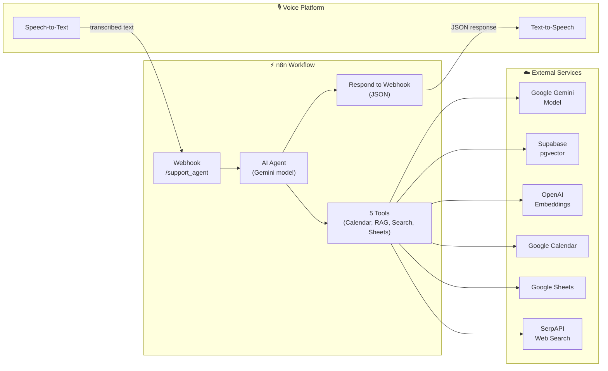
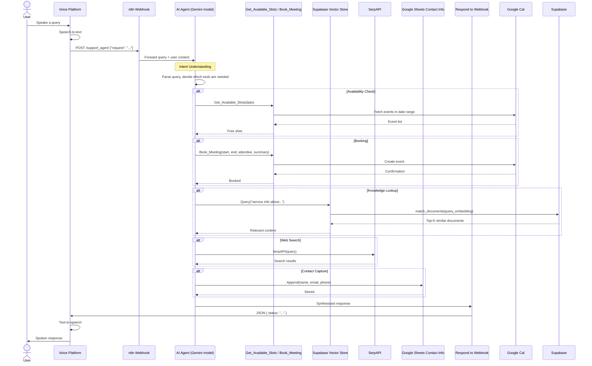
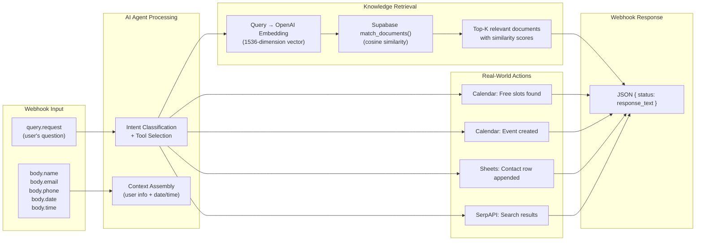
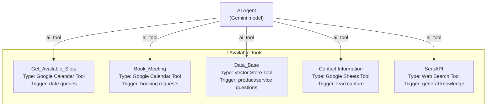

# 🏗️ Voice RAG Agent V2 — Architecture Deep Dive

## Table of Contents

- [System Overview](#system-overview)
- [Pipeline Sequence](#pipeline-sequence)
- [Data Flow](#data-flow)
- [Component Details](#component-details)
- [Vector Store Schema](#vector-store-schema)
- [Tool System Architecture](#tool-system-architecture)
- [Error Handling Strategy](#error-handling-strategy)
- [Security Model](#security-model)
- [Design Decisions](#design-decisions)

---

## System Overview

Voice RAG Agent V2 is an **n8n-hosted AI agent** that powers voice-based customer support. It's designed to sit behind a voice platform (Vapi, Retell, ElevenLabs Conversational AI, etc.) and handle user queries by reasoning, retrieving information, and taking real-world actions (booking calendar events, storing contact data, searching the web).



**Key insight:** The n8n AI Agent node is the **orchestrator**, not a hardcoded router. It receives a natural language query, decides which tools to invoke (potentially chaining multiple), and synthesises a response — all in a single node. The tools are the "hands" of the agent, each one doing one specific real-world action.

---

## Pipeline Sequence



**Multi-tool chaining:** The agent can execute several tools in a single turn. For example, a user saying "Book me in for Tuesday 2pm, my email is jane@acme.com" triggers three tools sequentially: `Get_Available_Slots` → `Book_Meeting` → `Contact Information`.

---

## Data Flow



---

## Component Details

### 1. Webhook Entry Point

```
Method: POST
Path:   /support_agent
Input:  JSON body with "request" (user's transcribed speech)
        + optional: name, email, phone, date, time

Response: JSON { status: "response text" }
```

The webhook is the **boundary between the voice platform and the AI agent**. It expects the voice platform to handle speech-to-text and POST the transcribed text. The optional fields (name, email, phone, date, time) enable the voice platform to pre-extract entities and pass them as structured data — but the agent can also extract these from the raw text itself.

### 2. AI Agent (Gemini model)

```
Model:    Google Gemini model
Role:     Intent understanding + tool orchestration + response synthesis

System Prompt:
  "You are a customer support AI Agent designed to handle various tasks efficiently.
   Your primary role is to check for available times for appointments, book appointments,
   grab contact information, and help retrieve information...

   Tools available:
   - Get_Available_Slots: Check calendar availability
   - Book_Meeting: Create an appointment
   - Data_Base: Retrieve information about our services
   - Contact Information: Store customer contact info
   - SerpAPI: Search the web for general information"

Context injection:
  - User request text
  - User name, email, phone (if provided)
  - Current date
```

**Why Gemini model?** Voice conversations require sub-second response times. Gemini model is optimised for low latency (~200ms for tool selection) and has a generous free tier. The agent's job is routing and synthesis — it doesn't need the creative writing capabilities of a larger model.

**Temperature:** Default (not overridden). The agent needs deterministic tool selection, not creative variety.

### 3. Vector Store & Embeddings (RAG)

```
Embeddings: OpenAI embeddings model (1536 dimensions)
Vector DB:  Supabase pgvector
Table:      documents (id, content, metadata, embedding)
Function:   match_documents(query_embedding, match_threshold, match_count)

Flow:
  1. User query → OpenAI Embeddings → 1536-dimension vector
  2. Supabase match_documents() → cosine similarity search
  3. Returns top-K documents above threshold (default: 0.7 similarity, 5 results)
  4. Agent synthesises response from retrieved content
```

**The embeddings model (OpenAI) is separate from the agent model (Gemini).** This is intentional — OpenAI's embeddings are state-of-the-art for retrieval quality, while Gemini model is better for fast, cheap agent reasoning. The two models don't need to be from the same provider.

### 4. Calendar Tools

Two separate Google Calendar tool nodes:

**Get_Available_Slots:**
```
Operation: Get All Events
Time range: [oneDayBefore, oneDayAfter] the user's requested date
             (dynamically set by AI via $fromAI())
Returns:     List of existing events in that window
Agent infers: Free slots between events
```

**Book_Meeting:**
```
Operation: Create Event
Fields:
  - start:     $fromAI("startTime")
  - end:       $fromAI("endTime")
  - attendees: $fromAI("attendee")
  - summary:   $fromAI("eventTitle")
```

**Why two separate nodes instead of one?** n8n's Google Calendar Tool node is single-operation. Separating "check" and "book" gives the agent finer-grained control — it can check without booking, and book only after the user confirms.

**The `$fromAI()` function** is an n8n AI agent feature that lets the agent dynamically fill node parameters based on the conversation context. For example, `$fromAI("startTime")` tells the agent "extract the start time from the user's request and pass it here." This is how the agent bridges natural language to structured API calls.

### 5. SerpAPI Web Search

```
Tool: SerpAPI (Google Search)
Role: General knowledge fallback

Used when:
  - The vector store returns no relevant documents
  - The user asks about something outside the knowledge base
  - Real-time information is needed (weather, news, etc.)
```

SerpAPI is the "I don't know but let me find out" tool. It prevents the agent from hallucinating when the answer isn't in the knowledge base.

### 6. Contact Information Storage

```
Tool:     Google Sheets (append)
Document: Contact Info spreadsheet
Sheet:    Sheet1
Columns:
  - Name:  $fromAI('name')
  - Email: $fromAI('email')
  - Phone: $fromAI('phone')
```

Simple CRM-lite functionality — the agent extracts contact details from the conversation and stores them. The `$fromAI()` function handles extraction: if the user says "my email is jane@acme.com," the agent extracts "jane@acme.com" and passes it to the Sheets append operation.

---

## Vector Store Schema

### Table: documents

| Column | Type | Purpose |
|---|---|---|
| `id` | UUID (PK) | Unique document identifier |
| `content` | TEXT | The document text (service info, FAQ, pricing, etc.) |
| `metadata` | JSONB | Structured metadata (category, product, audience, etc.) |
| `embedding` | VECTOR(1536) | OpenAI embedding of the content |

### Function: match_documents

```sql
match_documents(
  query_embedding VECTOR(1536),
  match_threshold FLOAT DEFAULT 0.7,
  match_count INT DEFAULT 5
)
RETURNS TABLE(id, content, metadata, similarity)
```

**Similarity threshold (0.7):** Only documents with cosine similarity > 0.7 are returned. This prevents low-quality matches from polluting the agent's context. If no documents meet the threshold, the agent falls back to SerpAPI or admits it doesn't know.

### Required Supabase scopes

```
vector operations (pgvector extension)
table read (documents)
function execute (match_documents)
```

---

## Tool System Architecture

The agent has 5 tools, each registered as a separate node connected to the AI Agent:



**Tool selection is autonomous.** The agent reads the tool name and description, then decides which to invoke based on the user's query. There is no hardcoded routing logic — the LLM's reasoning handles edge cases naturally:

- "What times are free next Monday?" → `Get_Available_Slots`
- "Lock in 3pm please" → `Book_Meeting` (with context from previous slot check)
- "Tell me about your pricing" → `Data_Base` (RAG)
- "My name is John, john@email.com" → `Contact Information`
- "What's the latest on AI regulation?" → `SerpAPI`

**Tool chaining:** The agent can invoke multiple tools in sequence. For compound requests ("Book me for Tuesday at 2, I'm jane@acme.com"), the agent chains `Get_Available_Slots` → `Book_Meeting` → `Contact Information`.

### How $fromAI() bridges NL to API calls

The `$fromAI()` function is the secret to making this work without code. It lets the agent dynamically populate structured API parameters from natural language:

```
User says: "Book me in for Friday at 3pm, my email is jane@acme.com"

Agent extracts via $fromAI():
  startTime  → "2026-07-11T15:00:00+10:00"
  endTime    → "2026-07-11T15:30:00+10:00"
  attendee   → "jane@acme.com"
  eventTitle → "Consultation Call with Jane"
```

No regex, no entity extraction model — the LLM does the parsing natively.

---

## Error Handling Strategy

### Layer 1: Missing knowledge (RAG fallback)

```
if vector_store returns 0 documents above threshold:
    agent → SerpAPI (web search)
    if SerpAPI also fails:
        agent → "I'm not sure about that, but I can have someone follow up."
```

### Layer 2: Calendar conflicts

Google Calendar's API naturally prevents double-booking — if a slot is taken, the create event API returns an error. The agent receives this and reports it to the user: "It looks like that slot was just taken. Would 3pm work instead?"

### Layer 3: Missing contact info

If the user asks to book but hasn't provided an email, the agent prompts for it: "Sure, I can book that for you! What email should I send the confirmation to?"

### Layer 4: Stateless resilience

Each webhook call is independent. If anything fails, the next call starts fresh. The voice platform handles retry logic at the conversation level.

---

## Security Model

### Secrets management

```
n8n Credential Store (encrypted)
├── Google Gemini API Key    → x04bitMIOUTEnUS6
├── OpenAI API Key           → wvguJoBQwhTbWc2L
├── Supabase API Key         → ov66Vf85dr9pl8Xf
├── Google Calendar OAuth    → 753JQGolQwNL7lxN
├── Google Sheets OAuth      → ApGTknppcJgogqKb
└── SerpAPI Key              → kIXgYiBhCwch4J74
```

All credentials are stored in n8n's encrypted credential store and referenced by ID in the workflow JSON. The sanitised export contains credential IDs, not actual keys.

### Webhook security

The webhook is **unauthenticated** (no API key required). This is intentional for voice platform integration — most voice platforms can't send custom auth headers. For production, consider:
- IP allowlisting the voice platform's outbound IPs
- Adding a shared secret in the request body
- Placing n8n behind a reverse proxy with auth

### Data exposure

- **Voice transcriptions** flow through n8n → Gemini → potentially Supabase/SerpAPI
- **Contact data** is stored in Google Sheets (whatever the user provides)
- **Calendar data** is read/written via OAuth-scoped access (specific calendar only)
- **No audio storage** — the workflow only sees transcribed text

---

## Design Decisions

### 1. Stateless webhook over stateful WebSocket

Webhooks are simpler to deploy, debug, and scale. The voice platform manages conversation state (history, turn-taking). This separation of concerns means:
- The workflow doesn't need session management
- Any n8n instance can handle any request (no sticky sessions)
- Debugging is straightforward — each request is a self-contained execution

The trade-off is that the agent has no memory of previous turns. For complex multi-turn conversations, the voice platform must resend context.

### 2. Gemini model for the agent

| Factor | Gemini model | Alternative |
|---|---|---|
| Latency | ~200ms | ~800ms-2s |
| Cost (1K tokens) | Free tier | ~$0.03/$0.06 |
| Tool calling | Native | Native |
| Voice-ready latency | Yes | Borderline |

For voice, sub-second response time is critical — users notice 2-second pauses. The Gemini model is fast enough that the voice platform can maintain natural conversational rhythm.

### 3. OpenAI embeddings for retrieval

OpenAI's embeddings model provides strong benchmark performance for retrieval tasks. The embedding quality directly impacts RAG accuracy — higher-quality embeddings mean the right documents are returned more often. The cost difference is negligible (~$0.02 per 1M tokens).

### 4. Supabase pgvector over dedicated vector DB

Supabase provides vector search alongside a full PostgreSQL database. This means:
- One service to manage, not two
- SQL queries can join document metadata with vector search results
- The free tier is generous (500MB database + pgvector support)
- No vendor lock-in — it's standard PostgreSQL with an extension

### 5. Tools over decision tree

Traditional IVR systems use hardcoded decision trees ("Press 1 for sales, press 2 for support..."). This agent replaces that with LLM-powered tool selection. Benefits:
- Handles edge cases naturally ("I need to reschedule, but first tell me about pricing")
- Adding a new capability = adding a new tool (no routing changes)
- The agent can chain tools in any order based on context

---

## Performance Profile

Typical query latency (end-to-end from webhook to response):

| Step | Time |
|---|---|
| Webhook → Agent | <10ms |
| Agent reasoning (Gemini model) | 200-500ms |
| Tool execution (RAG query) | 100-300ms |
| Tool execution (Calendar check) | 200-500ms |
| Tool execution (Calendar book) | 300-800ms |
| Tool execution (SerpAPI) | 500-1500ms |
| Agent synthesis | 200-500ms |
| Response formatting | <10ms |
| **Total (no tools)** | **~500ms** |
| **Total (RAG query)** | **~800ms** |
| **Total (calendar book)** | **~1.5s** |

The pipeline is **I/O bound** on external API calls. The agent's reasoning is fast enough that the dominant factor is whichever tool it invokes.

---

## Extending the System

### Adding a new tool

1. Add the appropriate n8n tool node (HTTP Request, Google Sheets, etc.)
2. Connect it to the AI Agent via the `ai_tool` connection
3. Give it a descriptive name and purpose (the agent reads these to decide when to use it)
4. Use `$fromAI()` for any dynamic parameters
5. Test with natural language queries that should trigger the new tool

### Adding documents to the knowledge base

```sql
-- Insert a new document (embedding will be generated by n8n separately):
INSERT INTO documents (content, metadata)
VALUES (
  'Your service documentation text here...',
  '{"category": "pricing", "product": "enterprise", "audience": "prospects"}'
);
```

Then use n8n's vector store ingestion tools (or a separate workflow) to generate and store the embedding.

### Switching the agent model

Update the `Google Gemini Chat Model` node to use a different model. The rest of the workflow (tools, webhook, response) stays the same — the agent model is pluggable.

---

<p align="center">
  <sub>Questions? Open an issue or start a discussion on the repo.</sub>
</p>
