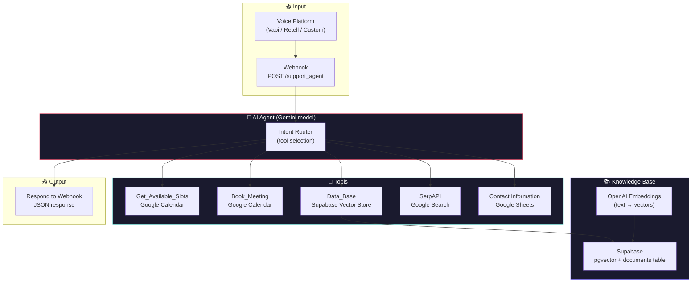

# 🎙️ Voice RAG Agent V2

> **A voice-powered AI support agent with RAG — book appointments, answer questions, and capture leads, all through natural conversation.**  
> Webhook-powered AI agent backed by a Supabase vector store, Google Calendar, and live web search — responds to voice queries with context-aware answers.

<p align="center">
  <em>🚧 Demo video coming soon — add a 30-second screen recording here showing a full conversation</em>
  <!--  -->
</p>

---

## What problem does this solve?

Customer support AI that just "sounds good" isn't enough — it needs to **do things**. Book appointments. Look up service details. Capture contact info. Search the web for answers. Voice RAG Agent combines a conversational AI agent with real tools, all triggered through a single webhook (designed to sit behind a voice interface like Vapi, Retell, or a custom phone gateway):

1. **Receive** a voice-transcribed query via webhook
2. **Understand** intent using Gemini model
3. **Retrieve** relevant information from a Supabase vector store (RAG over your service docs)
4. **Act** using tools — check calendar availability, book meetings, store contact info, search the web
5. **Respond** with a concise, context-aware answer

**The key insight:** This isn't a chatbot — it's an **AI agent with tools**. It can check your actual Google Calendar for free slots, book real appointments, and store lead data in Google Sheets. The RAG database means it answers product questions from your actual documentation, not hallucinated facts.

---

## 🏗️ Architecture



### The Tool System

The AI agent has access to **5 tools** and autonomously decides which to use based on the user's query:

| Tool | What it does | Example trigger |
|---|---|---|
| `Get_Available_Slots` | Checks Google Calendar for free slots on a given date | "Do you have any appointments this Thursday?" |
| `Book_Meeting` | Creates a calendar event with attendee, time, and summary | "Book me in for 3pm Tuesday" |
| `Data_Base` | Queries Supabase vector store for relevant service information | "What's included in the Pro plan?" |
| `SerpAPI` | Searches the web for general information | "What's the weather in Sydney?" |
| `Contact Information` | Stores name, email, and phone in Google Sheets | "My email is jane@acmecorp.com" |

The agent can use **multiple tools in sequence** — for example, check availability, then book the slot, then store contact info — all in one conversation turn.

---

## 🚀 Quickstart

### Prerequisites

- **n8n** (self-hosted or cloud) with LangChain nodes installed
- A **webhook URL** exposed to the internet (n8n provides this, or use a tunnel like ngrok for local dev)
- A **voice platform** that can POST transcribed speech to a webhook (Vapi, Retell, ElevenLabs Conversational AI, or a custom solution)
- API keys for the services below

### 1. Import the workflow

```bash
# In n8n, go to Workflows → Import from File
# Select: Voice_RAG_Agent_V2_SANITIZED.json
```

### 2. Set up API keys & credentials

You'll need accounts at:

| Service | Used for | Approx. cost |
|---|---|---|
| [Google AI Studio](https://aistudio.google.com) | Gemini model (agent brain) | Free tier available |
| [OpenAI](https://platform.openai.com) | Embeddings (text → vectors) | ~$0.10/1M tokens |
| [Supabase](https://supabase.com) | Vector store (pgvector + documents) | Free tier |
| [Google Calendar](https://console.cloud.google.com) | Availability checking + booking | Free |
| [Google Sheets](https://console.cloud.google.com) | Contact info storage | Free |
| [SerpAPI](https://serpapi.com) | Web search | ~$0.01/query |

### 3. Set up the knowledge base

```sql
-- In Supabase SQL editor, enable pgvector and create the documents table:
CREATE EXTENSION IF NOT EXISTS vector;

CREATE TABLE documents (
  id UUID PRIMARY KEY DEFAULT gen_random_uuid(),
  content TEXT,
  metadata JSONB,
  embedding VECTOR(1536)
);

-- Create a function for similarity search:
CREATE OR REPLACE FUNCTION match_documents(
  query_embedding VECTOR(1536),
  match_threshold FLOAT DEFAULT 0.7,
  match_count INT DEFAULT 5
)
RETURNS TABLE(
  id UUID,
  content TEXT,
  metadata JSONB,
  similarity FLOAT
)
LANGUAGE plpgsql
AS $$
BEGIN
  RETURN QUERY
  SELECT
    documents.id,
    documents.content,
    documents.metadata,
    1 - (documents.embedding <=> query_embedding) AS similarity
  FROM documents
  WHERE 1 - (documents.embedding <=> query_embedding) > match_threshold
  ORDER BY similarity DESC
  LIMIT match_count;
END;
$$;
```

Then populate `documents` with your service information, FAQs, pricing, etc. — each row gets an OpenAI embedding via n8n's vector store ingestion tools.

### 4. Configure Google Calendar

1. Create a Google Cloud project with Calendar API enabled
2. Set up OAuth consent screen
3. Add the calendar ID to both Calendar tool nodes
4. The agent will use this calendar for both checking availability and booking

### 5. Run it

The workflow is **always-on** (`active: true`). Once the webhook is configured:

1. Your voice platform transcribes the user's speech → text
2. POSTs to `https://your-n8n-instance/webhook/support_agent` with `{"request": "user's question here"}`
3. The agent processes it (choosing tools as needed) and returns a JSON response
4. Your voice platform reads the response back to the user

---

## 📁 Project Structure

```
voice-rag-agent/
├── Voice_RAG_Agent_V2_SANITIZED.json   # n8n workflow export
├── Voice_RAG_Agent_V2_diagram.html     # Visual diagram of the workflow
├── README.md
└── ARCHITECTURE.md
```

### Key nodes deep-dive

| Node | Role | Why it matters |
|---|---|---|
| `Webhook` | Entry point | POST endpoint that receives voice-transcribed queries — the gateway from voice platform to AI |
| `AI Agent` | Brain | Gemini model-powered agent that understands intent, selects tools, and constructs responses |
| `Supabase Vector Store` | Knowledge base | Stores your service documentation as embeddings — RAG retrieval for accurate answers |
| `Embeddings OpenAI` | Text → vectors | Converts document content and queries into 1536-dimension vectors for similarity search |
| `Get_Available_Slots` | Calendar check | Real Google Calendar availability — the agent can tell users actual free slots, not fake ones |
| `Book_Meeting` | Calendar booking | Creates real calendar events with attendee email, summary, and time |
| `Contact Information` | Lead capture | Appends name, email, and phone to a Google Sheet — CRM-lite |
| `SerpAPI` | Web search | Fallback for questions outside the knowledge base |
| `Respond to Webhook` | Response formatting | Wraps the agent's output as clean JSON for the voice platform to consume |

---

## 🎯 Conversation Flow Example

```
User (voice): "Hey, do you have any free slots this Friday afternoon?"

Agent [uses Get_Available_Slots]:
  → Checks Google Calendar for Friday
  → Returns: "Yes! I have 2pm and 4pm available this Friday."

User (voice): "Book me in for 2pm. My email is jane@acmecorp.com."

Agent [uses Book_Meeting + Contact Information]:
  → Creates calendar event: "Consultation Call" at Friday 2pm
  → Stores name + email in Google Sheets
  → Returns: "Done! You're booked in for Friday at 2pm. I've saved your contact details. Is there anything else?"

User (voice): "What's included in your enterprise plan?"

Agent [uses Data_Base (RAG)]:
  → Queries Supabase vector store for "enterprise plan"
  → Finds matching documentation
  → Returns: "Our enterprise plan includes unlimited seats, SSO, priority support, and a dedicated account manager. It's $499/month billed annually."
```

---

## 🛡️ Error Handling & Reliability

- **Graceful degradation** — if the vector store returns no results, the agent falls back to SerpAPI web search or admits it doesn't know
- **Calendar conflict detection** — Google Calendar itself prevents double-booking; the agent will report conflicts
- **Stateless design** — each webhook call is independent. Conversation history is managed by the voice platform, not the workflow
- **Active by default** — the workflow is set to `active: true`, designed to run continuously

---

## 💰 Cost Model

Per-conversation cost estimate (typical 3-turn conversation):

| Component | Provider | Cost/turn |
|---|---|---|
| Agent LLM | Gemini model | Free (generous free tier) |
| Embeddings query | OpenAI | <$0.001 |
| Calendar check | Google | Free |
| Calendar booking | Google | Free |
| Web search (if used) | SerpAPI | ~$0.01 |
| Sheet append | Google | Free |
| **Total per conversation** | | **~$0.01-0.02** |

---

## 🤔 Design Decisions & Trade-offs

### Why Gemini for the agent?

The Gemini model is fast (~200ms for tool selection), free for moderate usage, and natively supports function calling. For an agent that needs to route between 5 tools and respond quickly (voice conversations can't tolerate 3-second latency), a lightweight model is the right call. A larger model would produce slightly better responses but at 10-50x the cost and 2-3x the latency.

### Why Supabase pgvector instead of Pinecone/Weaviate?

Supabase provides vector storage alongside a full PostgreSQL database — you get RAG + relational data in one service. This means:
- One credential to manage instead of two
- SQL queries alongside vector queries (e.g. "find documents about pricing AND filter by product=enterprise")
- Free tier includes 500MB database + vector support

### Why a webhook instead of a persistent WebSocket?

The webhook design is stateless — each query is a self-contained POST request with a JSON response. This is simpler to deploy, debug, and scale than a WebSocket connection. Conversation state (history, context) is managed by the voice platform upstream, not the workflow.

### Why tools over hardcoded logic?

The AI agent dynamically chooses which tools to use based on the query. This is fundamentally more flexible than a decision tree:
- Adding a new capability = adding a new tool node (no routing logic changes)
- The agent can chain tools ("check calendar AND store contact AND book meeting" in one turn)
- Edge cases ("book me in for the first available slot next week") are handled naturally by the LLM's reasoning

---

## 🔜 Roadmap

- [ ] **Multi-language support** — detect language and respond in-kind
- [ ] **Conversation memory** — store chat history for context across turns
- [ ] **SMS fallback** — if voice connection drops, continue via text
- [ ] **Sentiment detection** — escalate to human if user sounds frustrated
- [ ] **Analytics dashboard** — track common questions, booking conversion rate, peak times
- [ ] **Multi-calendar** — support checking/booking across multiple team members' calendars

---

## 📝 License

MIT — use this for your own projects, commercial or personal.

---

<p align="center">
  <sub>Built with n8n · Powered by Gemini model, Supabase pgvector, OpenAI Embeddings & Google Calendar</sub>
</p>
